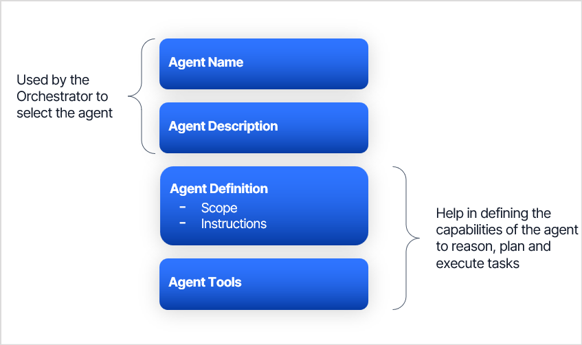

# Setting up an Agent

Setting up an agent involves defining its purpose, configuring its core functions, and ensuring it has the necessary tools and resources to perform its tasks. It also includes defining the boundaries of the agent to allow it to take actions within a given scope. 

## Agent Profile

Agent profile consists of the following fields:

**Name**: Choose a unique name that reflects your agent's core function and persona. It is good to have a name that is intuitive and indicative of its role. 

> Examples: 
> * Credit Card Assistant for an agent that handles all queries related to credit cards. 
> * Leave Manager for an agent that manages all requests related to employee leaves in an organization. 
> * Order Manager for an agent that manages all the user requests related to order status, returns, and refunds. 

---

**Description**: Specify your AI agent's primary objectives and key responsibilities. The description should clearly define the agent's role in the application and differentiate it from other agents. The application orchestrator uses this description to choose the most appropriate agent for a certain task. 

Examples: 
* Credit Card Assistant: An agent that handles all queries related to credit cards.
* Leave Manager: An agent that manages all requests related to employee leaves in an organization.
* Order Manager: Manages all the user requests related to order status, returns, and refunds. 

---

**Avatar**: Select an avatar for the agent. This is primarily for visual appeal. 

---

**AI Model**: Select the AI model that the agent will use to perform its tasks. The LLM selected here is used by the agent for all the interactions with the user and to design the workflow required to complete a given task. If you haven't added an LLM before, [configure a model](https://docs.kore.ai/gale/models/external-models/add-an-external-model-using-easy-integration/) to use.

You can choose a model based on the specific use case of the agent. If the agent is designed to generate code, select a model that excels in coding skills. 

---

## Tasks and Objectives

**Scope**: This section outlines the agent's role and the tasks it is capable of performing. The scope defines the agent's capabilities, serving as a guideline for setting its objectives and outlining its functionalities. By clearly establishing what the agent can do and how it should operate, this definition ensures that its goals are effectively aligned.

Examples:

* Leave Manager: You are an AI-powered Leave Management Assistant designed to streamline the leave application process and provide employees with up-to-date leave balances. Your key responsibilities include:
    * Facilitating Leave Applications: Guide employees through the process of applying for leave, ensuring the correct leave type and duration are selected.
    * Providing Leave Balances: Offer accurate and real-time updates on remaining leave entitlements.
    * Cancelling Leave requests: Help users cancel their leave requests
* Credit Card Assistant: You are an AI-powered Credit card assistant that assists users with credit card-related inquiries and transactions efficiently and accurately. Your responsibilities include:
    * Credit Card Approval Status: provide updates on the status of of credit card applications. 
    * Outstanding Balance Inquiry: Provide details on the outstanding bills and information on recent transactions. 
    * Bill Payments: Facilitate secure payment of outstanding credit card bills.
*  Order Manager: You are an AI agent responsible for enabling users to access real-time order updates and manage their orders independently. Key responsibilities are:
    * Order Status Inquiry: Provide updates on the order status. 
    * Return Management: Verify the eligibility of return, guide users on the return process, initiate returns, and provide information on return policies. 
    * Refund Enquiry: Provide the status of the refund and address refund-related queries. 

---

**Instructions**: Instructions for an agent are a set of directives or rules that define how an agent should behave, respond to inputs, and complete tasks effectively, aligning with the application's overall goal. Instructions can be used to define an agent's boundaries or provide specifications on how to interact with users. 

They serve as a guide to ensure the agent operates within its scope and delivers accurate and consistent results.

Examples:

* Setting the tone of the conversation:

    “Respond in a professional and empathetic tone when handling refund-related queries.”

* Understanding User Inputs:

    “When a user asks for leave balance, do not prompt exclusively for the leave type.”

* Output Guidelines:

    “Always get a confirmation from the user before performing any transactions. ”

---

## Actions

**Actions** are the tasks that agents can perform. They are the basic building blocks of an agent's capabilities. The Actions are implemented using **Tools**. Tools are the executable functions that help an agent achieve its objectives.

**Tools**are components that enable various actions to be carried out effectively. They function as specialized units that execute specific tasks. Actions rely on these tools, which incorporate domain-specific business logic to successfully complete their designated roles. These tools are capable of performing activities such as data retrieval, logical operations, and facilitating connections with external systems.

Examples:

* Actions for a Leave Managing Agent might include:	
    * Get leave balance that invokes an external API to get leave details.
    * Apply leaves
* Actions for a Credit Card Assistant might include:
    * Retrieve outstanding amount 
    * Fetch the credit limit for the user 
    * Initiate a bill payment
    * Present last *n* transactions that might include retrieving data from a database. 

There are **two types of tools** that can be used for Agent actions. 

* **Global Tools**: Global tools are shared resources that multiple agents in an app can access to perform common operations efficiently. These tools ensure **consistency** and **reusability. The agent platform offers a no code  builder for creating and managing tools**. To learn more about Global tools, refer to [this](https://docs.kore.ai/gale/agents/overview/). 
* **Custom/Inline Tools**: With **inline tools**, you can write and execute business logic directly within the system using **Python** or **JavaScript**, allowing seamless integration and automation of complex workflows. For more information on Tools, refer to this.