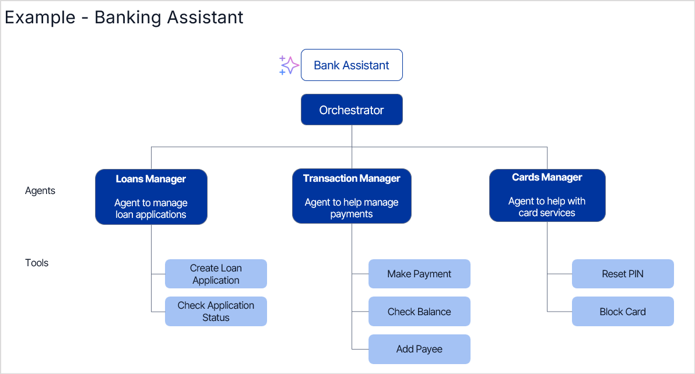

# About Agentic Apps

Agentic Apps represent a paradigm shift from rule-based systems to dynamic, autonomous systems. They are intelligent software systems powered by multiple specialized AI agents that collaborate under the coordination of an orchestrator to understand user intent, decompose complex tasks, and deliver automated outcomes. By leveraging large language models (LLMs), agentic apps can reason, adapt, and act without requiring constant human intervention.

## Key Components

Agentic Apps are composed of several key components that enable autonomous decision-making and complex task execution.

### Orchestrator

The orchestrator is the brain of the agentic app. It manages agent interactions, task delegation, and workflow execution to achieve the app's goals.

Key responsibilities include:

* Interpreting user input to understand intent and context.
* Delegating tasks to the most suitable agents.
* Handling complex workflows by invoking multiple agents.
* Resolving conflicts between agent outputs.
* Verifying and validating responses before presenting to the user.

The Agent Platform follows the Supervisor Pattern for its orchestrator. In this design, a central orchestrator functions as the supervisor, responsible for coordinating the activities of the various agents.

### Supervisor Pattern

The Supervisor Pattern is an architectural pattern used in the design of agentic apps, where a central component called the "orchestrator" acts as a supervisor to manage and coordinate multiple AI agents. This pattern helps to efficiently handle complex tasks by breaking them down into smaller sub-tasks and delegating them to specialized agents.

Here's how the Supervisor Pattern works and helps in agentic apps:

1. User Input: The user provides input or a query to the agentic app.
1. Orchestrator Analysis: The orchestrator, acting as the supervisor, receives the user input and analyzes it to understand the intent and context.
1. Task Decomposition: The orchestrator breaks down the complex task into smaller, manageable sub-tasks that individual agents can handle.
1. Agent Selection: Based on the nature of the sub-tasks, the orchestrator selects the most suitable agents to handle each one. This selection is based on the agents' specialized knowledge and capabilities.
1. Task Delegation: The orchestrator assigns the sub-tasks to the selected agents and provides them with the necessary information and context.
1. Agent Execution: Each agent independently works on its assigned sub-task, utilizing its specific skills, knowledge, and tools. Agents may interact with external systems or APIs to gather information or perform actions.
1. Result Aggregation: Once the agents complete their sub-tasks, they return the results to the orchestrator.
1. Conflict Resolution: If conflicts or inconsistencies arise in the results provided by different agents, the orchestrator resolves them to ensure a coherent outcome.
1. Response Generation: The orchestrator combines the results from the agents and generates a final response to the user's query.

Benefits of the Supervisor Pattern:

* Modularity: The Supervisor Pattern enables a modular design, where each agent specializes in a specific domain or task.
* Scalability: By distributing tasks among multiple agents, the agentic app can handle complex tasks and scale effectively.
* Specialization: Agents can be designed to possess in-depth knowledge and skills in specific areas, resulting in more accurate and effective task execution.
* Flexibility: The orchestrator can dynamically select and coordinate agents based on the task requirements, enabling the system to adapt to different scenarios.
* Fault Tolerance: If an agent fails or provides incorrect results, the orchestrator can detect and handle the issue, ensuring the overall system remains functional.

The Supervisor Pattern provides a structured approach to designing agentic apps, enabling efficient coordination and collaboration among AI agents to deliver intelligent and automated solutions.

**Example:** In a banking app, to transfer funds from a savings account to pay off a loan, the orchestrator:

1. Fetches information from the loan agent regarding the amount to be paid.
1. Checks the savings account balance using the Transaction Manager.
1. Pays off the loan after confirming with the user.
1. Ensures both actions are completed successfully and in the correct order.
1. Confirms the transaction to the user.

### Agents

Agents are specialized, autonomous workers that possess the knowledge and resources to perform tasks related to a specific goal. Each agent has a unique scope defining its core functions, objectives, and responsibilities.

Agents utilize various tools to enhance their capabilities. After receiving a user query from the orchestrator, the agent selects the most suitable tool, prepares the required input parameters, invokes the tool, processes the result, and returns the output to the orchestrator or user.

**Example:** In a banking application, specialized agents handle various user queries:

* A savings account agent processes fund transfers, adds new payees, displays balances, and performs other related tasks.
* A loan agent manages loan applications and payments.
* A card management agent handles PIN resets or card blocking.

Each agent is tailored to its specific domain, ensuring efficient and accurate handling of queries and actions.

### Tools

Tools are modules or capabilities that allow agents to access and interact with external environments. For example, an agent may use an SMTP tool to send email notifications.

The agent selects the appropriate tool for a task based on tool descriptions and its reasoning capabilities. It then generates a structured request to invoke the tool with the necessary parameters.

#### Tool Selection and Invocation

To accomplish a task, the agent intelligently selects the necessary tools. This decision-making depends on:

* Tool Descriptions: Comprehensive details and instructions outlining each tool's functions and purpose.
* Reasoning Capabilities: The language model's analytical skills to match task requirements with the most appropriate tools based on their available functionalities.

Once the appropriate tool is selected, the agent invokes it by generating a structured request, typically in the form of JSON or code, through tool or function calling. The framework then executes this request, passing the specified parameters to the selected tool for execution.

#### Tool Calling by Agents

The process of an agent using tools follows this sequence:

1. **Task Planning:** After receiving a user query via the orchestrator, the agent determines that it requires external functionality or data to fulfill the query.
1. **Tool Identification:** The agent selects the most suitable tool for the task at hand.
1. **Parameter Preparation:** Using LLM capabilities, the agent extracts relevant entities (e.g., location, date, user preference) and maps them to the required input format.
1. **Tool Invocation:** The agent calls the tool, passing the prepared parameters.
1. **Execution:** The tool processes the input and performs the necessary action.
1. **Result Processing:** The agent processes the tool's output, validating, formatting, or using it for the next workflow step.
1. **Output Delivery:** The agent sends the result either back to the orchestrator or to the user if the task is complete.

### Interaction Context

Agentic apps maintain state and conversation history to enable more user-friendly and effective interactions. This comprehensive state management enables agents to maintain continuous and contextually relevant communication throughout the entire interaction.

**Example**: In the fund transfer scenario:

* The transfer amount is stored in short-term memory until the transaction is completed.
* The user's preferred transaction method is maintained as long-term memory.

## Example of an Agentic App: Banking Assistant

A Banking Assistant built as an Agentic App demonstrates how multiple specialized agents handle different banking tasks:

* The orchestrator manages communication between users and banking agents.
* Specialized agents handle loans, transactions, cards, and more.
* Each agent utilizes tools with built-in business logic to complete specific tasks.

This approach ensures an organized, automated, and scalable banking solution.

#### Related Links

* [About AI Agents](../../ai-agents/agent-overview.md)
* [Create an Agentic App](../../ai-agents/agentic-apps/create-app.md)
* [Set up AI Agents](../../ai-agents/create-agent.md)
* [Configure Tools for Agents](../../ai-agents/tools/overview.md)