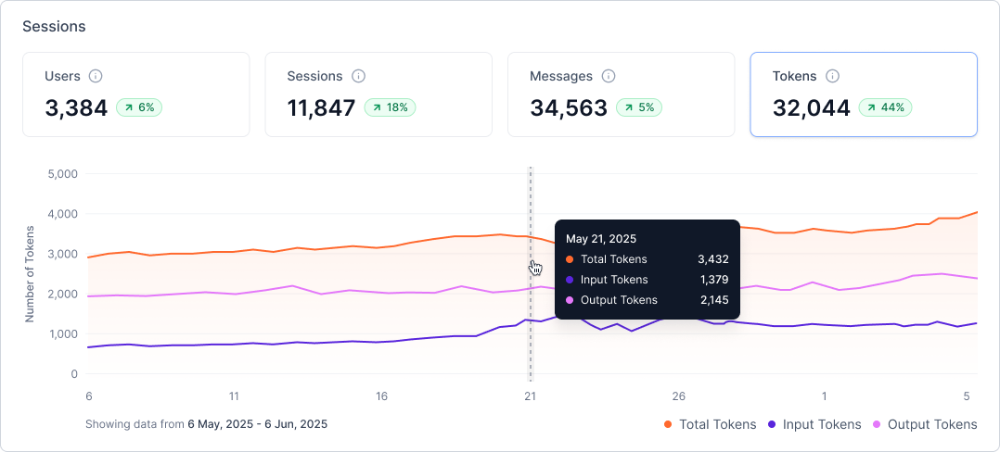
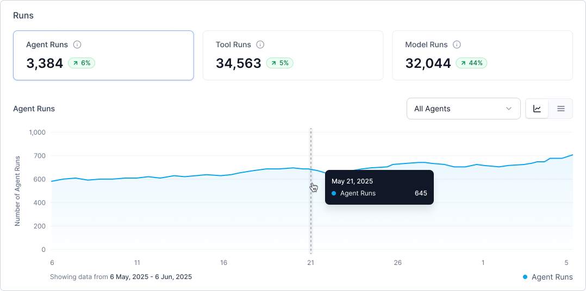

# Dashboard

The Analytics Dashboard is a real-time, comprehensive analytics interface designed for platform users, developers, and administrators. It offers clear visibility into usage patterns, engagement trends, and system performance across agents, tools, and models.

Structured into two key data layers—session-level and run-level insights—the dashboard consolidates core metrics to support data-driven decisions, optimize resource use, and track adoption. Filters are available at both the time frame and environment levels, allowing users to select a specific environment for which they want to view analytics. By default, the environment filter is set to the current draft.

* Session-Level Data: Displays total users, session counts, message volume, and tokens consumed. Each metric includes percentage change indicators and trend visualizations to support usage pattern analysis.
* Run-Level Data: Highlights executions across agents, tools, and models, detailing average response times, token usage, and performance trends. This data is accessible through both graphical and tabular views, allowing for deeper exploration by component type and execution behavior.

## Metrics

### Sessions

The top section of the dashboard presents four interactive metric cards, each with real-time values, trend indicators, and drilldowns:

**Users**

* Displays the number of unique active users for the selected time range
* Includes percentage change compared to the previous equivalent period
* Shows visual trend indicator (up/down arrow with percentage)
* Provides an interactive chart showing daily or hourly activity

**Sessions**

* Shows total session count for the selected time frame
* Highlights percentage change and trend vs historical period
* Displays session count over time using a time-series chart.

**Messages**

* Displays total input and output messages exchanged during the selected period
* Compares message trends with previous time frames
* Includes volume chart with hourly and daily breakdown

**Tokens**

* Displays total tokens consumed by Agent and Supervisor components
* Visual comparison with equivalent historical period
* Includes token usage chart with time-based trends

### Runs

The **Runs** section visualizes execution performance across three component categories, with list and chart views:

**Agent Runs**

* Displays total agent executions with real-time trend indicators
* Agent performance trend charts across the selected time range
* Provides detailed agent-level metrics: **Agent Name, Number of Runs, Average Response Time, and Tokens Consumed**

**Tool Runs**

* Displays total tool executions by all agents in the app, along with comparative trend data
* Visualizes breakdown by tool type (Workflow, Code, MCP, Knowledge)
* Offers detailed tool-level metrics: **Tool Name, Number of Runs, Average Response Time,  and Tool Type**

**Model Runs**

* Displays total model calls made by Agents and Supervisor during the selected timeframe
* Breaks down model-level performance: **Model Name, Number of Runs, Average Response Time, and Tokens Consumed**.

