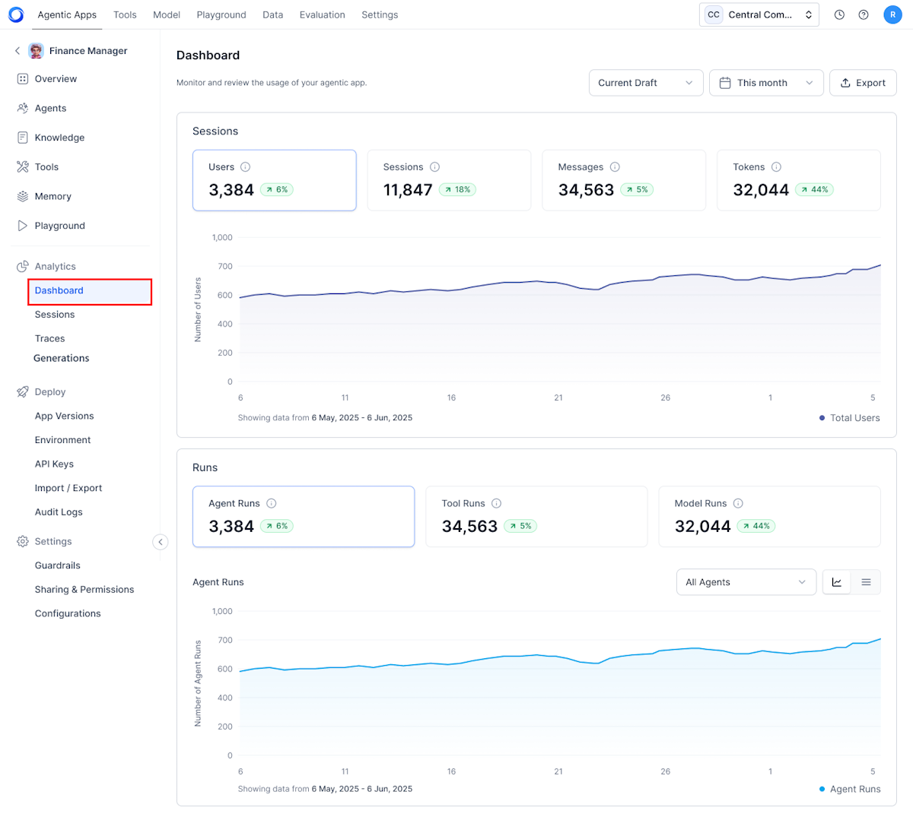
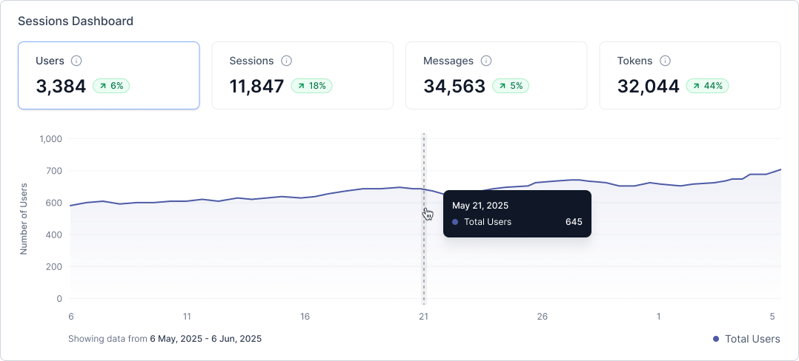
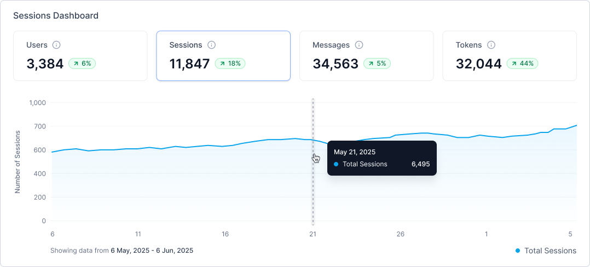
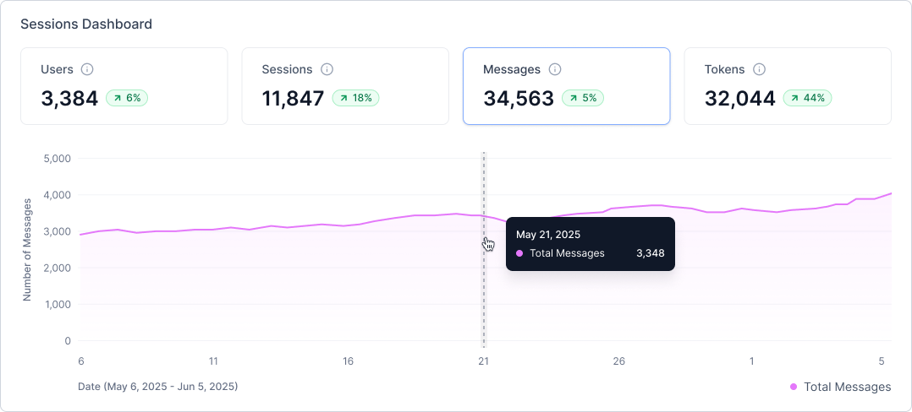
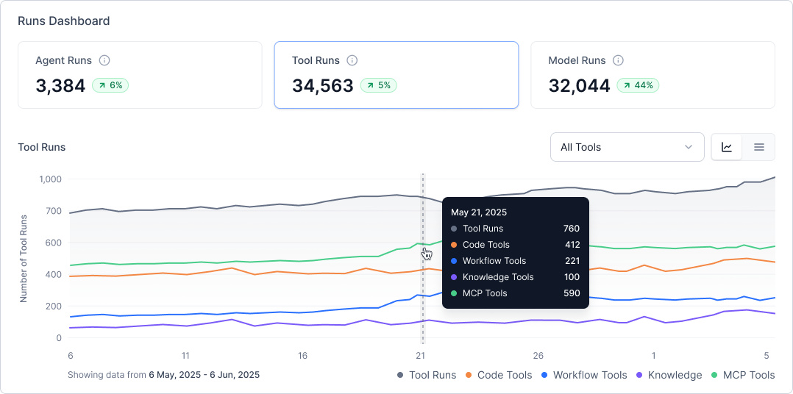
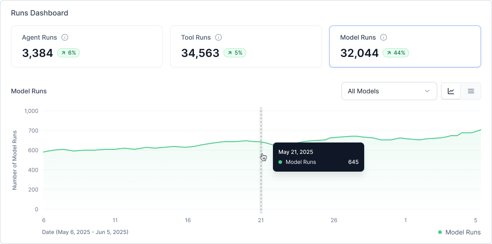

# App Usage Analytics Dashboard

The Analytics Dashboard provides real-time insights into app usage across your platform. It provides comprehensive visibility into user engagement, performance metrics, and resource utilization for agents, tools, and models.

The dashboard organizes analytics into two primary categories:

* **Session-level insights**: User activity and engagement metrics.
* **Run-level insights**: Execution performance and resource consumption.

## Key Features

* Real-time data updates.
* Customizable time frame and environment filters.
* Trend analysis with historical comparisons.
* Interactive visualizations with detailed drill-down capabilities.
* The default view displays the current draft environment.

## Navigation and Controls

Customize the analytics view by using the dashboard's filtering options and interactive controls:

* **Time Frame Selection**: Choose from predefined ranges or set custom dates to analyze specific periods.
* **Environment Filter**: Select specific environments for targeted analysis (defaults to current draft).
* **View Modes**: Toggle between interactive charts for trend analysis and detailed tables for granular inspection.
* **Drill-down Navigation**: Click any metric card or data point to access expanded insights and detailed breakdowns.
* **Export Options**: Download data for offline analysis and custom reporting.

## Key Metrics and Components

### Session Metrics

The dashboard's top section, displays four key performance indicators, each featuring:

* Current value with real-time updates
* Percentage change from the previous period
* Visual trend indicators
* Interactive time-series charts

#### Users

Tracks unique active users within the selected timeframe, displaying:

* Total user count
* Period-over-period comparison
* Daily or hourly activity breakdown

#### Sessions

Monitors total session volume, including:

* Session count and trends
* Historical performance comparison
* Time-based distribution chart

#### Messages

Measures communication volume between users and the system:

* Total input and output message counts
* Comparative trend analysis
* Hourly and daily volume breakdowns

#### Tokens

Tracks token consumption across Agent and Supervisor components:

* Total tokens consumed
* Usage comparison with previous periods
* Time-based consumption patterns

### Run Analytics

The Runs section provides detailed execution metrics across three component categories, available in both chart and tabular formats.

#### Agent Runs

Monitors agent execution performance with:

* Total execution count and trends
* Performance metrics over time
* Detailed agent-level data:
    * Agent name
    * Number of runs
    * Average response time
    * Token consumption

#### Tool Runs

Analyzes tool utilization across all agents:

* Execution counts with trend indicators
* Breakdown by tool type:
    * Workflow
    * Code
    * MCP (Model Context Protocol)
    * Knowledge
* Tool-specific metrics:
    * Tool name
    * Run frequency
    * Average response time
    * Tool category

#### Model Runs

Tracks model API calls from Agents and Supervisors:

* Total model invocations
* Performance trends over time
* Model-level details:
    * Model name
    * Execution count
    * Average response time
    * Token usage

