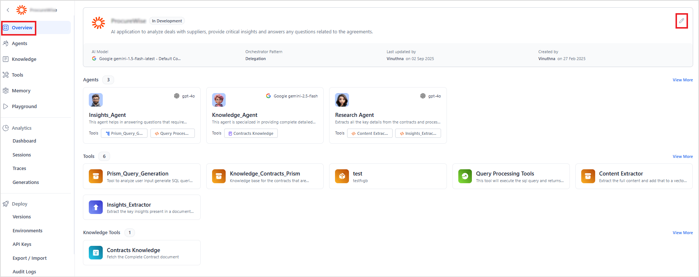

# App Profile

Navigate to the app's Overview page. Click the Edit icon to view the App Profile. 

The **App Profile** lists key configuration options for an application. You can review and update these settings as required.

1. Name - Display Name given to the app.
2. Description - A brief summary outlining the app's purpose.
3. Orchestration - Orchestration pattern for the app. Agent Platform supports two types of orchestration patterns.
    * Supervisor - A centralized orchestration pattern where a supervisor agent manages and coordinates the tasks of other agents. [Learn More](../supervisor.md).
    <!-- * Delegation - An orchestration pattern where agents independently delegate tasks to other specialized agents without centralized control. Learn More. -->
4. AI Model - AI model to be used by agents and supervisors, if any. Refer to this for the list of supported models. Use the gear icon to configure the AI Model settings. Configuration properties vary depending on the selected model. Refer to the model’s official documentation for details.
5. Real-time Voice - Enable this feature to allow users to interact with the app through voice. If this feature is enabled, select the AI model to be used by the agent and supervisor for voice interactions. Refer to [this](../../models/supported-models.md) for the list of supported models. Use the gear icon to modify the model settings. Note that the configuration properties vary by model. 
6. External Agent - Enable this feature to allow the application to communicate with external agents through proxy agents within the app. [Learn more](../external-agents.md). 