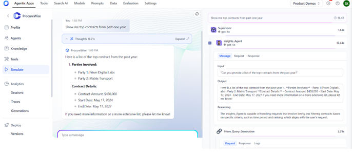
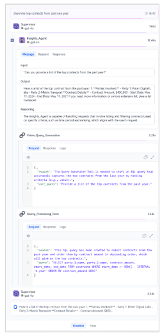
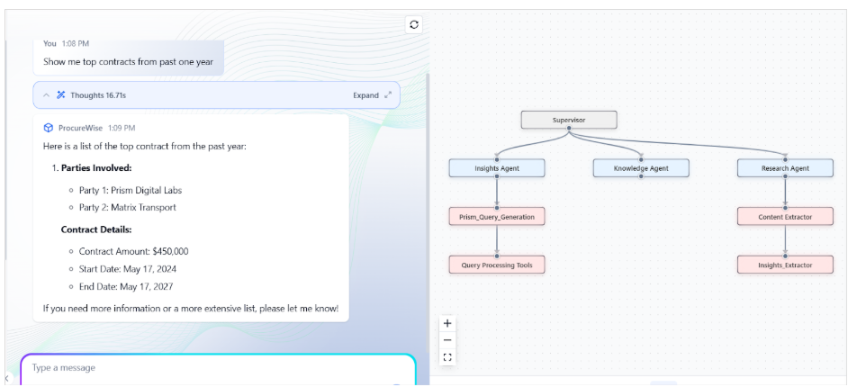

# App Simulation and Testing

Simulating and verifying the behavior of an Agentic application before it is deployed in the real world helps detect the accuracy of the response under different scenarios. This helps minimize errors, enhances the user experience, and improves the agent's effectiveness in the actual environment.
The Simulate section provides an interactive interface that allows users to submit queries and view the corresponding responses generated by the agent.

   

Users can also pass contextual information to the agent through attachments. [Learn More](attachment-support.md).

**Query Input**: Enter your query in the designated input field to initiate the simulation.

**Response Display**: The agent's response is displayed, providing immediate feedback on the input provided.

**Processing Timeline**: The right pane displays a chronological timeline that details the processing of the user query. It helps you trace the flow of execution and understand the contribution of each component involved in generating a response. The highlights of the timeline:

* Displays the query execution in chronological order, starting from the user's input to the final output.
* Each step in the timeline represents a distinct agent or tool(e.g., Supervisor, Insights_Agent) and includes the time taken to complete its task.
* Clicking on a step reveals detailed information, including:
   * Messages: The specific question or command sent to the component or received from the component, along with the reasoning or explanation of the logic used to process the request. 
   * Request: The request prompt to the component
   * Response: Response received from the component. 
   * Logs: Debug information, if any, is available for the execution step. 

      

**Flow Diagram:** The overall process flow is visually represented in a concise diagram, making it easier to understand the sequence of operations.

This detailed layout enables users to quickly grasp the system's processing, enhancing understanding of how queries are processed and responses are generated.

   