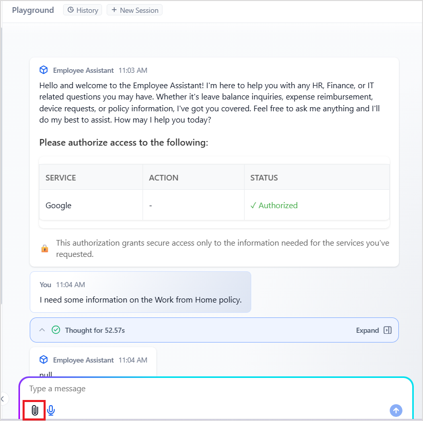
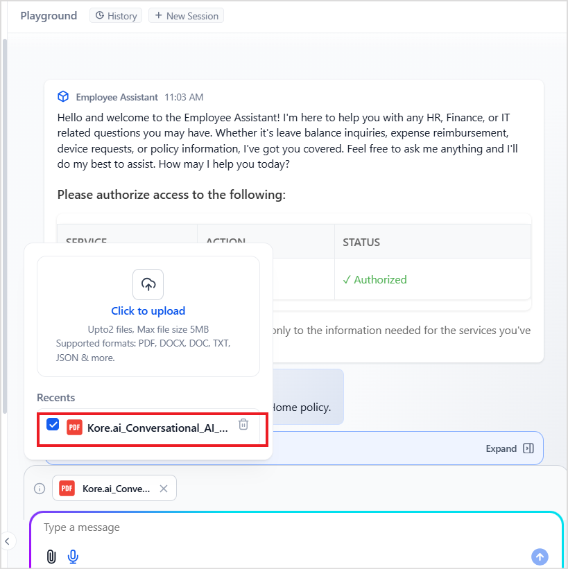

# Attachment Support in User Interactions

Agentic Applications support **real-time document sharing during interactions**. This feature enables users to upload files directly into the conversation flow, allowing agents to dynamically analyze and utilize document content as context for response generation.

The platform handles uploaded files in **two ways**, depending on the file types:

## 1. Content Extraction and Contextual Use

For selected file types, the platform extracts the content and uses it as context to generate accurate and personalized agent responses. This allows the assistant to dynamically understand and respond based on the content of the uploaded file. This feature reduces the manual effort of users and eliminates the need for them to summarize or type out content from documents. It saves time and improves response accuracy. 

For example, when interacting with an HR Assistant agent to submit a job application, the user typically needs to provide various personal and professional details. With document sharing, the user can simply upload their resume, and the assistant can automatically extract the necessary information from it.

**How it works**

* Users upload documents using the attachment option in the chat interface (enabled after the first user message).
* The platform extracts the content from the files. 
* The agents utilize the extracted insights from the document to deliver personalized and contextually relevant responses. 

## 2. File Metadata extraction

For a broader range of file types, while the content is not extracted, the platform captures and stores file metadata as **artifacts** in the metadata field of the system memory, sessionMeta. It captures the following metadata fields for each uploaded file:

* fileId: Unique identifier for the uploaded file
* type: Type of data. 
* filename: Original filename as uploaded by the user.
* mimetype: MIME type of the uploaded file.
* isActive: Indicates if the document is applicable for the current conversation.[ Learn More](#heading=h.d5ui0anfb1f).
* downloadUrl: Direct access URL for file content. This is a temporary link and is **valid and accessible for 30 days** from the date of upload. 

This metadata is stored in the system memory, sessionMeta, in the **artifacts** field under the metadata field as shown below. ` `


```json
 "artifacts": [
    {
      "fileId": "f-1558ea9e-xxxxxxxxxxxx-a283-c0bef1dec83a",
      "type": "file",
      "filename": "app-export.json",
      "mimetype": "application/json",
      "isActive": false,
      "downloadUrl": "http://localhos/api/v1/getMediaStream/orgFiles/public?h=dHkwTlA3QmFpVmgxUDAzWmVScmd0eWNLV1Y1dUtrNFV6cU5IdWpycXZPbz0$"
    }
  ]
```


This metadata can be used in **Agent and orchestrator prompts** and **code tools** for further processing. 


### Accessing Artifacts through Code Tools

**Example**: A user uploads a .csv sales report. Although the content isn’t extracted, the file URL can be accessed in a code tool that uses a custom script to download and analyze the data. Here’s a revised version for clarity:

This is a sample code script that retrieves the download URL of a file when only a single file is uploaded.

```javascript
retrieved = memory.get_content("sessionMeta") // to access the sessionMeta memory store
download_url = retrieved["content"]["artifacts"][0]["downloadUrl"] // to access the download URL of the file. 
```


### Accessing Artifacts in Prompts

To refer to the uploaded file information in the supervisor and agent prompts, use:


```json
{{memory.sessionMeta.artifacts}}
```


## Supported File formats for Document upload


<table>
  <tr>
   <td><strong>File Formats</strong>
   </td>
   <td><strong>Content Extraction</strong>
   </td>
   <td><strong>URL Generation</strong>
   </td>
  </tr>
  <tr>
   <td>PDF (.pdf)
   </td>
   <td>✅ Yes
   </td>
   <td>✅ Yes
   </td>
  </tr>
  <tr>
   <td>Microsoft Word (.docx)
   </td>
   <td>✅ Yes
   </td>
   <td>✅ Yes
   </td>
  </tr>
  <tr>
   <td>Text files (.txt)
   </td>
   <td>✅ Yes
   </td>
   <td>✅ Yes
   </td>
  </tr>
  <tr>
   <td>JSON files (.json)
   </td>
   <td> ✅Yes
   </td>
   <td>✅ Yes
   </td>
  </tr>
  <tr>
   <td>Spreadsheets: .csv, .xls, .xlsx
   </td>
   <td>❌ No
   </td>
   <td>✅ Yes
   </td>
  </tr>
  <tr>
   <td>Presentations: .ppt, .pptx
   </td>
   <td>❌ No
   </td>
   <td>✅ Yes
   </td>
  </tr>
  <tr>
   <td>Web files: .htm, .html
   </td>
   <td>❌ No
   </td>
   <td>✅ Yes
   </td>
  </tr>
  <tr>
   <td>Images: .gif, .png, .jpg, .jpeg, .bmp
   </td>
   <td>❌ No
   </td>
   <td>✅ Yes
   </td>
  </tr>
  <tr>
   <td>Rich Text: .rtf
   </td>
   <td>❌ No
   </td>
   <td>✅ Yes
   </td>
  </tr>
</table>


## Upload File

To upload a document while testing the application using Playground, use the **attach** option in the chat widget. 




This allows you to upload the files. Refer to [this for file limits](https://docs.kore.ai/agent-platform/ai-agents/agentic-apps/settings/app-configurations/#attachment-configuration). 


## File State Management

Each file has an associated state with it that indicates whether the content extracted from the uploaded file should be used in the current conversation or not. 

* **Active state**: By default, when a file is uploaded, it is in **active **state. This means the content of the file is eligible for use in the current conversation. 
* **Inactive state**: Uncheck the file in the attachment list to make it **inactive**, which means that the content extracted from the document should not be used for the current conversation. Setting a file to inactive does **not delete or remove** it. The file remains available and can be checked again when required.  

For example, if a user uploads multiple documents but only wants the agent to refer to one of them, he can uncheck the irrelevant files, ensuring only the intended file is used for that interaction.




## Points to Note

* The attachment option is enabled in the chat widget after the initial message, i.e., after a session has been started. 
* There is a limit on the number and size of files that can be uploaded. Refer to [this for more info](https://docs.kore.ai/agent-platform/ai-agents/agentic-apps/settings/app-configurations/#attachment-configuration). 