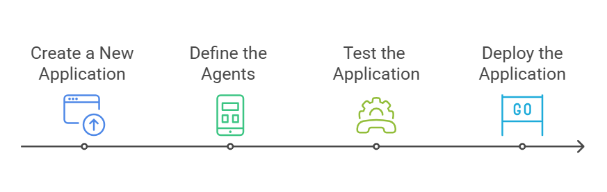
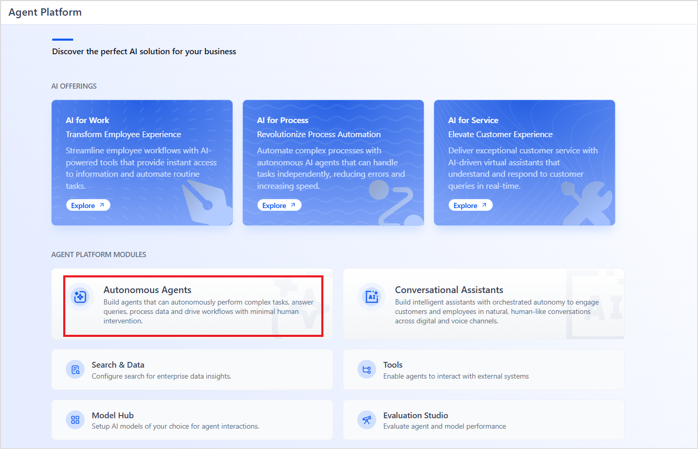
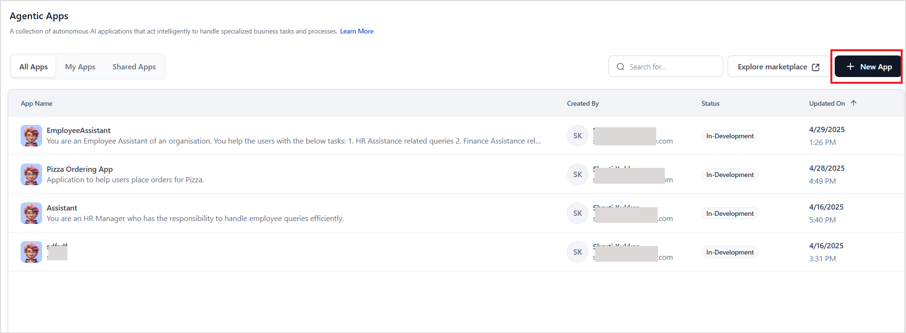
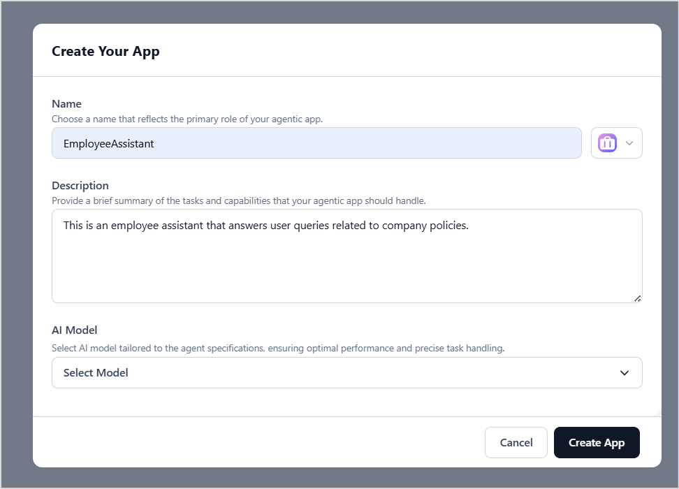

# Create an Agentic App

Prerequisites:

* Add an AI Model that supports tool-calling capabilities. The Agent Platform currently supports OpenAI, Gemini, Anthropic, and Azure OpenAI models. For more information, see [Add an External Model](../../models/external-models/add-an-external-model-using-easy-integration.md){:target="_blank"}.

## Steps to Create an Agentic App

Creating an Agentic App broadly consists of the following steps: 

### Step 1: Create an Agentic App

1. Sign in to the Agent platform and go to **Autonomous Agents**.

2. Click on the **+New App** on the **Agentic Apps** page. This page also lists the existing apps in the workspace.  

2. Enter or select the following details: 

    * **Name**: Provide a name for the app that reflects its core function.
    * **Icon**: Select an icon for the app.
    * **Description**: Write a description explaining its main features and goals. This will help to set the scope and context of the application and ensure the application does not respond to queries based on pre-trained knowledge.
    * **AI Model**: Choose an appropriate model and connection for the application.

3. Click **Create App**.  
After the app is created, the app **overview** is displayed. Move to the next steps of configuring agents and tools. 

For a completely configured app, the **Overview** section provides a structured summary of the app, including linked agents, tools, and knowledge bases, organized into four sections for easy navigation and usability.

* **App Summary** displays essential app details with an **Edit** option for configuration changes.
* **The Agents** section shows the autonomous agents of the app. The list displays information about the agents associated with the app, including their name, description, and linked tools. 
* **The Tools** section lists the different types of tools associated with the agents in the Agentic app.
* **The Knowledge** section displays knowledge bases associated with the Agentic app.
---

### Step 2: Define or Set Up Agents

Configure agents with appropriate roles and responsibilities within the application.  
See [How to set up an agent](./../create-agent.md).

Before testing and deploying an Agentic app, use the Diagnostics to comprehensively validate its readiness. This tool proactively identifies potential issues across the app, agents, tools, events, and configurations, ensuring the application meets production-quality and operational standards before to deployment. See [Diagnostics for agent platform](diagnostics-for-agent-platform.md).

---

### Step 3: Simulate or Test the Behavior of the App and the Agents

Simulate different scenarios to evaluate agent interactions and responses.  
See [Simulate and Test the App](./../agentic-apps/app-testing.md).

---

### Step 4: Deploy the App

Finalize configurations and deploy the app for end users. See [App Deployment](./deployment/app-deployment.md).

---

## App Overview

The Overview page provides a comprehensive summary of your app after it has been successfully set up. This page displays essential details, including the tools and agents that have been configured for the app.

By default, certain configurations are pre-selected when creating a new app. If you need to review or modify these configurations, go to the [app profile](app-profile.md) and make necessary changes. [Learn More](app-profile.md).
