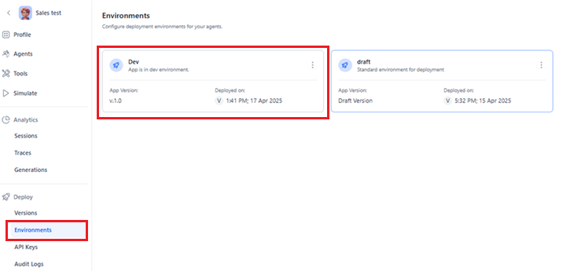
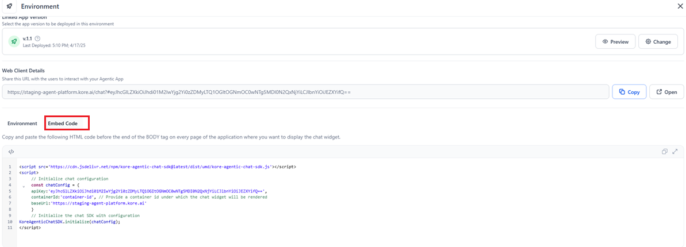

# Access Deployed Version

Integrating and managing a deployed Agentic app involves embedding it within your application, ensuring secure access, and monitoring user activity. Seamless integration is achieved through the Webclient Script, authentication is managed via generated API keys, and user actions are tracked using audit logs, all of which contribute to a secure, branded, and user-friendly experience.

## Integrate the App within a Website via Webclient Script

The Webclient Script provides a simple integration method for embedding the Agentic app within your existing website. It provides users with a smooth, native experience without redirecting them to another site.

### Key Features and Benefits 

* Single-Script Integration: Add the application with just one `<script>` tag.
* Seamless User Experience: Users can interact directly with the app within your website.
* Customizable Appearance: Configure to match your brand's look and feel.
* Seamless Session Management: Maintains user context and authentication state between the site and the app.

### Steps to Access the Webclient Script for an App

1. Go to the Environments page of the app.
1. Select the environment tile for which you want to access the script.  
   
1. Click **Embed Code**.  
   
1. Copy the provided HTML code and paste it into the desired location in your application or website where you want the chat experience to appear.

!!! note
 
    The 'containerId' parameter must match an existing HTML element ID in your webpage. Before initializing the SDK, ensure that you have created a container element (for example, `

`) where you want the chat widget to appear. The chat interface will render inside this element, so position it strategically within your page layout.

## Generate the API Key for App Authentication

API Key is required to authenticate the requests sent to the Agentic App via APIs. Follow the steps to create a new API Key.

* Go to the API Keys page and create a new API key.
* Provide a name for the key and click Generate Key. This will create a unique key. Keep it confidential. For security reasons, you will not be able to view this key again once you navigate away from the page.
