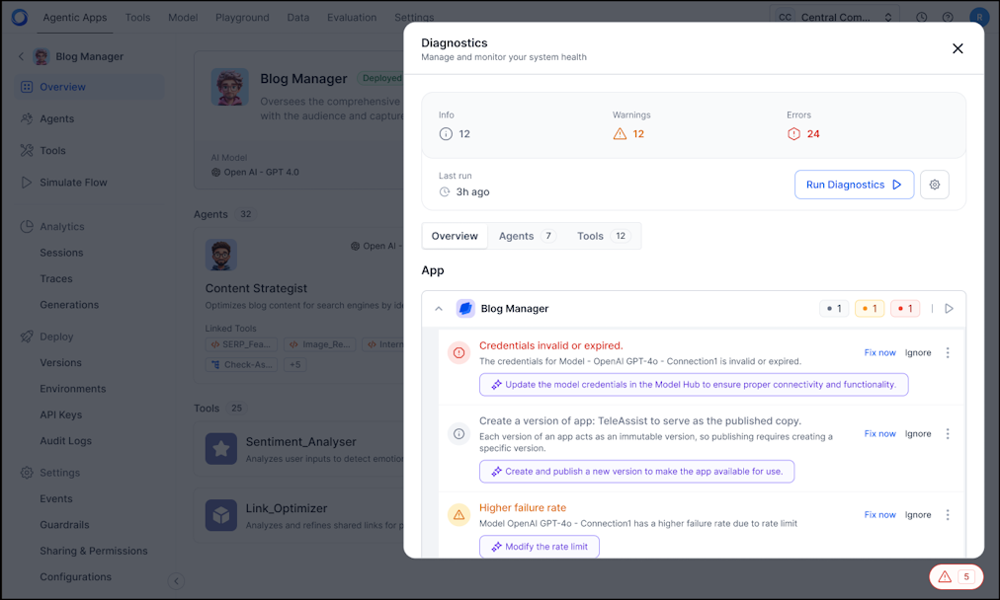
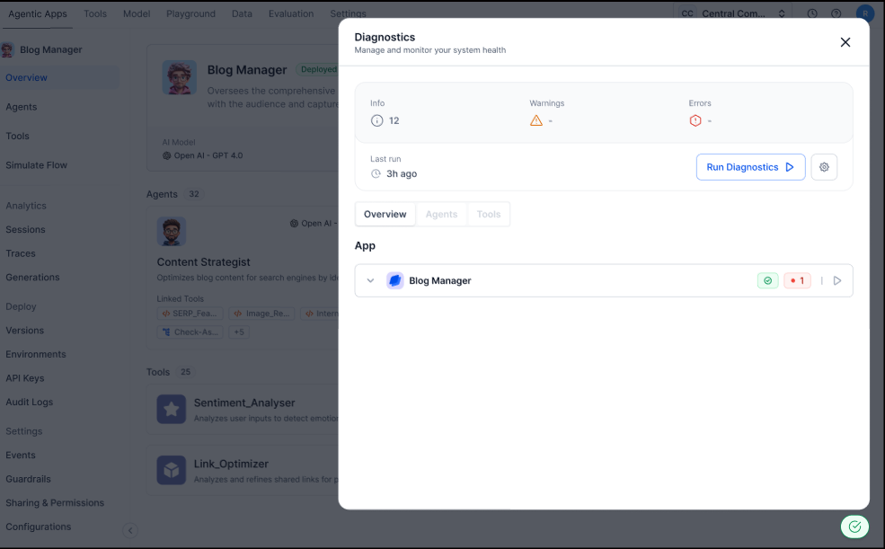

# Diagnostics for Agent Platform

When a user runs Diagnostics from the Agentic App Overview page, the platform initiates a comprehensive validation process covering the app’s architecture and configuration. It evaluates key components—including agents, tools, events, memory systems, and app-level orchestration—to detect potential issues before deployment.

Upon completion, the platform displays a detailed report categorizing findings as informational messages, warnings, or errors across all components. For each warning or error, users have the option to address and fix the issue immediately, enabling proactive resolution and reducing risks before deployment.

Key highlights

* Automatically detects and categorizes missing or misconfigured elements, prioritizing errors and warnings for efficient remediation.
* Produces detailed, actionable reports with clear recommendations tailored to each identified issue.
* Provides an overview of total errors, warnings, and passed checks for quick, at-a-glance health assessment.
* Offers actionable guidance for every issue, facilitating prompt and effective resolution.
* Employs a consistent, repeatable validation process applying uniform standards across all deployments to ensure scalable, reliable, and proactive detection of issues, helping apps meet defined quality and operational readiness benchmarks before production.

## Sample diagnostics report for the Agent Platform

| Section       | Description                                                                                     |
|---------------|-------------------------------------------------------------------------------------------------|
| **Summary**   | Displays timestamp of last run, components evaluated, and count of errors/warnings triaged or ignored. |
| **Agents**    | Lists all agents (including Supervisor if present), highlighting configuration gaps, missing tool links, or deprecated bindings. |
| **Tools**     | Includes workflow, knowledge, MCP, and code tools; flags misconfigurations, missing parameters, or logic issues. |
| **Events**    | Validates event triggers, workflows, and bindings for correctness and reliability.              |
| **Memory**    | Assesses memory references and state management readiness.                                      |
| **System Checks** | Covers platform-level validations such as graph compilation, LLM configuration, environment setup, and logical orchestration. |

Users are provided with actionable controls within the diagnostics report to address, ignore, or navigate to identified issues for timely resolution. 

* Triaged Issues: Displays previously ignored or resolved errors/warnings for audit visibility. 
* Navigation Links: Allows users to click into specific sections and jump directly to the affected component in the app. 
* Fix Options: Each error or warning includes a **Fix now** or **Ignore** action, enabling immediate remediation or deferral.

