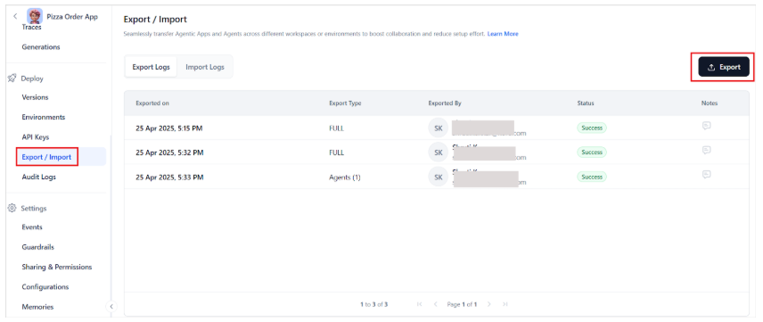

# Export Agentic Apps

The Agent Apps Export functionality lets you download and export the configuration details of one or more agent applications. This feature provides a convenient way to back up, share, or migrate agent app setups across environments. By exporting agent apps, users can preserve important app configurations, agent definitions, and tool configurations in a standardized file format for future use. This simplifies the backup and recovery process, minimizing errors and speeding up the process.

## Export Options

When exporting, choose one of the following options:

* Export the entire app - App-level export includes data and configuration related to the entire application. This export is useful when you want to back up or migrate the complete app setup. It includes:
    * Application metadata
    * All configured agents
    * Tools and their configurations
    * Application-level configurations
    * MCP server configurations
    * Custom memory store definitions
* Export one or more individual agents- Agent-level export is limited to one or more agents and includes details required to replicate or transfer a specific agent's functionality. It includes:
    * Agent metadata and configuration
    * Tools used by the agent
    
!!! note

    The tool configurations are part of the app-level export. 

## Export App and Agents

To export an agentic app or an agent, follow these steps:

1. Open the Agentic app and go to the Export/Import page.
1. Select the **Export** option in the upper-right corner.

    

1. Choose your preferred export type. 

    

1. For app export, select the [versions](deployment/app-deployment.md#app-versioning) of the apps and the agents you want to export and select **Export App**.
1. To export one or more agents, select the agents and the corresponding versions and select on **Export Agent** option.

    

**Exported File Details**

Exporting an app or an agent exports all the configurations to a JSON file that is downloaded to the local filesystem. The exported JSON file can be imported into another environment or restored in the same environment to recreate the app setup. Follow the naming conventions when saving the downloaded file:

* App export filename: app-&lt;app-name>-&lt;date-time>.json
* Agent export file: agents-&lt;app-name>-&lt;date-time>.json