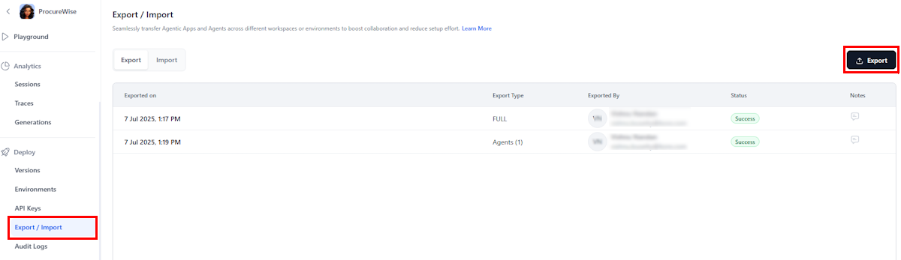
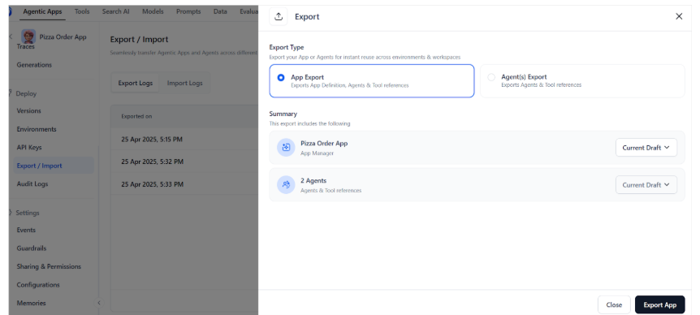
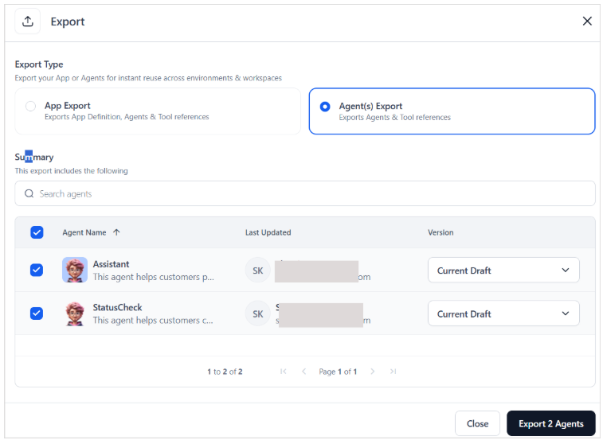

# Exporting Agentic Apps

The **Agent Apps Export** functionality allows users to easily download and export the configuration details of one or more agent applications. This feature provides a convenient way to back up, share, or migrate agent app setups across environments. By exporting agent apps, users can preserve important app configurations, agent definitions, and tool configurations in a standardized file format for future use. This simplifies the backup and recovery process, minimizing errors and speeding up the process.

## Export Types

You can choose to:

* Export the **entire app** - App-level export includes data and configuration related to the entire application. This export is useful when you want to back up or migrate the complete app setup. It includes:
    * Application metadata
    * All configured agents
    * Tools and their configurations
    * Application-level configurations
    * MCP server configurations
    * Custom memory store definitions
* Export **one or more individual agents**- Agent-level export is limited to one or more agents and includes details required to replicate or transfer that agent's functionality. It includes:
    * Agent metadata and configuration
    * Tools used by the agent
    
    Note that the tool configurations are part of the app-level export. 

## Steps to Export

To export an Agentic app:

* Open the Agentic App.
* Go to the Export/Import page.
* Click on the Export button on the top right.

    

* Next, select the type of export you want. You can export the entire app, including agents and tools, or selectively export one or more agents. 

    

* For app export, select the versions of the apps and the agents you want to export and click Export App.
* For exporting one or more agents, select the agents and the corresponding versions to be exported and click on Export Agent button at the bottom.

    

## Exported File Details

Exporting an app or agent exports all the configurations to a JSON file and is downloaded to the local machine. The exported JSON file can be imported into another environment or restored in the same environment to recreate the app setup. File Naming Conventions for the downloaded file:

* App export file: app-&lt;app-name>-&lt;date-time>.json
* Agent export file: agents-&lt;app-name>-&lt;date-time>.json