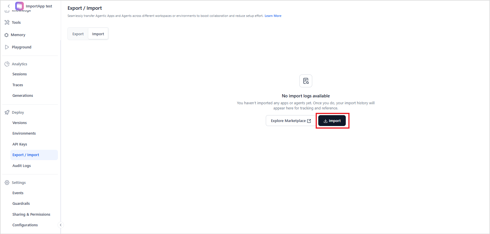
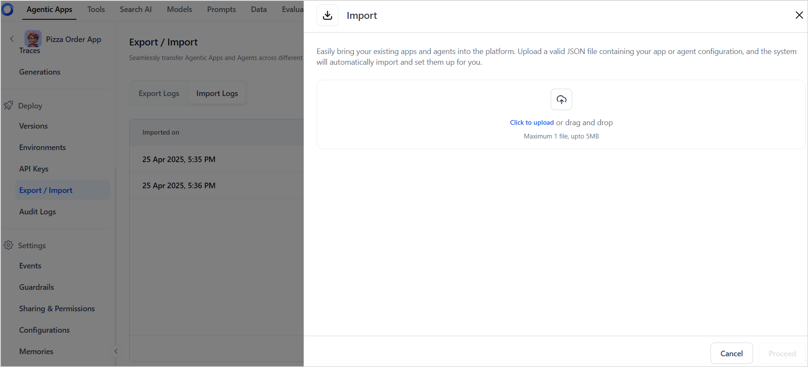
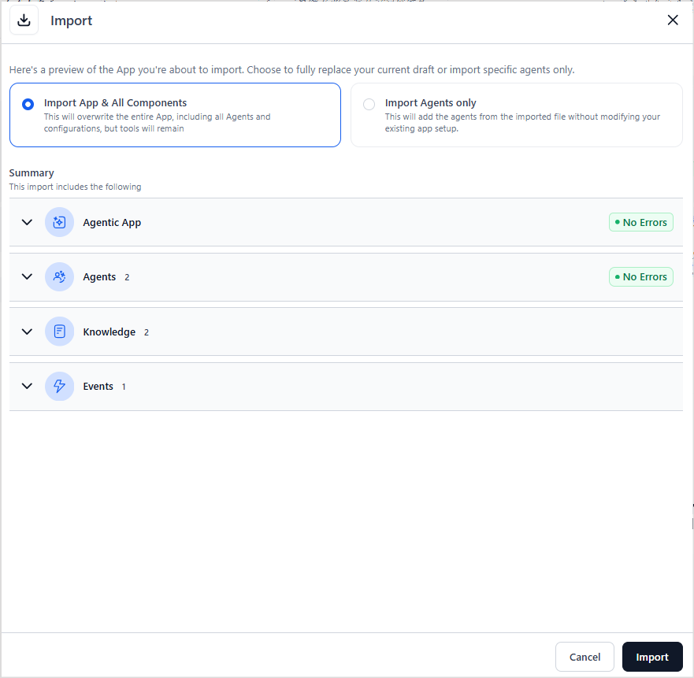
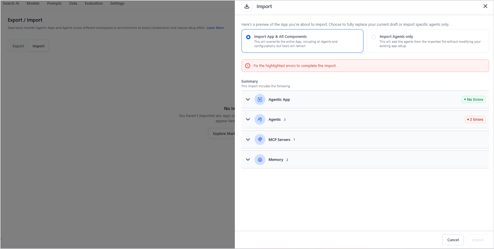
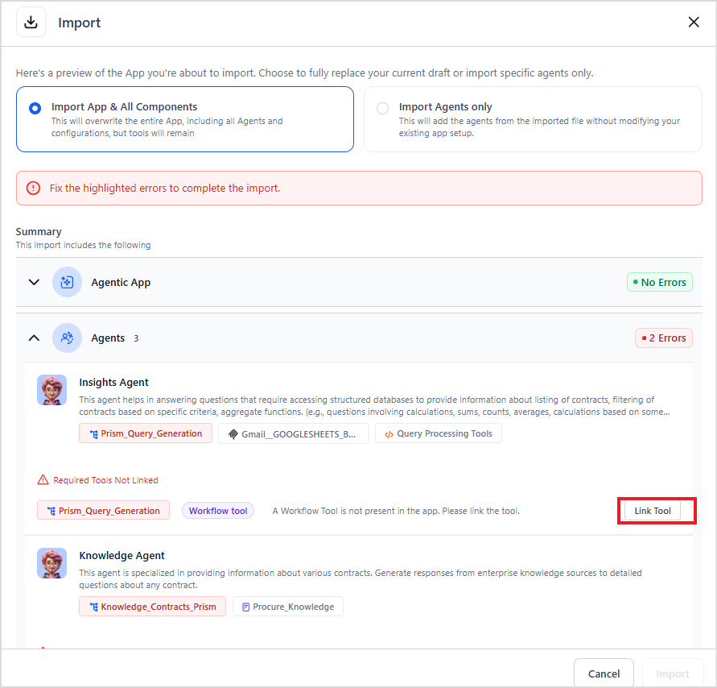

# Import Agentic Apps

The Agentic App Import feature enables users to transfer complete application configurations between environments. This capability facilitates the reuse, sharing, and version management of agentic applications.
The agentic app import feature enables users to transfer complete application configurations between environments. This feature facilitates reuse, sharing, and [version management](deployment/app-deployment.md#version-management){:target="_blank"} of agentic applications.

## Prerequisites

* You can import the apps and agents from the JSON files. 
* The user must have import permissions. 
* Currently, imports can be done only into existing applications. To import an app, create a new app and use the import option to overwrite the app's configuration.  

## Steps to Import Apps and Agents

To import apps or agents into an agentic app, follow these steps. 

* Go to the **Export/Import** page under the **Deploy** section of the newly created app. 
* Go to the **Import** tab. 
* Click the **Import** button and upload the JSON file from which the application is to be imported.  Note that the file size cannot exceed 5MB.

* Upload the config file to use for importing and click Proceed. 

* Review the app components before importing. Upon uploading the file, the page shows a summary of all the agentic app components in the JSON file:
    * Agentic App Summary - Name and Description of the app. 
    * Agents - A list of agents, along with their descriptions and the tools associated with each agent. External agents are clearly marked for easy identification. Visual cues on this page will help differentiate between the three types of tools. Note that the workflow tools are not exported with the app exports. They need to be exported individually. Hence, during import, workflow tools must be explicitly linked to the corresponding tools after they are imported. 
    * Tools - a list of tools not associated with any of the agents is listed separately under Tools. 
    * Knowledge tools associated with an app.
    * MCP servers: Servers configured in the app. 
    * Events configured in the app.
    * User-defined Memory store configurations. 

* If the file format is correct and no errors are found, the application is configured using the JSON file. 
**Note:** Importing a configuration will overwrite all existing settings in the target application.
* The status of the import can also be seen under the Import tab. 
* Review and validate the imported apps and their components.
* If there are any missing configurations found in the uploaded files, they are highlighted as errors in red and should be corrected before importing the application. 

* If there are any linked workflow tools, you need to manually import them to the new app first. Then, during the app import process, link the workflow tools in the app to the already imported tools. 

### Key Considerations for Import

* The target application must already exist. 
* Any existing app configurations will be **overwritten during the import process**.
* The system attempts to import components in the following order: **tools**, **agents**, and then **application configuration**.
* The config file cannot exceed 5MB in size.
* If valid, the platform creates the application with all components.
* If invalid, the platform displays appropriate error messages, and the import can be completed only after the errors are resolved.
* Partial imports are not supported.
