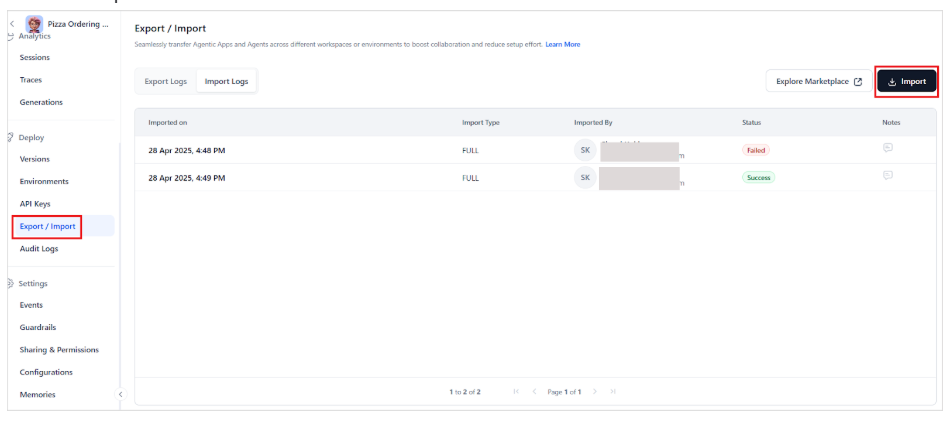
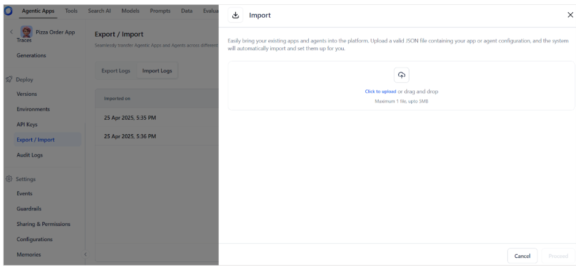

# Import Agentic Apps

The Agentic App Import feature enables users to transfer complete application configurations between environments. This capability facilitates reuse, sharing, and version management of agentic applications.

## Prerequisites

* The Apps and agents can be imported from the JSON files in a standard format. 
* The user must have import permissions. 
* Currently, imports can be done only into existing applications. So to import an app, create a new app and use the import option to overwrite the app configuration.  

## Steps to Import Apps and Agents

To import Agentic Apps or agents in an agentic app, take the following steps. 

* Go to the Export/Import page under the Deploy section of the app. 
* Go to the Import Logs tab.
* Click the Import button.

    

* Upload the config file to use for importing and click Proceed.

    

* If the file format is correct and no errors are found, the application is configured using the JSON file.  \
**Note:** Importing a configuration will overwrite all existing settings in the target application.
* The status of the import can also be seen under the Import Logs. 
* Review and validate the imported apps or agents. 

### Key Considerations for Import

* The target application must already exist.
* Any existing app configurations will be **overwritten during import**.
* The system attempts to import components in the following order: **tools**, **agents**, and then **application configuration**.
* The config file cannot exceed 5MB in size.
* If valid, the platform creates the application with all components.
* If invalid, the platform displays an appropriate error message and aborts the import.

### Rollback for Failed Imports

* If any part of the application import fails, appropriate error messages are shown and the platform rolls back all changes. Any components, tools, or agents created in the process are removed. The application either completely imports the file or fails to import it at all.