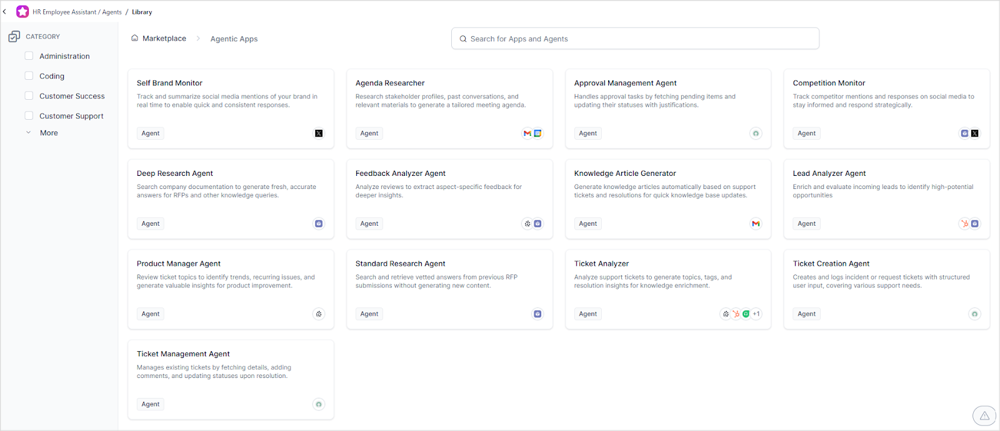

# Marketplace

The Marketplace is your centralized repository for discovering and deploying pre-built AI agents, tools, and templates—accelerating agent development without requiring code. With over 250 industry-specific templates integrated with 150+ business applications, the Marketplace transforms how you build and deploy agentic solutions.

## Key Benefits

* **No-Code Development**: Build agents declaratively using pre-configured templates
* **Industry Accelerators**: Access domain-specific solutions across service, work, and process domains
* **Extensive Library**: 250+ templates covering various industries and use cases
* **Pre-built Integrations**: Connect seamlessly with 150+ business applications
* **Preview Before Install**: Review template definitions, integrations, and use cases before deployment
* **One-Click Installation**: Deploy immediately with customization options to match your requirements

## Usage Approaches

### 1. Deploy Complete Apps

Start with a fully functional agentic app:

* Select a pre-built app matching your business needs.
* Deploy as-is for immediate value.
* Customize agents and tools to fit specific requirements.

### 2. Enhance Existing Apps

Extend your current apps:

* Import individual agents or tools.
* Add new capabilities to existing workflows.
* Mix and match components for optimal functionality.

## How to Use the Marketplace

### Installing a Complete App

1. Access the Marketplace on the [Agentic Apps](https://agent-platform.kore.ai/apps) page or navigate directly to the [Marketplace](https://kore.ai/marketplace/).

    

2. Browse by category and select an agent to view its capabilities, associated tools, model compatibility, and language support.

       

3. Select required tools from dropdown menus, click **Install App** and proceed to import.

       

4. **Setup is completed**:
    * The app, agents, and tools are created in your workspace.
    * (Optional) Connect to Search AI for knowledge base integration. [Learn more about Knowledge Tool Integration](https://docs.kore.ai/agent-platform/ai-agents/knowledge/overview/).

### Enhancing an Existing App

1. Navigate to [Agentic Apps](https://agent-platform.kore.ai/apps), choose an existing app and click **Explore Marketplace**.

    

2. Browse by category and select an agent to view its capabilities, associated tools, model compatibility, and language support.
       

3. Click **Select Tools > Install**, choose the target app, and proceed with **Import**.

    

## Testing and Deployment

### Simulate and Test

Before launching, ensure your configuration is validated:

* Assess agent responses and behaviors
* Confirm tool integrations
* Simulate real-world scenarios

See [Simulate and Test the App](https://docs.kore.ai/agent-platform/ai-agents/agentic-apps/app-testing/).

### Deploy to Production

After successful testing:

* Finalize configurations
* Deploy across target environments
* Monitor performance and usage

See [App Deployment Guide](https://docs.kore.ai/agent-platform/ai-agents/agentic-apps/app-deployment/).