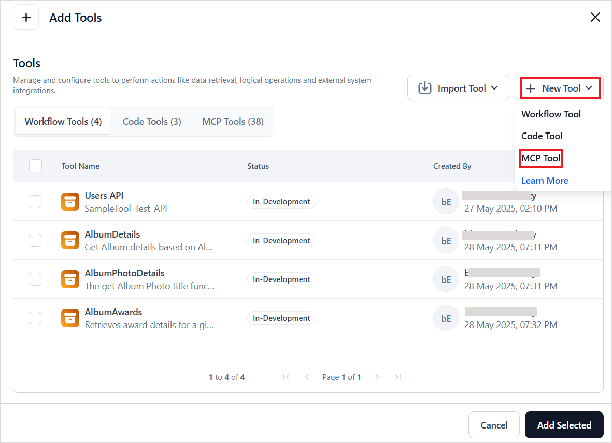

# MCP Overview

The Model Context Protocol is an open standard that provides a way for AI models to interact with external tools, data, and services. It simplifies integration by creating a universal interface for AI to communicate with different systems. It acts as a universal connector. 

MCP follows a client-server architecture, where:

* MCP server exposes specific capabilities through the standardized Model Context Protocol.
* The host or MCP client(in this case, Agent Platform) connects to the server, discovers available tools, and invokes them as part of agent workflows.

[Learn More.](https://docs.anthropic.com/en/docs/agents-and-tools/mcp)

Agentic Apps enable seamless integration with the MCP server, allowing the apps to use the tools hosted by the MCP server. 

**Key Points:**

* Currently, only **tool discovery and invocation** from MCP servers is supported. 
* The integration between Agent Platform and the MCP server is **static** in nature. Any updates to the MCP server (like changes in tool definitions or additions) require manual reconfiguration with the MCP server. Dynamic updates are not supported. 
* Currently, only **SSE-based MCP server endpoint configurations** are supported.


## Configuring an MCP Server in an Agent

To integrate tools from an MCP server into an agent, follow these steps:

Navigate to the **Tools** section of the app and click on **Add Tool**. Click on **+New Tool** to configure a new MCP server and add tools. 




Provide the MCP server configuration on the following page. 


**Name**- Provide a unique name for the MCP server. 

**Description**- Provide a description of the capabilities/tools offered by the server. 

**Request Definition** - Define how the platform should send a request to the MCP server to fetch available tools. Click **Configure** and provide:

* HTTP Method: the method used for the request like, `POST` or `GET.`
* URL: Endpoint that returns tool definitions.
* Headers:  Any required headers like Authorization tokens.

Click the **Test** button to fetch tool metadata from the MCP server. 

Upon successful connection, the platform displays the list of all the tools offered by the MCP server. Select the required tools and click **Add Selected** to add the tools to the agent. 


### Tool Naming Convention

To avoid naming conflicts and help identify the source, imported tool names are automatically **prefixed with the MCP server name**. 

Format: 
```
<MCP server name>__<Tool name as exposed by the server>
```

For instance, if the tool name is GMAIL_DELETE_DRAFT and the MCP server name is “GoogleMCP”, the tool name will be listed as GoogleMCP__GMAIL_DELETE_DRAFT.