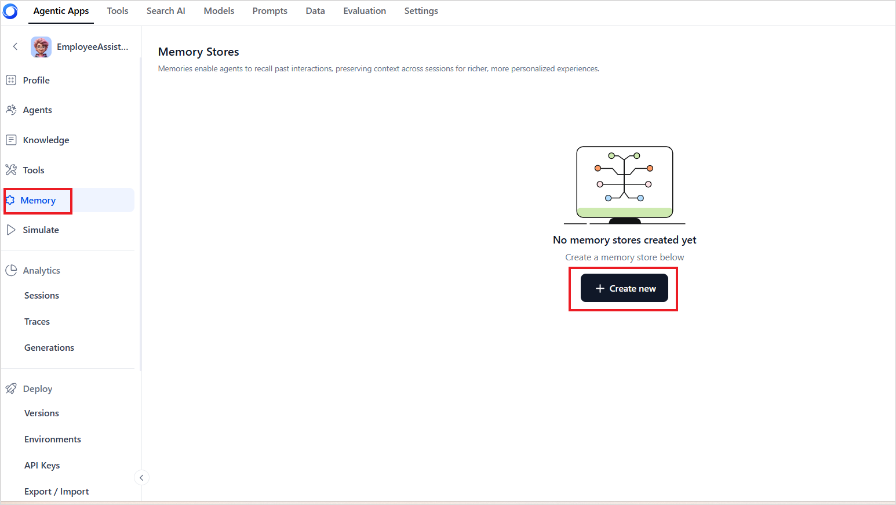
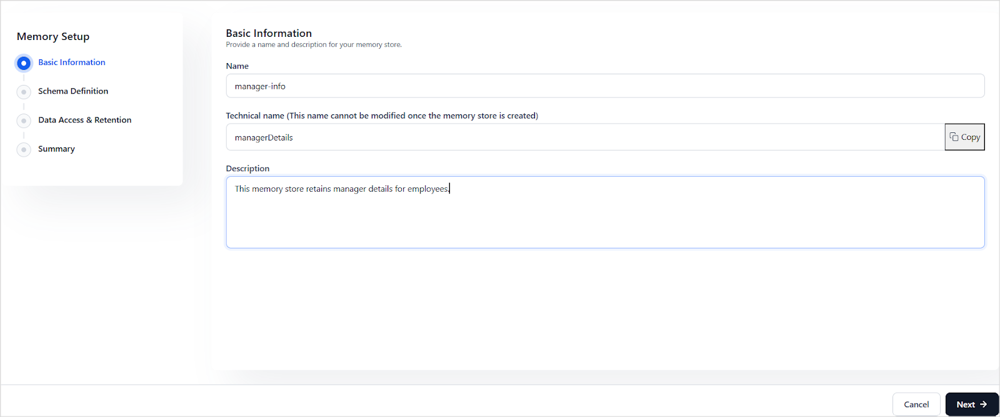

# Memory Stores in Agentic Apps

Memory stores in Agentic Apps enable agents to retain, access, and manipulate information during a session or across multiple sessions or interactions. They are essential for building intelligent, personalized, and context-aware experiences by maintaining data during agent workflow executions.

Agentic Apps support two main types of memory:

* **Session Meta Memory**: Default temporary memory for contextual data within a session. This is a default read-only system memory and cannot be directly updated by users. 
* **Custom Memory Stores**: Persistent, user-defined stores that can be read and written to using code tools. The lifetime of the memory store varies as per the access type assigned to the store during creation. 


## Creating Memory Stores

To create a new memory store, go to the Memory page in the app and click on **Create new**.  





To set up Memory store, provide the following details. 

**Basic Information**

**Name**: Provide a user-friendly name for the store. 

**Technical Name**: Provide a unique name for the store. This name **cannot be modified** after the store is created. Note that this name should not have any special characters or spaces. This is the name that is used within prompts and code tools to refer to the memory store. 

**Description**: Provide a brief summary describing the intended usage or purpose of this memory store.




**Schema Definition**

Define the structure of the data to be stored in the memory store. This schema ensures consistency and clarity in how data is stored and accessed. The schema is defined using the[ ](https://json-schema.org/)**JSON Schema** specification. It outlines the expected fields (keys) and their data types. For instance, to define a memory store, *employee_details,* that stores the employee details like name and location, use a schema as shown below. 


```json
{
  "type": "object",
  "properties": {
    "emp_ID": {
      "type": "number"
    },
    "firstName": {
      "type": "string"
    },
    "lastName": {
      "type": "string"
    },
    "preflanguage": {
      "type": "string"
    }
  }
}
```


**Require strict adherence**: Check this option to enforce that the updates to memory exactly match the schema defined for the memory store. If there is any mismatch, the updates fail. 

**Data Access and Retention**

This section is used to control data access and retention. 

**Access Type**: This field specifies the visibility and scope of the data in the memory store. It can take one of the following values:

* **User-specific**: Data is scoped to individual users. This data is available across the sessions and is specific to the user.
* **Application-wide**: Data is scoped to the app level. This data is available to all users throughout the application, irrespective of the sessions. 
* **Session-level**: Data is only available within the same session. 

**Retention Policy**: This field specifies how long the data is retained, irrespective of the access type value. This can be set to **session-level,** in which case it is retained only for the duration of a session. Alternatively, you can specify the time( 1 day, 1 week, or 1 month) for which the data must be retained before automatically removing it from the memory store. 

!!!note
    Set appropriate retention periods based on specific usage of the data to balance performance, cost, and compliance.


<table>
  <tr>
   <td><strong>Access Type</strong>
   </td>
   <td><strong>Scope</strong>
   </td>
   <td><strong>Identifiers</strong>
   </td>
   <td><strong>Use Case Example</strong>
   </td>
  </tr>
  <tr>
   <td><strong>User-specific</strong>
   </td>
   <td>Data tied to individual users
   </td>
   <td>AppId and UserId
   </td>
   <td>Store employee language preference for each user
   </td>
  </tr>
  <tr>
   <td><strong>Application-wide</strong>
   </td>
   <td>Shared across the application
   </td>
   <td>AppId
   </td>
   <td>Store announcement message to be displayed to all employees upon login.
   </td>
  </tr>
  <tr>
   <td><strong>Session-level</strong>
   </td>
   <td>Valid only during the active session
   </td>
   <td>AppId and SessionId
   </td>
   <td>Store intermediate steps in a multi-turn dialog
   </td>
  </tr>
</table>


**Review** and **save** the configuration to create the memory store. 


## Accessing Memory Stores from Prompts

To access the content in the memory stores from the prompts, use the following format:

```{{memory.<store-name>.<field-name>}}```

Where, store-name: technical name of the store 
Field-name: name of the field as defined in the schema of the memory store. 


## Accessing Memory Stores from Code Tools


* Memory stores can be accessed within the agent and orchestrator prompts and in the code tools. However, they can be manipulated only via the code tools. 
* Memory stores are referenced using the technical name of the store. 
* *sessionMeta*, by default, populates the session information in the sessionInfo object within the store. The sessionInfo object contains the following fields.
    * sessionId
    * appId
    * sessionReference
    * userReference
    * userId
    * runId
* Memory stores can be accessed from code tools using either **JavaScript** or **Python**. The format remains the same for both. 


### Reading from Memory Store

Use the following format to access a memory store in the code tools and retrieve either the complete record or specific fields using **projections**. 


```
memory.get_content(<store_name>,<projections>)
```


Where, 

store_name: The technical name of the store. 

projections: fields of the JSON document object used to identify the document from the store. This is optional. If projection is omitted, the complete record is returned. 

**Examples**:

  1. To fetch the complete employee record from the store defined above, use the following 
    ```
    memory.get_content("employee_details")
    ```
    
  2. To fetch the first name of the employee from the store, use:
    ```
    memory.get_content("employee",{"firstname":1})
    ```
    Here, `{"firstname": 1}` is a **projection object**, indicating that only the `firstname` field should be included in the result.

  3. To fetch both first name and location (subset of the complete record), use:
    ```
    memory.get_content("employee", {"name": 1, "preflanguage": 1})
    ```

### Writing to Memory Store

Use the following format to create or update a record in the memory store. This method:

* Creates a new record if none exists.
* Updates the existing record if one is found (based on sessionID, userId, or applicationId, depending on the store’s access type).

```
memory.set_content(<store_name>,<data_object>)
```

where, 
store_name: the technical name of the store. 
data_object:  A JSON object representing the fields to write or update in the memory store.

**Note**
  * Records are stored based on the memory store’s access context: **session**, **user**, or **application**. 
  * Fields not included in the update are retained as-is.

**Examples**

  1. To update the name in a record. Based on the access type of the memory store, if the corresponding record does not already exist, the following method will create a new record and set the firstname as John. 
  ``` 
  memory.set_content("employee",{"firstname":"John"})
  ```
  If, however, a record exists but the firstname is different, this method will overwrite the first name in the same record.

  2. To update multiple fields, specify the fields to be updated in the data_object. 
  ```
  memory.set_content("employee", {
    "firstname": "John",
    "preflanguage": "English"
  })
  ```

### Deleting Content from Memory Store

To delete a record from the memory store, use the following format. Depending on the access type of the store, the following method will delete the record corresponding to the session, user, or application. 


```
memory.delete_content(<store_name>)
```

Where, store_name: technical name of the memory store from which content is to be deleted. 

**Example**

To delete the employee details from the store. 


```
memory.delete_content("employee")
```


## Session Meta Memory

The `sessionMeta`memory store is the **default memory store** used in Agentic Apps for handling metadata and session-specific information. It is typically used to:


* Store **temporary session data.**
* Maintain **contextual metadata**

**Schema**

This memory store follows the following schema:


```
{
  "type": "object",
  "properties": {
    "metadata": {
      "type": "object"
    },
    "sessionInfo": {
      "type": "object"
    }
  }
}
```


The **metadata** field is used to maintain any contextual metadata information. ***Developers can update this field only via the APIs or while accessing the platform via XO or AI for Work.***

The **sessionInfo** is a system-populated object that includes the following session-related fields:

* sessionId
* appId
* sessionReference
* userReference
* userId
* runId

**Scope and Identification**

The scope of this memory store is limited to a **session**. The content in this memory store is identified using **appId** and **sessionId**. 

**Accessing sessionMeta**

To access the sessionMeta from agent and orchestrator prompts, use the following format:


```
{{memory.sessionMeta.<field-name>}}
```


For example, you can add the user name to the prompt as follows if the metadata has the name of the employee. 

The name of the employee is {{memory.sessionMeta.metadata.empName}}

Note: This is a read-only memory store and cannot be updated via tools. However, you can update the metadata field in sessionMeta via APIs. Refer to [this to learn more](../../apis/agentic-apps/execute.md).
