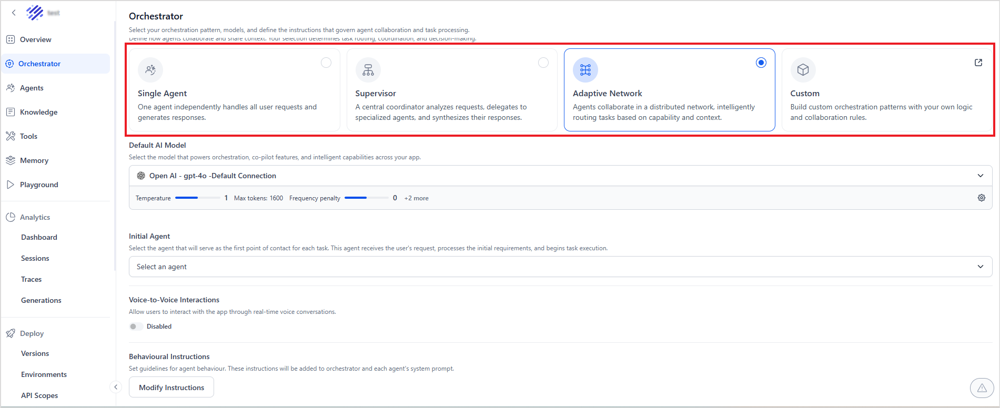

# App Orchestrator 

This page allows you to select the orchestrator pattern for the app and make the required configurations for the same. 

An orchestration pattern refers to the architectural pattern or structured approach in which multiple agents coordinate, communicate, and execute tasks to accomplish a goal. It defines how agents work together, take control of the execution flow, delegate tasks, and make decisions or resolve conflicts.

Agent Platform supports the following types of orchestration patterns:

1. Single Agent - The application can use this pattern of orchestration when it consists of a single agent that independently handles the requests and generates responses. This is ideal for apps with one primary capability.
2. Supervisor - This pattern introduces a central controller that analyzes requests, delegates tasks to specialized agents, and synthesizes the response based on the agent responses. [Learn More](../supervisor.md). 
3. Adaptive Network - In this pattern, the agents collaborate in a distributed manner, intelligently routing tasks based on their capabilities and context. [Learn More](../adaptive-network.md). 
4. Custom - (In)Agent Platform also enables you to build custom orchestration patterns with custom logic and rules using the SDK.

## Orchestrator Configuration

For each orchestration pattern, configure the following. 

* Default AI Model - Select the AI model that the app will use for all operations. It also displays the selected model’s default settings. Use the gear icon to configure the AI Model settings. Configuration properties vary depending on the selected model. Refer to the model’s official documentation for details.
* Voice-to-Voice Interactions - Enable this field to allow users to interact with the app via real-time voice conversations. Once enabled, provide the AI model that processes speech and generates voice responses. Refer to [this](../../models/supported-models.md) for the list of supported models. Use the gear icon to modify the model settings. Note that the configuration properties vary by model. 
* Behavioral Instructions  - Use this section to set the guidelines for the agent's behavior. The system automatically adds these instructions to the orchestrator prompt and the system prompt of each agent. Click Modify Instructions, then enter the prompt. 

### Supervisor Configuration 

In addition to the configurations discussed above, configure the following for the Supervisor pattern. 

* Orchestrator Prompt - A set of instructions for the supervisor of the app. This should include instructions and requirements that guide the orchestrator's decision-making process.

### Adaptive Network Configuration

In addition to the configurations discussed above, configure the following for the Adaptive Network pattern. 

* Initial Agent: Select the agent that will serve as the first point of contact for each task. This agent receives the user's request, processes the initial requirements, and begins task execution.

For this pattern, configure the agents with the delegation rules. [Refer to this to learn more](../network-orchestration.md). 
