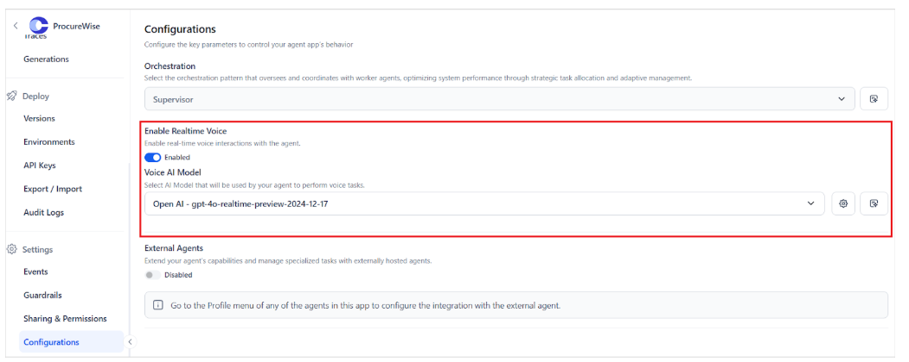

# Real Time Voice Integration

(In)Agent Platform supports **real-time voice interaction** powered by advanced Voice AI models. This feature allows users to engage in natural conversations with AI agents through voice, as spoken input is recognized, processed, and responded to with minimal delay.

## Enabling Voice Support

Navigate to the Agentic app’s Configuration and enable Realtime Voice. This feature uses AI models to perform voice tasks. Select the appropriate model to be used for this integration. 

   

Click the settings icon to customize the configuration of the AI model. 

* Voice AI Model: This model is responsible for interpreting user queries and generating spoken responses. Currently, (In)Agent Platform supports only OpenAI models. Refer to[ this to learn more about adding an external model to (In)Agent Platform](../../models/external-models/add-an-external-model-using-easy-integration.md).
* Temperature: This config controls the randomness and creativity of the responses. The value for this field can range from 0 to 1.2
    * Lower values (e.g., 0.2–0.6) produce more focused, deterministic answers.
    * Higher values (e.g., 1–1.2) make responses more creative and varied.
* Max Tokens: The maximum length of the model's response in tokens. This config can take values from 1 to 32000. Consider the following while setting this value.
    * A **low token limit** (e.g., 100–300) ensures short, concise answers, ideal for real-time voice interactions, whereas a **higher token limit** (e.g., 500–1000+) allows for more detailed and elaborate responses, more suited for multistep instructions. 
    * The size of the response token directly affects the response time. 
    * For natural interactions, it's recommended to keep the token size small.
* Voice: Select the voice used by the AI to deliver audio responses.
* Voice Activity Detection Parameters: Helps the application detect when a user’s turn ends. This is done with the help of the following parameters:
    * Threshold: Adjusts the sensitivity for detecting voice activity. Lower values indicate greater sensitivity, allowing for the detection of quieter speech or shorter pauses. Whereas higher values indicate less sensitivity and wait for clearer silence.
    * Prefix Padding: Duration of audio to include in the stream before speech is recognized
    * Silence Duration: Duration of silence before the application considers the user’s message has ended
    * Type: Select the type of voice activity detection to use

When an agentic app is integrated with an (In)Business Customer Experience application through the Automation Node for voice integration, the Voice Gateway utilizes the voice capabilities of the model set up in the agentic app.
