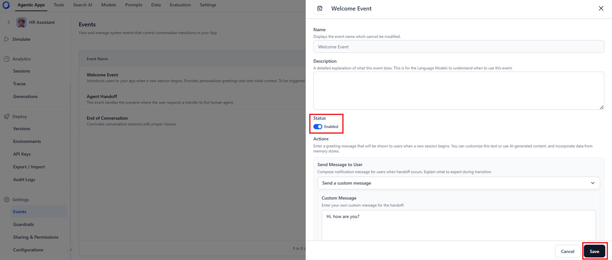
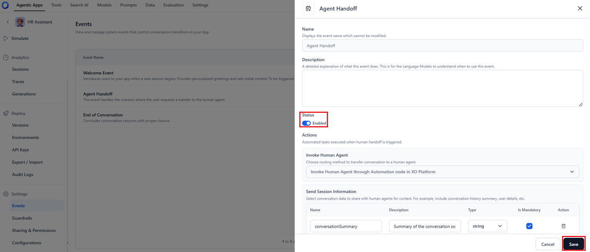
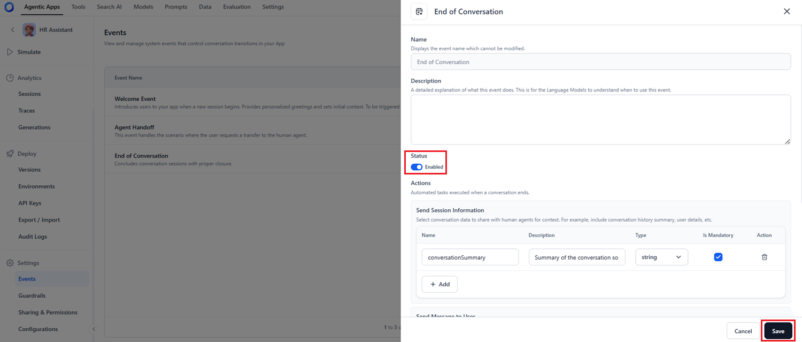

# Events

Events in the Agentic App mark critical moments in a user's conversation journey. Events are used to manage transitions such as the start or end of a conversation or handoff to a human agent. These predefined events help streamline the user experience by ensuring consistent behavior at these specific interaction milestones.

Events are system-triggered and occur at specific points in the conversation. These events are executed automatically based on system-detected conditions. These system events reflect natural transitions in a dialogue. Their purpose is to improve clarity, consistency, and control over how conversations begin, end, or escalate. Agent Platform allows developers to set up and customize the app behaviour at the trigger of these events. 

Currently, Agent Platform supports the following three system events:

1. **Welcome Event**
    The Welcome Event is triggered automatically when a new session begins with the application. It is used to deliver personalized greetings and establish the initial context, helping users understand the app's capabilities. This event is triggered only once per session, at the start of the interaction.

    By default, the event is in the Disabled state.

    To enable and configure the Welcome event, follow these steps:

    * Click on the edit icon and enable the event status.  
    * Under Actions, configure the greeting message using the Send Message to User option that users see when a new session starts. You can either use AI to generate the message or provide a custom message.

    

1. **Agent Handoff**

    This event is triggered when an agent handoff is requested in a conversation. Use the Description field of the event to configure the detection of this event. Use the following properties to configure the event.

    * **Status** - Enable this to allow the agent to trigger this event. 
    * **Invoke Human Agent** - Currently, Agent Handoff can be handled only through the Automation Node in XO Platform. 
    * **Send Session Information**: Define one or more fields to capture key details from the conversation and store them in session memory when this event is triggered.  For example, you can save an interaction summary and pass it to the agent for reference. To implement this, specify the field name and describe the expected content in the field. The application uses the context to populate these fields automatically using the LLM and saves them in the session.
    Send Message to User: Use this field to set the message that the users see when a session ends. You can either use AI to generate the message or provide a custom message. 
    * **Session Management**: Specify how the session should be handled after the event occurs, during a human handoff.
    * **Keep Alive**: Maintain the current session even after this event.
    * **Terminate Session**: End the session once the event is triggered.

    

1. **End of Conversation Event**

    This event is automatically triggered when a session ends. It can be used to deliver personalized messages or concluding comments at the end of the interaction. 
    
    This event is Disabled by default. 
    
    To enable and configure the event,
    
    * Click on the edit icon and enable the event status.  
    * The description field indicates how to identify the end of conversation and trigger this event. 
    * Under Actions, configure the event using the following fields. 
        * Send Session Information: Define one or more fields to capture key details from the conversation and store them in session memory. For example, you can save an interaction summary at the end of a session. Specify the field name and describe the expected content. The system uses the context to populate these fields automatically using the LLM and saves them in the session.
        You can add one or more fields to save session information.
        * Send Message to User: Use this field to set the message that the users see when a session ends. You can either use AI to generate the message or provide a custom message. 
        * Session Management: Specify how the session should be handled after the event occurs.
            * Keep Alive: Maintain the current session even after this event.
            * Terminate Session: End the session once the event is triggered.

        