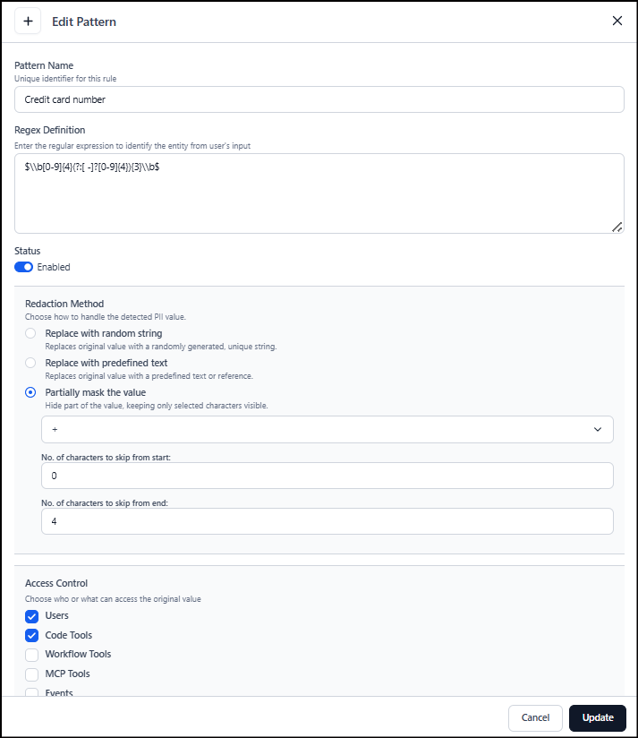

## Steps to create a PII Detection Pattern

1. Go to **PII & Guardrails** > **PII**.
2. Select **+ New Pattern** to add a new detection rule. The configuration panel appears on the right.
3. Enter a **Pattern Name** to identify the type of sensitive data you want to detect.
4. Provide the **Regex Definition** to flag the value as PII.
5. Enable the **Status** toggle to activate the pattern.
6. Choose **redact, mask, or replace** to anonymize detected values through replacement or partial masking.
7. Select **Access Control** options to specify which components can view unmasked values; unselected components receive only masked data.
8. Use **Test Pattern** to validate that your regex detects the correct values and that masking behaves as expected.
9. Select **Create** to save and activate the PII detection pattern.

