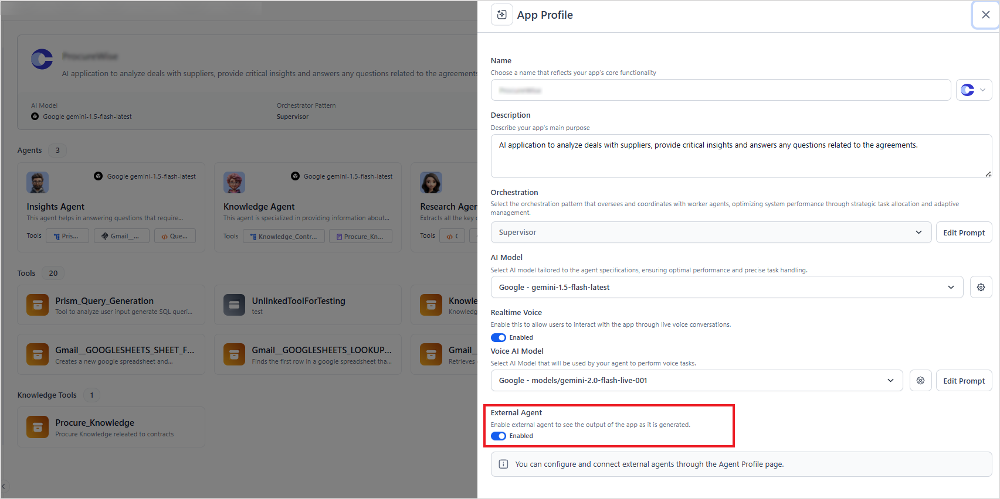
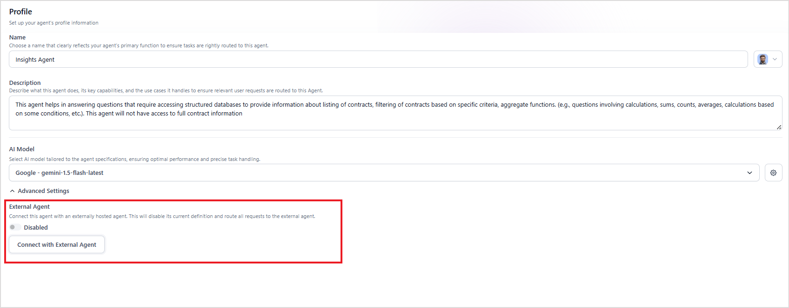
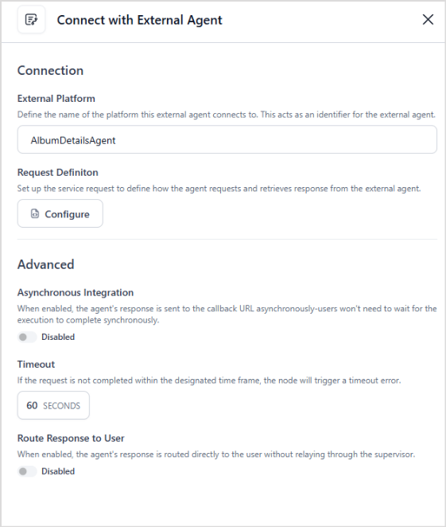
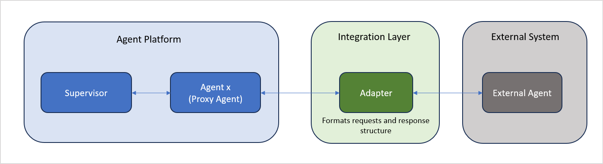

# Connect with External Agents

Enterprises often utilize AI agents built on diverse platforms, resulting in a multi-vendor environment. Rebuilding these agents from scratch to work together is costly and inefficient. To solve this, the Platform introduces a Proxy Agent Architecture, a central integration layer that enables seamless connectivity between the existing external agents and the platform. 

Proxy Agent acts as an intermediary, seamlessly relaying communication between the platform and external agents. This approach ensures the translation of protocols while maintaining the performance, security, and functional integrity of the existing agent ecosystem.


## Prerequisites

The External Agents connected to the Platform must adhere to the Agent Protocol.

## Set Up

* Enable external agents for the app.
* Configure the external agent in the app. 

### Enabling External Agents

Go to the app's Overview page. Click the edit icon at the top-right of the App Profile section and enable External Agents as shown below. 



### Configuring the External Agent

To configure an external agent, create a new agent in your Agentic app. Go to the newly created agent's Profile page and under Advanced Settings, enable External Agent and click on Connect with External Agent to configure it. 




Provide the following configuration details for the external agent and click **Save**.



* **External Platform**: Give a unique and identifiable name of the platform to which this external agent connects.
* **Request Definition**: Define the complete structure and configuration required for the proxy agent to call the external agent via its API. This includes specifying the HTTP method, endpoint URL, headers, request body, and expected response format. 
    * HTTP Method - Specify the HTTP method used by the API call (for example, GET, POST, PUT, DELETE).
    * URL - Enter the full endpoint URL to which the request will be sent.
    * Request Headers - Key-value pairs sent with the request to provide context or authorization.
    * Request Body - If the method supports or requires a payload (for example, POST, PUT), specify the body structure. Refer to the Request and Response format of the agent below. 
    * Response - The response from the API is displayed here when the Test is initiated with sample values.

Click on the Test button to initiate a sample request to the external agents and verify the connection and response format. 

* **Asynchronous Integration** - This property specifies whether the response expected from the external agent is synchronous or asynchronous. If this field is enabled, the proxy agent shows a URL that can be used as a callback URL from the external agent.
* **Timeout** - This property specifies the maximum duration (in seconds) the proxy agent will wait for a response from the external agent. If a response isn't received within this specified time, the request is considered to have failed due to a timeout error.
* **Route Response to User** - When enabled, the response from the external agent is directly presented to the user, bypassing the supervisor. This allows response to be presented in real time. Also, the response is delivered as it's without any modification or enrichment. This is ideal for scenarios where real-time responsiveness is prioritized and the external agent is fully trusted to handle user queries independently.

## Key Characteristics of the Proxy Agent

The proxy agent offers a secure and streamlined method for integrating external agents with our platform.

* Enables secure communication with external platforms.
* Supports seamless data exchange between the proxy agent and the external agent.
* Translates data formats between our platform and the external system using the Agent Protocol format described below.
* Automatically manages timeouts and communication failures for reliability.
* External agents are listed alongside native agents, ensuring a consistent user interface.
* Users get a clear visual indicator of the external agent’s status.

## Request and Response formats for the External Agent

The Proxy Agent sends the request and response to the Eternal Agent in a specific format. The external agent is expected to consume the input and provide the output in this format for seamless integration. If the external agent varies in its request or response formats, it's recommended to create an adapter that processes the request from the Platform Proxy Agent and converts it according to the external agent's specifications. Similarly, the response from the external agent should be formatted as per the specifications below.

### Request Format

Following is the format of the request object sent from the Proxy agent to the external agent. The values of all the fields are passed to the external agent dynamically:

```json
{
  "sessionIdentity": [
    {
      "type": "sessionReference",       
      "value": "string"
    },
    {
      "type": "userReference",
      "value": "string"
    }

  ],
  "input": [
      "type": "text", //Enum: "text" 
      "content": "User Input" 
  ],
   "debug": {            // Optional
    "enable": "string",
    "debugMode": "string"  // Enum: "full" | "no" | "thoughts"
  },
  "stream": {           // Optional
    "enable": "string",
    "streamMode": "string" // Enum: "token" | "messages"
  }
}
```

* sessionIdentity: This field is used to maintain sessions in conversations. This field can be used to specify app sessions or user sessions. 
* input: This field is used to pass the actual input to the external agent. 
* debug: This field enables debug mode in the external agent. Set the ‘enable’ field to true and debugMode to “thoughts”. If debugging is enabled, the response from the external agent is expected to include debug information. 
* stream: This field enables the streaming of the response from the external agent. Set the ‘enable’ field to true and set streamMode to one of the following: token or messages. The ‘streamMode’ refers to how AI-generated responses are streamed back to the user.
    * Token - Streams output token-by-token
    * Messages - Streams complete message chunks. 
  Currently, only messages are supported.
* metadata: This field allows users to pass metadata information. This data is then available in the sessionMeta memory and is available for the duration of the session. 

Learn More about the fields [here](../apis/agentic-apps/execute.md). 

### Response Format

The following is the response format expected by the Proxy agent:

```json
{
  "messageId": "msg-123",
   "output": [
    {
      "type": "text",
      "content": "Final answer"
    }
  ],
  "debug": [
    {
      "type": "thought",
      "content": "Analyzing the query...",
    },
    {
      "type": "thought",
      "content": "Processing data...",
    }
  ],
  "sessionInfo": {
     status: 'idle' | ‘busy’ | 'error';
     conversationState: 'COMPLETED' | ‘ACTIVE’| 'ERROR';
     userReference: string;
     sessionReference: string;
     userId: string;
     sessionId: string;
     runId?: string;
     appId: string;
     output?: {
        type: "text" | "image" | "file" | "audio";
     content: string;
     }
   }
}
```

Where,

* **output** is the response from the external agent. 

* **debug** is the debug information.

* **sessionInfo objects** contain session-related information. While streaming, a series of output events is sent, each with part of the total output. Ultimately, the entire output, stitched together under sessionInfo, is sent as a single unit.

## Handling Format Variations

If your external agent doesn't follow the expected format, follow the steps listed below. 

* Create an adapter to translate incoming and outgoing data.
* Adapter should:
    * Accept the Platform-defined request structure.
    * Convert it to the format required by your external agent.
    * Reformat the external agent's response to match the Platform’s response structure.


