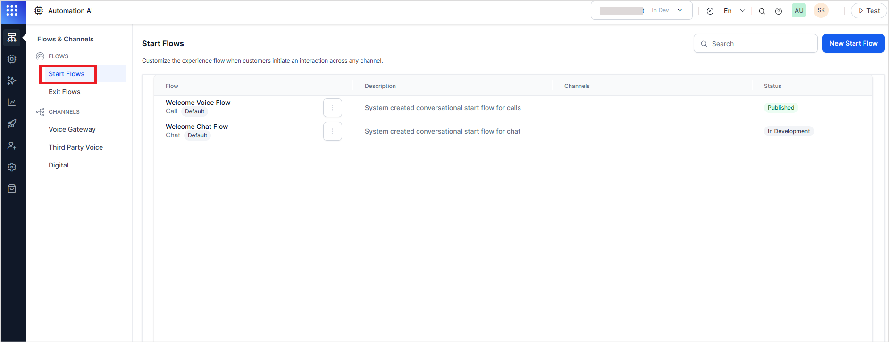
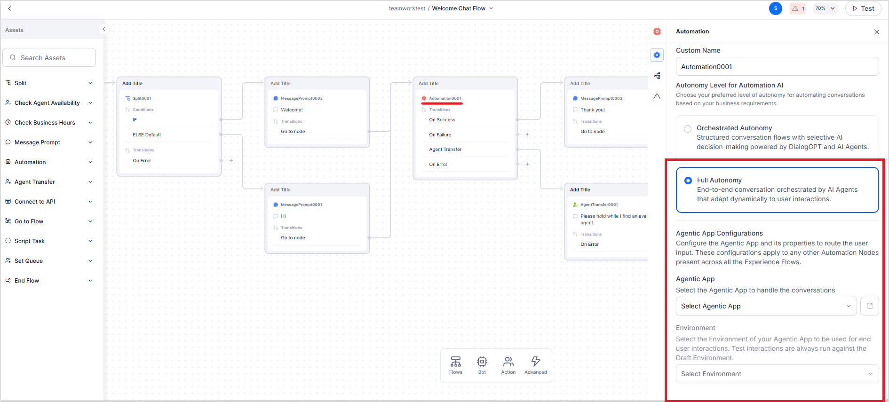

# Integrating AI for Service with Agent Platform

AI for Service (XO) is a no-code virtual assistant builder that delivers personalized, multilingual conversations across channels. Agent Platform provides end-to-end development, deployment, and advanced multi-agent orchestration for scalable agentic apps at the enterprise level. 

Agent Platform seamlessly integrates with the XO platform to create a powerfully unified solution for service scenarios. By deploying agentic apps through XO, organizations gain the combined advantages of XO's conversation optimization capabilities and the Agent Platform's sophisticated multi-agent orchestration. The XO platform's channel management, conversation analytics, and journey optimization perfectly complement the Agent Platform's agentic capabilities, creating an end-to-end solution that automates complex service interactions and continuously optimizes them based on real-time performance data. Organizations leveraging both platforms together can rapidly deploy intelligent service solutions that evolve and improve over time, driving higher customer satisfaction while reducing operational costs.

## Prerequisites

* XO and Agent Platform applications must be in the same workspace for integration.
* Ensure that the relevant channel flows (e.g., chat, voice) are set up in XO.

## Integration Steps

Integration is achieved by configuring the **Automation Node** within the Experience Flow of the desired communication channel.

**Steps**:

1. Navigate to the **Start Flows** in the XO application.

    For every interaction across a channel, a welcome flow is designed that defines the end-to-end customer experience for each communication channel.  Go to the welcome flow of the desired communication channel.  

2. Add an **Automation Node.**

    Open the flow designer and drag and drop an automation node at an appropriate point in the flow. 

3. **Configure the Automation Node.**

    Open the settings for the Automation Node. Under Autonomy Level for Automation AI, select **Full Autonomy.** This setting enables integration with the Agentic Apps in the same workspace as that of the XO application. The Agentic Apps offer fully autonomous AI Agents that adapt dynamically to the user's interactions.  

    Provide the Agentic App Configurations:

    1. **Agentic App**: Select the app to be integrated that will handle all the interactions on the given communication channel. The dropdown lists all the existing Agentic Apps in the same workspace. You can also create an Agentic App from scratch. 

    2. **Environment**: Select the Environment of your Agentic App to be used for end-user interactions. Once the flow is published, the selected environment is used in the published mode. However, the tests are always run against the Draft Environment of the selected application. 

    3. **Real-time Voice Interactions**: Enable this to support two-way real-time voice streaming via the **Kore Voice Gateway**. This feature uses multi-modal AI models for intelligent voice interactions. When real-time voice interaction is enabled, Kore Voice Gateway uses the underlying models configured in the Agentic App to add voice capabilities to the application.

    Refer to [this](https://docs.kore.ai/xo/flows/node-types/automation/){:target="_blank"} for other configurations of the node.

**Important Notes:**

* The Agentic App configuration is applied **globally across all Automation Nodes within the selected flow**. Changes to the configuration will affect all nodes in the same flow. Automation Nodes in any other flows are not affected. 

* When using the **Test** functionality in the flow designer, the execution will always refer to the **Draft** version of the selected Agentic App, irrespective of the environment selected. 

* Real-time voice feature is available only when the  **Kore Voice Gateway** is enabled. 

* Real-time voice interactions require voice support to be enabled in the associated Agentic App. [Learn more](./../ai-agents/agentic-apps/settings/app-configurations.md).