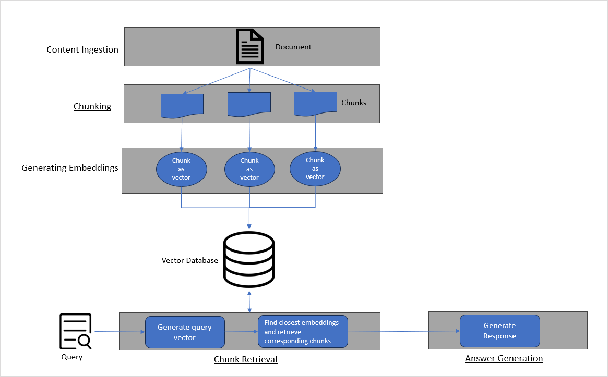

# Knowledge: Empower AI Agents with Enterprise Context 

The **Search and Data AI** is a critical enterprise context layer for AI agents, enabling them to deliver intelligent and context-aware responses. 

Without rich, relevant context, even the most sophisticated AI agents operate with significant limitations, resulting in uninformed decisions, generic responses, and failure to deliver business value. Search and Data addresses this challenge by connecting AI agents to an organization's complete knowledge ecosystem through the following key capabilities:

* **Extensive Data Connectivity**: The platform offers 100+ connectors to various content repositories and knowledge bases, including SharePoint, Confluence, ServiceNow, OneDrive, Google Drive, Slack, and Teams. This allows AI agents to access a wide range of enterprise knowledge sources.
* **Enterprise Application Integration**: Structured data connectors to business applications like Salesforce, ServiceNow, Jira, and HubSpot enable agents to access real-time business data. This integration ensures that AI agents have the most up-to-date information to respond accurately.
* **Advanced Hybrid Search Capabilities**: The platform features hybrid text and multi-vector weighted search, programmable intelligent extraction pipelines, and customizable query pipelines. These advanced search capabilities allow AI agents to retrieve the most relevant information from the indexed content.
* **Enterprise Security Compliance**: The platform integrates with existing access control mechanisms to ensure data governance and maintain security protocols. This ensures that AI agents operate within the organization's security framework.
* **Contextual Intelligence Engine**: The platform provides AI agents with dynamic enterprise and user context essential for effective operations. This contextual intelligence enables agents to deliver personalized and relevant responses.
* **Seamless Agent Enablement**: The platform supplies AI agents with relevant contextual information for handling complex tasks. This seamless integration allows agents to leverage the full potential of the organization's knowledge ecosystem.

## Knowledge Integration

Agent Platform enables easy integration with Search AI via **AI for Service** and offers seamless search capabilities on content from various sources. The Search AI application is at the core of this integration, which facilitates **Retrieval-Augmented Generation (RAG)-based search** across various content sources, such as enterprise knowledge bases, document repositories, FAQs, and third-party systems.

This advanced RAG-based architecture enables autonomous agents to deliver context-aware, accurate, and timely responses using information from knowledge sources.

## Search AI

**Search AI** is an advanced AI-driven **RAG-based search solution** that enables organizations to search across large datasets conversationally. It combines LLM capabilities with intelligent retrieval to generate accurate and context-aware answers. These answers can be provided to fulfill user queries.

Search AI enables an end-to-end workflow for creating a robust, intelligent, and scalable knowledge experience. This involves three stages, as illustrated and explained below.

### Ingestion

Integrate and index content from diverse data sources to build a unified knowledge base. Search AI provides a versatile solution for data ingestion, supporting methods such as [web crawling](https://docs.kore.ai/xo/searchai/content-sources/web-crawl/){:target="_blank"}, [directory indexing](https://docs.kore.ai/xo/searchai/content-sources/directory/){:target="_blank"}, and [connectors](https://docs.kore.ai/xo/searchai/content-sources/connectors/){:target="_blank"} for third-party applications.

### Enhancement and Vector Generation

Refine and enrich the ingested content to align with specific organizational needs and improve the quality of answer generation. Key aspects of enhancement include:

* [Processing ingested content using Workbench](https://docs.kore.ai/xo/searchai/workbench/introduction/){:target="_blank"}: Clean up irrelevant content, remove noise, tag or annotate content with custom metadata, or apply rules to exclude or update content. 
* [Selecting the most suitable embedding models and fields for vector generation](https://docs.kore.ai/xo/searchai/index-configuration/){:target="_blank"}: This involves choosing the right models to convert the content into vector representations and specifying which parts of the content (such as title, body, metadata) should be used for vectorization. This ensures that the semantic meaning of the content is accurately captured. 

### Retrieval

Set up retrieval and answer generation strategies to deliver the most accurate and relevant information to the users, including: 

* [Selecting the optimum retrieval strategy](https://docs.kore.ai/xo/searchai/retrieval/){:target="_blank"}: This defines how relevant content is fetched in response to user queries. Search AI supports Vector Retrieval and Hybrid Retrieval. 
* [Query Processing to improve retrieval relevance](https://docs.kore.ai/xo/searchai/rag-agents/){:target="_blank"}: Leverages LLM to enhance and clarify user queries by understanding the context and user intent. Also identifies key terms within a query and removes noise from the user query. This helps improve query understanding and retrieval accuracy. 
* [Answer Generation configuration](https://docs.kore.ai/xo/searchai/answer-generation/){:target="_blank"}: Define how responses are composed based on retrieved content. You can configure whether the response should be extractive (directly from content) or generative (summarized and rephrased). For generative answers, configure further properties for optimized results. 

[Learn more about Search AI](https://docs.kore.ai/xo/searchai/about-search-ai/){:target="_blank"}.

### An Example Scenario

If an AI agent is configured to provide information about a company’s product offerings, the relevant content is available on the company’s public website. Search AI enables the agent to set up a knowledge tool that indexes the website’s content. When users ask questions such as “What are the AI Solutions offered by the company?”, the agent uses the knowledge tool to retrieve and present accurate information directly from the indexed content, ensuring responses are both relevant and up to date.

