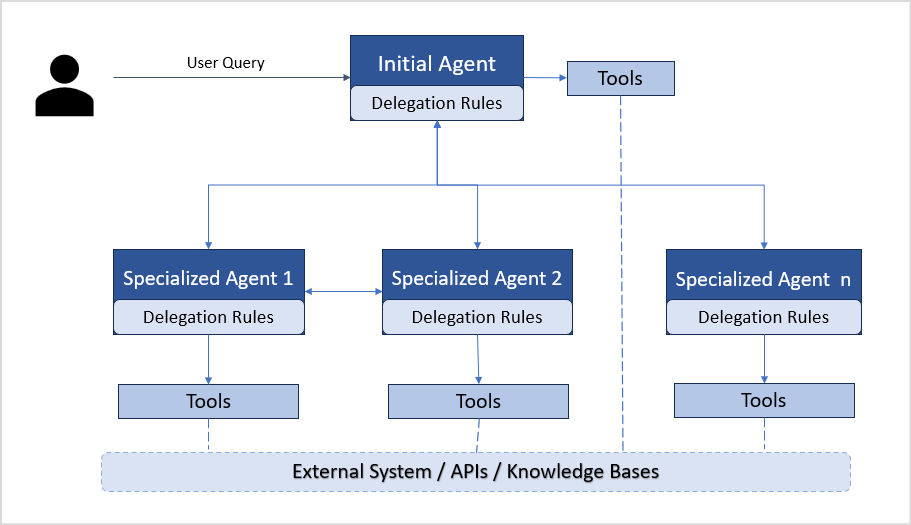
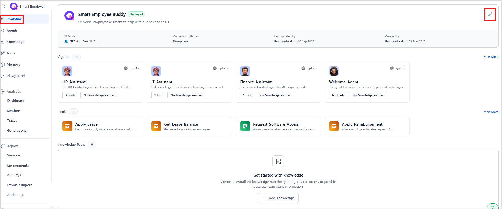
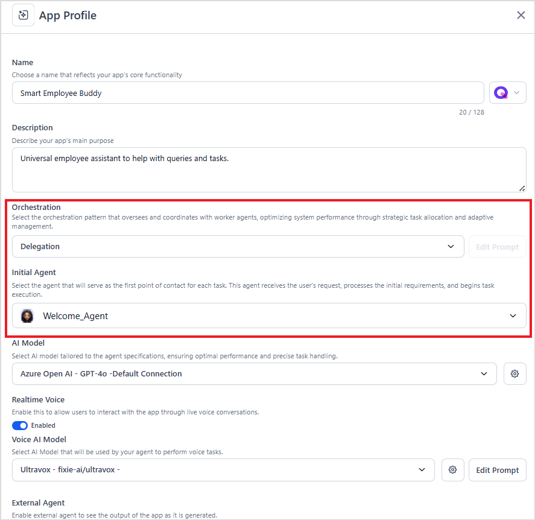
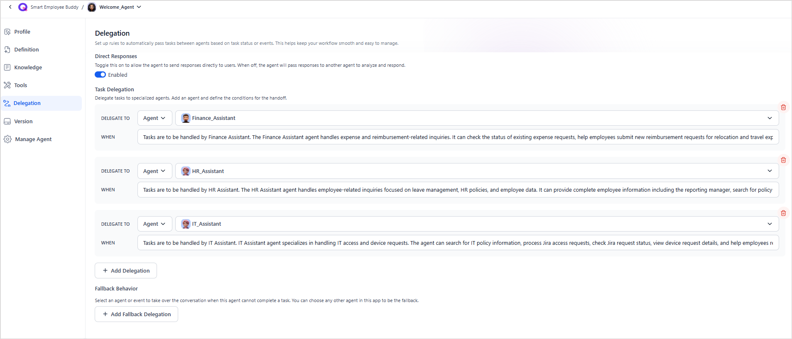
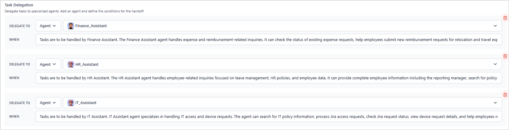

# Adaptive Network Orchestration Pattern

The Network (Delegation) Orchestration Pattern is an architectural approach for designing agentic applications where specialized AI agents dynamically transfer control and context of a task to one another based on the task's requirements. This pattern operates in a decentralized manner, allowing agents to evaluate tasks and hand them off to the most suitable agent with relevant expertise. It creates a seamless, sequential workflow optimized for tasks requiring specialized knowledge across multiple domains.

This pattern is particularly effective for scenarios where tasks evolve dynamically and the optimal agent isn't known upfront, such as in customer support, IT service desks, or multi-step problem-solving. By enabling agents to pass control while preserving conversation context, the pattern ensures efficient task resolution and a cohesive user experience without requiring a central orchestrator.

## Key Capabilities

* **Dynamic delegation**: Agents assess tasks and delegate them to more specialized agents when a task requires specialized knowledge or tools.
* **Context preservation:** The conversation context is maintained during delegation, ensuring the new agent has full knowledge of prior interactions.
* **Decentralized control and agent autonomy:** Agents can independently delegate or accept tasks based on specialization and context, without any supervisor.
* **Low latency and efficient resource usage:** Agents communicate and transfer tasks directly. Direct handoffs reduce unnecessary LLM calls and lead to faster task completion.

## Core Architecture and Functionality

This pattern follows a sequential approach to resolve a user query with the help of specialized agents: 

1. **User Input Reception**: The application receives an initial query or request from the user.
2. **Task Evaluation**: This request is sent to a designated initial agent. The agent evaluates the intent and context of the query to determine if it can handle it or if it should be forwarded to a specialized agent.
3. **Task Handoff**: The task and the conversation context are transferred to the selected agent.
4. **Task Execution**: The specialized agent carries out the task using the necessary tools. If additional user input is required, the agent communicates directly with the user.
5. **Multi-Agent Handling**: For complex queries requiring multiple agents, each agent handles the part it can and sends the query to the next agent for pending tasks. When handing off, each agent shares a summary of completed and pending tasks to preserve context and progress.
6. **Response Delivery**: The agent shares the response directly with the user. 

## Difference between the Supervisor Pattern and the Delegation Pattern

In the **Supervisor pattern**, a central Supervisor mediates every interaction between agents or between an agent and the user. The Supervisor handles decision-making, task routing, and overall flow coordination. Agents do not need to be aware of other agents' roles or specializations. This allows the Supervisor to invoke multiple agents in parallel, but introduces latency since every interaction happens via the Supervisor.

In contrast, the **Network pattern** has agents aware of other agents' specializations. They can directly hand off tasks to the most suitable agent or interact with the user themselves. The responsibility of routing lies with the agents based on their understanding of the task, rather than relying on a central coordinator. The flow is usually sequential, where one agent evaluates the task and delegates it to another specialized agent as needed.

## When to Use the Network Pattern

* **Complex multi-domain tasks**: When a task requires multiple specialists sequentially, but the exact order is unknown and is only determined during processing. 
* **Dynamic requirements**: When the requirements emerge during processing, resulting in dynamic task routing based on content analysis, like in escalation scenarios.

## Example: Smart Employee Buddy 

*Smart Employee Buddy* is an employee assistant that uses the network delegation pattern to handle a wide range of employee queries and tasks:

* **Welcome Agent** acts as the initial entry point and routes queries to specialized agents:
* **HR Assistant** handles queries related to leave, benefits, and policies
* **Finance Assistant** handles queries related to expenses, reimbursements, and payroll
* **IT Assistant** helps with IT-related technical issues and troubleshooting.

**Example Query:** *“I can’t access my payslip.”* (This could relate to IT for access issues or Finance for issues with payslip management).

The delegation process:

1. The Welcome Agent receives the query.
2. It analyzes the intent and context.
3. Based on indicators (“can’t access”) and delegation rules, the query is initially routed to the IT Assistant.
4. The IT Assistant checks for technical issues (login problems, system errors). It interacts with the user for additional information. If the issue is not IT-related, the task is re-delegated to the Finance Assistant.
5. The Finance Assistant verifies the payroll system, identifies access restrictions, and resolves the issue by granting proper access or sending the payslip directly.

## Implementing the Network Pattern

Implementing the Network Pattern in an agentic app requires:

1. Orchestration Setup in the Agentic App.
2. Configuring Delegation & Fallback Rules for the Agents.

### 1. Selecting the Orchestration Pattern for the Agentic App	

1. Navigate to the App Profile page by clicking the edit icon in the App Overview.  

2. Then, select an *Initial Agent*. The Initial Agent is the entry point for all queries and tasks. Every request is first routed to this agent, which evaluates the input before handing it off to the appropriate specialized agent. 

### 2. Configuring Delegation and Fallback Rules for the Agents 

In an agentic app that uses the Network orchestration pattern, each agent has a dedicated Delegation Section to define routing rules for smooth handoffs and uninterrupted workflows.

Configure the delegation rules for all the agents in the app: 

1. **Direct Responses**: Toggle Direct Responses to control how the current agent interacts with users
    1. Enabled: The agent can send responses directly to the user.
    2. Disabled: The agent passes responses to another agent for analysis and reply.
2. **Task Delegation**: Configure rules for handing off tasks to specialized agents
    3. Click **Add Delegation**. 
    4. From the **Delegate To** list, select the agent you want to route tasks to.
    5. Define the condition under which the handoff should occur. 
    
    Add all the delegation rules in this section that the given agent can use for routing. 
    
    For example, the following agent can delegate tasks to three specialized agents—Finance Assistant, HR Assistant, and IT Assistant —depending on the nature of the task.  

3. **Fallback Behavior**: Select an agent or event to take over the conversation when this agent cannot complete a task itself and cannot identify any other agent that can complete the task. You can configure another agent or event to automatically take over the conversation. This ensures that unresolved tasks are always routed to the correct fallback, and no task or conversation remains unresolved. 
    6. Click on **Add Fallback Delegation**.
    7. Select the fallback agent or event from the list. 
    8. Set the condition under which it should be triggered. 

    **Note**: When an event is selected as the fallback delegation, subsequent request handling depends on the event configuration. For example, if an agent handoff event is set up to escalate to a human agent via AI for Service, the fallback triggers that specific behavior.

## Passing Information Between Agents

When the control is passed from one agent to another, the data, including the context info, summary, and pending tasks, is saved to the `sessionMeta` memory under the `delegationContext` field. The next agent can use this field to get the required information. 

Additionally, the agents can also use custom memory stores to save information as required. This ensures that task-specific data is easily shared during handoffs.
