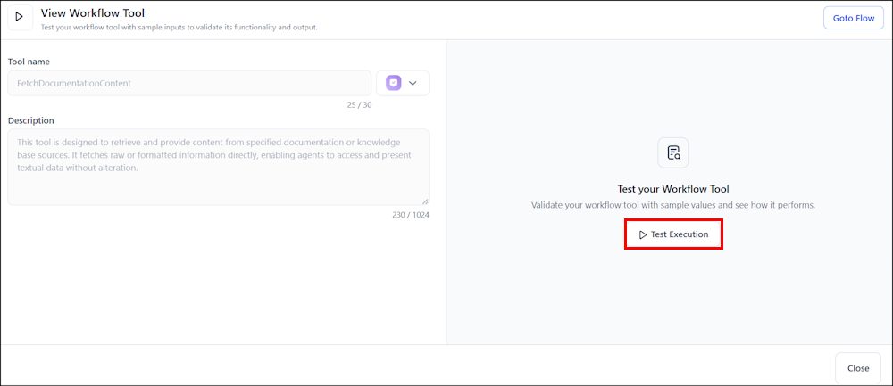
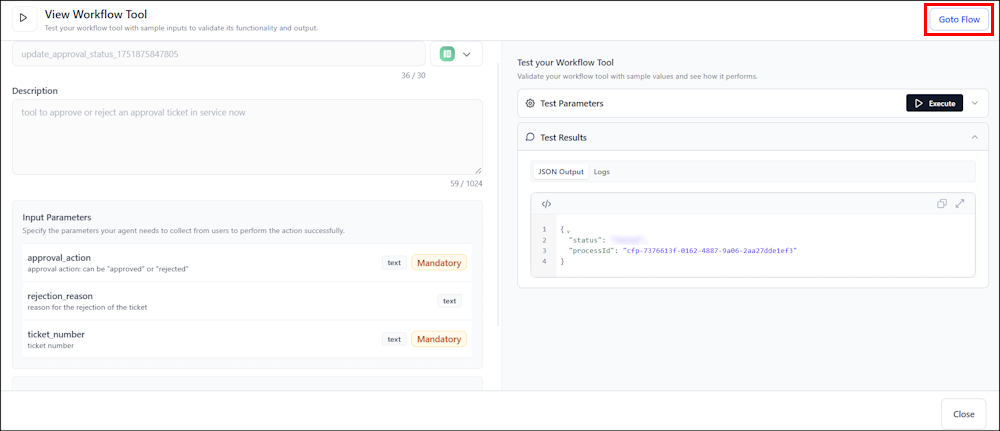

### Test a Workflow Tool

The test interface enables users to view the parameters, test, and interact with workflow tools directly within the Agentic App. It combines tool details, input parameters, and execution controls on a single screen, streamlining testing and execution.
This interface provides a consistent way to test workflow tools without leaving the current context.

**To test a workflow tool**

1. From the tools page, select a workflow tool to open its interface.

1. Review the tool name, description, and input parameters. Parameters are read-only.

1. Select **Test Query**, enter sample values for required parameters, and then select **Run Query**.

    

1. Select **Test Results** to view the output in JSON or Logs.

1. Select **Go to Flow** to edit parameters or logic.

    