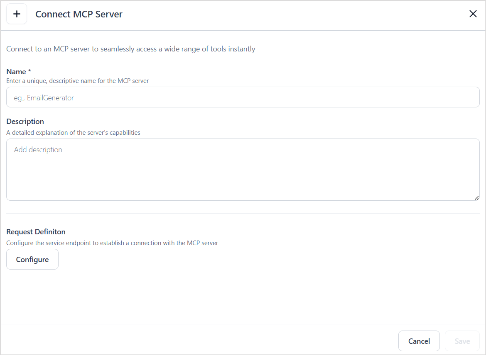
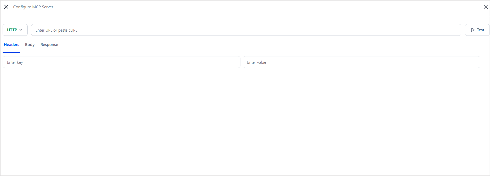
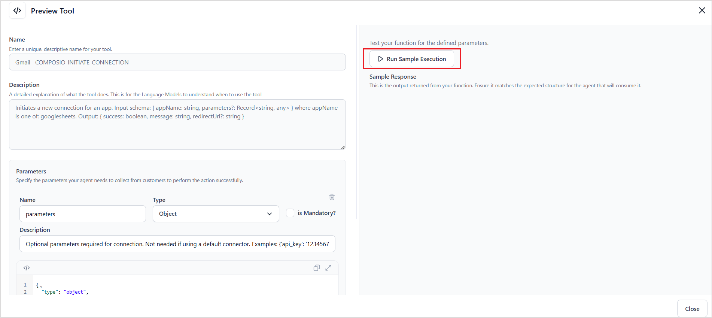
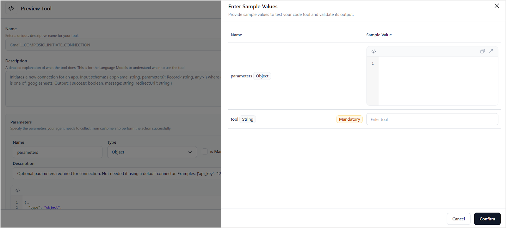
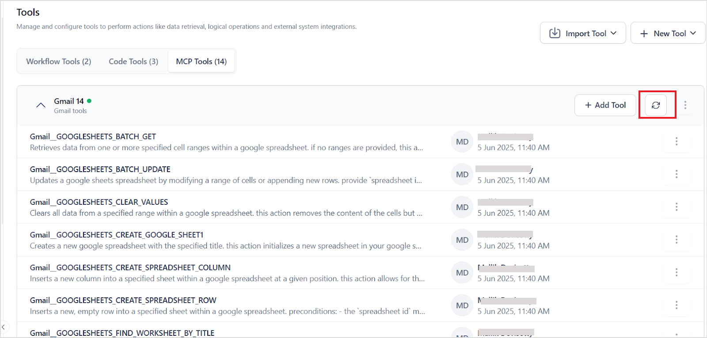
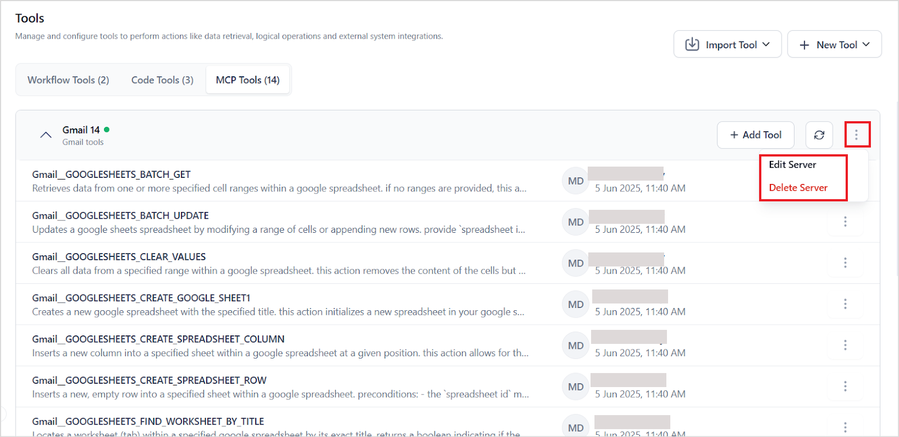

# Configuring an MCP Server in an Agent

To integrate tools from an MCP server into an agent, follow these steps:

Navigate to the **Tools** section of the app and click on **Add Tool**. Click on **+New Tool** to configure a new MCP server and add tools. 


Provide the MCP server configuration on the following page. 



**Name**- Provide a unique name for the MCP server. 

**Description**- Provide a description of the capabilities/tools offered by the server. 

**Request Definition** - Define how the platform should send a request to the MCP server to fetch available tools. Click **Configure** and and provide the MCP server configuration details.


* Select the MCP server configuration type - `HTTP` or `SSE`.
* URL: Endpoint that returns tool definitions.
* Headers:  Any required headers like Authorization tokens.

Click the **Test** button to fetch tool metadata from the MCP server. 

Upon successful connection, the platform displays the list of all the tools offered by the MCP server. Select the required tools and click **Add Selected** to add the tools to the agent. 


## Tool Naming Convention

To avoid naming conflicts and help identify the source, imported tool names are automatically **prefixed with the MCP server name**. 

Format: 
```
<MCP server name>__<Tool name as exposed by the server>
```

For instance, if the tool name is GMAIL_DELETE_DRAFT and the MCP server name is “GoogleMCP”, the tool name will be listed as GoogleMCP__GMAIL_DELETE_DRAFT.

### Tool Testing

Once an MCP server is configured, preview and test the tools to ensure they are functioning as expected. 

Testing the tools is essential as it helps validate their functionality, confirms the formats of requests and responses, identifies any issues, and ultimately builds confidence in the tools’ reliability.

To test a tool, 

* open the tool in **Preview** mode.
* Click on **Run Sample Execution**. 



* Enter sample values for the inputs and click **Confirm** to initiate a request to the MCP server. 




* The request is sent to the MCP server, and the resulting output is displayed in the **Sample Response** section.


## Updating/Reconfiguring the MCP server

Whenever there are any updates to the tools hosted via the MCP server or, reconfigure the MCP server in the Agentic App for the changes to reflect. 

Use the **refresh** icon to fetch updated content from the MCP server. 




To modify the configuration of the MCP server, click on the ellipsis in the right corner of the MCP server and click** Edit Server**. Make the necessary changes and save. 



## Security Considerations

If the MCP server includes pre-authorized tools that access Personally Identifiable Information (PII), avoid sharing the Agentic app that uses those tools. Sharing the app could grant others access to sensitive data stored on the connected servers.