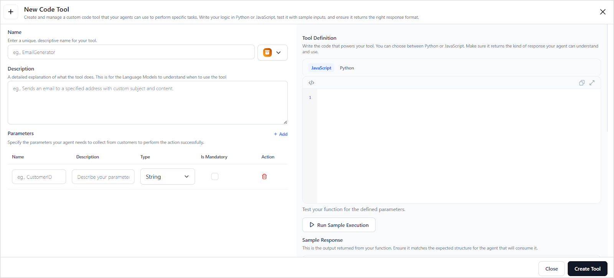
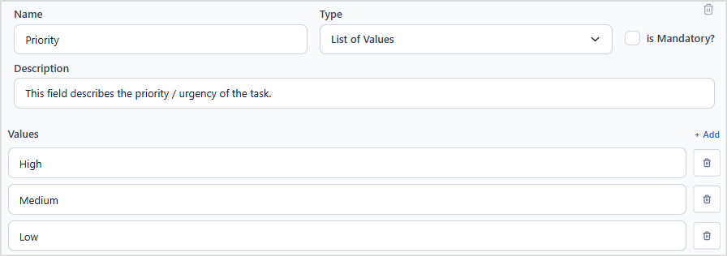
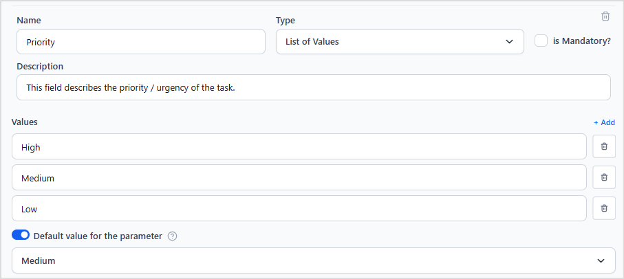

# Create a Code Tool

To create a code tool, click **+Create Tool** in the **Tools** page while creating the agent and select **Code Tool**. Provide the following details for the tool.




**Name**

Enter a **unique and descriptive name** for the tool to help identify its purpose. 

**Example**: SQL Query Processor

Don't add special characters or spaces. Only alphabets, numbers, and underscores are allowed in the name. 

---

**Description**

Provide a **clear and detailed description** of the tool’s functionality. This helps the agent understand:

* What the tool does.
* When to use it.
* How to use it.

**Example for SQL Query Processor**:

"This tool will execute an SQL query and return the result."

This field is used by the LLMs to determine when to invoke the tool. 


---

**Parameters**

Define the **input parameters** required by the tool to perform its task. For each parameter, specify:

* **Name:** A unique identifier for the parameter.
* **Description:** Explains the parameter’s purpose to help the agent extract relevant data from user input.
* **Type:** The expected data type. The following types are supported: 
    * **string**: sequence of characters
    * **number**: An integer value
    * **boolean**: true or false
    * **list of values**: A restricted set of predefined values. This type is useful when the input must be one of a specific set of options. For this type of field, add all the values that the parameter can take. For example, a parameter priority of type enum might accept values like "low," "medium," or "high."  

    * **object**. A structured data type that includes one or more nested parameters. Use this when multiple related values must be grouped. For example, a location object might include fields like building,  city, and zip code. An object type can have a nested structure. Adhere to the **Sample Schema** for detailed structure and formatting guidelines.
    
    **Defining an object parameter** 
    
    When defining the object type of parameter, 
     * use the *properties field* to list all the fields inside the object. This field is mandatory for an object type of parameter.
     * For each field in properties, specify the ***type (string, number, boolean, enum, or object)***, ***description***(optional), and ***required*** fields(optional).
     * Use the *required* array to list the mandatory fields of an object. 
     * If there is an object within this object, its type must be set as object and must have its own *properties* and *required* fields to define the fields within this sub-object. 
    
    **Example**: Assume an object field is expected to contain ID, email, and location of an employee, where ID and email are mandatory fields. The location field is an object containing the city, state, and country fields, where only city and country are mandatory. Here is a sample schema for this type of employee object. 

    ```json
    {
        "type": "object",
        "properties": {
            "id": {
            "type": "string",
            "description": "Unique user identifier"
            },
            "email": {
            "type": "string",
            "description": "User email address"
            },
            "location": {
            "type": "object",
            "properties": {     //  mandatory when type is object
                "city": {
                "type": "string",
                "description": "City where user resides"
                },
                "state": {
                "type": "string",
                "description": "State where user resides"
                },
                "country": {
                "type": "string",
                "description": "Country where user resides"
                }
            },
            "required": [
                "city",
                "state"
            ]
            }
        },
        "required": [
            "id",
            "email"
        ]
    }
    ```


* **isMandatory**: Indicates whether this input parameter is mandatory or not. 
* **Default value of the parameter**: Enable this option to assign a default value to the parameter. This default value is used whenever the parameter value isn't found in the input. The data type for the default value must be same as that of the parameter itself. For instance, if the priority isn't specified in the user input, the default value of Medium is used when configured as shown below. 


---

**Definition**

This is the core **logic of the tool**. This is the custom code that gets executed when the tool is invoked. This can be written in either JavaScript or Python.

For the SQL Query processor, below is a sample JavaScript code. 


```javascript
const fetch = require('node-fetch');

async function executeSQL(query) {
    const url = 'https://bldrhpiodbmcvhywchhd.supabase.co/rest/v1/rpc/execute_dynamic_query';
    const headers = {
        'Content-Type': 'application/json',
        'apikey': 'your-api-key-here'
    };
    const body = JSON.stringify({ query });

    try {
        const response = await fetch(url, {
            method: 'POST',
            headers: headers,
            body: body
        });

        const responseData = await response.json();
        return JSON.stringify(responseData);
    } catch (error) {
        console.error('Error:', error.message);
        return JSON.stringify({ error: 'Error in using API' });
    }
}

// Execute with input parameter
const query = $query;
return executeSQL(query);
```

Similarly, to print the booking confirmation message using Python, use the following code. 
 
```python
from datetime import datetime

def booking_confirmation(source, destination):
    return f"Ticket booked from {source} to {destination} on {datetime.now()}"

return booking_confirmation(source, destination)
```
---

**Sample Response**

Before finalizing the tool, you can test its functionality to ensure it works as expected. Click **Run Sample Execution** and provide the required input parameters. View the generated sample response to verify the correct execution of the tool.

The response also contains **logs** along with the script **result**. The logs can be used for debugging purposes. 

Once the tool is defined and successfully tested, click **Create Tool** to add it as an agent tool. The tool is then available to the agent and will be invoked automatically when a matching intent is identified. 
