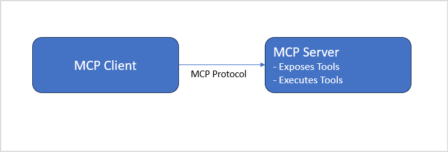
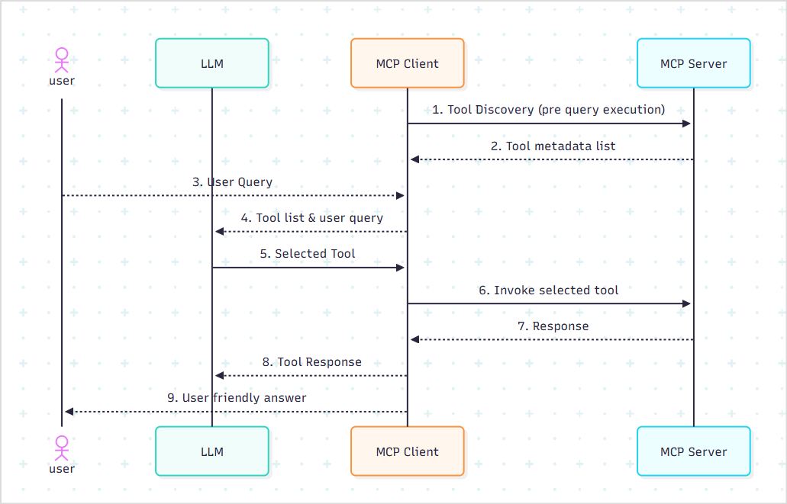

# About MCP Tools

The Model Context Protocol is an open standard that provides a way for AI Agents to interact with external tools, data, and services. It simplifies integration by creating a universal interface for AI to communicate with different systems. It acts as a universal connector. 

MCP follows a client-server architecture, where:

* MCP server exposes specific capabilities through the standardized and unified format, Model Context Protocol.
* The host or MCP client(in this case, Agent Platform) connects to the server, discovers available tools, and invokes them as part of agent interactions. The language model within the client application decides when to invoke the tools exposed by the server.
* The MCP protocol is the communication layer between these two components, defining how requests and responses are structured and exchanged. 

This decoupling of the MCP server from the client allows for greater flexibility, scalability, modularity, and extensibility. 

## MCP Client–Server Interaction Workflow

1. **Tool Discovery**

    During MCP server configuration,  the MCP Client discovers the tools available on the MCP server. This is important for the application to learn the capabilities available on the server. These tools can then be assigned to the agents for dynamic decision-making.

2. **Intent Detection and Tool Invocation**

    When a user sends a query, the list of tools and the query are sent to the LLM for intent detection and tool invocation. The LLM identifies the tool to be used and forms a structured tool call. 

3. **MCP Client Sends Invocation to MCP Server**

    The MCP Client sends a structured request to the MCP Server with the tool name and required parameters.

4. **Execution**

    The MCP Server executes the tool logic and sends the results back to the MCP client. 

5. **Response Generation**

    The agent uses the tool’s output to formulate a natural language response for the user with the help of the LLM.

### **Example: Weather Check Agent via MCP Tools**

1. The MCP server sends a list of available tools to the client.
    Includes a tool like ‘getWeatherForecast’.
2. The user submits a query to the client.
  *"What's the weather like in Dubai today?"*
3. The MCP client forwards both the query and the list of tools to the LLM. 
4. The LLM selects the *getWeatherForecast* tool as the most suitable tool to answer the user's query. 
5. The MCP client sends the tool name, ‘*getWeatherForecast’,* and parameters like region *‘Dubai’* to the MCP server.
6. The tool in the MCP server calls the external weather API and returns the weather data to the MCP client.
   Example result: "36°C, Partly cloudy, Wind: 15 km/h" 
7. The MCP client sends the result back to the LLM.
8. The LLM generates a final natural language response.
 *"The weather in Dubai today is partly cloudy with a temperature of 36°C and light winds from the northwest."*

[Learn More.](https://docs.anthropic.com/en/docs/agents-and-tools/mcp)

Agentic Apps enable seamless integration with the MCP server, allowing the apps to use the tools hosted by the MCP server. 

**Key Points:**

* Currently, only **tool discovery and invocation** from MCP servers are supported. 
* Currently, dynamic updates from the MCP server, such as changes to tool definitions or newly added tools, are not automatically reflected in the Agent Platform. Developers must manually reconfigure the MCP server and reselect the tools to apply updates. 
* Agent Platform supports both **SSE-based and HTTP-based MCP server endpoint configurations**.