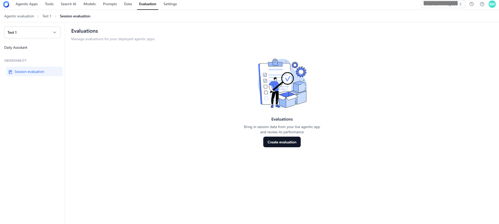
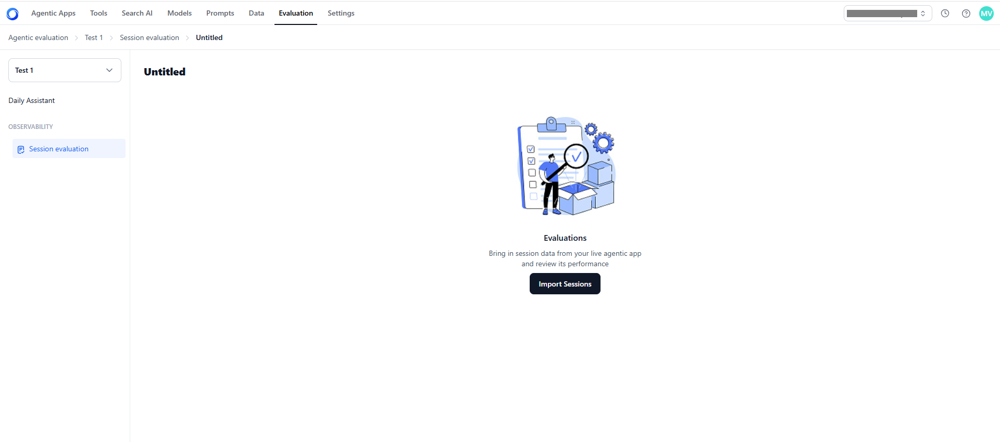

# Create Evaluations 

Once your project is set up, the next step is to create an evaluation where session data can be analyzed. Evaluations act as containers for imported sessions and are the starting point for applying evaluators.

**Steps to create an evaluation**:

1. On the Session Evaluation page, click **Create Evaluation**.
    
2. The system automatically creates a new evaluation folder.
3. Rename the evaluation if needed (a default name is assigned).

    