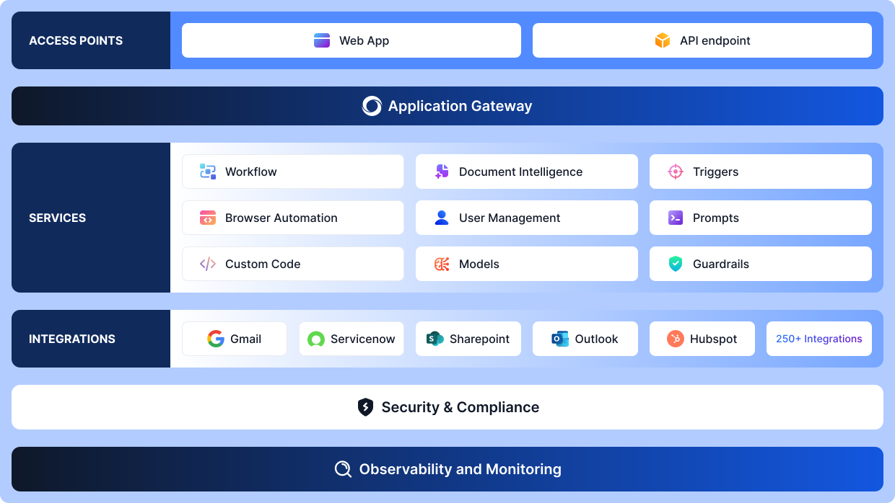

# Introduction to AI for Process

AI for Process is an enterprise-grade process automation platform that leverages artificial intelligence to streamline complex workflows across your organization. The platform enables process automation teams to build, deploy, and manage AI-powered workflows that ensure compliance, deliver consistent outcomes, and provide actionable insights while maintaining flexibility across different AI models, applications, and cloud environments.

## Use Case Examples

AI for Process is suitable for automating a wide range of business processes, for example:

* Customer service workflows that require intelligent routing and response.
* Document processing and data extraction tasks.
* Approval workflows with compliance requirements.
* Cross-system data synchronization and updates.
* Event-driven business process automation.
* Multi-step processes that require coordination between different departments or systems.

## Key Capabilities

AI for Process enables enterprise automation through a suite of integrated capabilities. These capabilities are designed to transform the design, execution, and optimization of business processes. They include ready-to-use components for immediate deployment and extensive customization options.

### Process Automation Framework

The Platform provides a comprehensive suite of tools designed to automate complex business processes:

* **Workflow Engine**: A visual, no-code workflow builder that enables teams to create and deploy agent-powered workflows without programming expertise. The engine supports both pre-built AI process agents and the creation of custom workflows, allowing organizations to automate processes tailored to their specific requirements.

* **Expert AI Reasoning**: Coordinates multi-agent interactions with intelligent decision-making capabilities. This feature enables sophisticated orchestration where multiple AI agents collaborate, each understanding when to act, respond, or delegate tasks based on business context and predefined logic.

* **Event-Driven Triggers**: Automates process flows by enabling AI agents to respond to specific events across connected enterprise systems. API triggers enable workflows to initiate automatically in response to system events, reducing manual handoffs and improving operational efficiency.

* **Human-in-the-Loop Integration**: Maintains critical human oversight by enabling AI agents to request human input or approval at key decision points. User input forms can be embedded directly into automated processes for data entry, validation, or approval workflows.

### Integration Capabilities

AI for Process seamlessly connects with your existing technology ecosystem through:

* **Enterprise System Connectivity**: Access over 250 pre-built integrations to connect AI agents with enterprise applications, databases, and services. This extensive connectivity enables agents to access the data and systems they need to execute complex workflows effectively.

* **Memory Management**: Enable AI agents to retain and recall key information across interactions, providing more personalized and contextually aware responses while reducing the need for repetitive context provision.

### Analytics and Monitoring

AI for Process provides comprehensive visibility into your automation ecosystem through:

* **Real-Time Performance Metrics**: Monitor AI agent performance with detailed analytics covering deployment statistics, execution metrics, and latency measurements. Track credit consumption, response times, and resource utilization to optimize performance and control costs.

* **Comprehensive Audit Logging**: Maintain complete transparency with time-stamped logs of all system activities. Every user action, agent decision, and workflow modification is recorded, ensuring full traceability for security and compliance purposes.

* **Model Cost Management**: Gain granular visibility into token usage across different large language models. The platform provides consumption analytics at both the agent and model levels, enabling informed decisions about resource allocation and deployment strategies.

### Model and Infrastructure Flexibility

The Platform operates seamlessly across diverse technical environments:

* **Multi-Model Support**: Deploy and manage commercial models from leading providers, including OpenAI, Google, and Anthropic, within a single workflow. The platform also supports fine-tuned models and integration with open-source models through HuggingFace for cost-effective scaling.

* **Cloud-Agnostic Architecture**: Operate across any infrastructure, including AWS, Microsoft Azure, Google Cloud, on-premise deployments, or hybrid cloud configurations. This flexibility ensures your automation infrastructure can adapt to changing organizational requirements.

### Security and Compliance Features

AI for Process incorporates enterprise-grade security measures:

* **Role-Based Access Control (RBAC)**: Manage permissions systematically by granting users access to AI agent configuration and operation based on their organizational roles. This ensures only authorized personnel can modify critical automation workflows.

* **Data Protection**: Automated data anonymization and PII masking protect sensitive information throughout the automation process. Built-in guardrails help organizations meet regulatory standards and maintain data privacy.

* **Compliance Framework**: The platform provides extensive monitoring and audit capabilities to ensure regulatory compliance. Human approval checkpoints can be inserted at critical workflow steps to validate decisions and maintain oversight where required.

## Unified Architecture for Enterprise Productivity

AI for Process is designed to provide a unified, flexible framework for implementing AI capabilities within an enterprise. It combines pre-built components, customization options, and integration capabilities to address a wide range of business needs while ensuring security and compliance.

**Key Layers and Components of the Platform**:

1. **Access Points**: Entry interfaces for users and systems
It provides entry interfaces for users, systems, and external applications to interact with the platform through various channels, including web-based interfaces, mobile applications, APIs, and direct integrations. 

2. **Application Gateway**: Central routing and management hub
It serves as the central routing and management layer, managing request handling, load balancing, and traffic distribution across the platform. It ensures secure and efficient communication between external access points and internal services.

3. **Services**: Core business logic and AI processing capabilities
It contains the core business logic and processing capabilities, including the Workflow Engine, Expert AI Reasoning, multiple AI model integrations, and the Human-in-the-Loop framework. This layer executes automated processes, makes intelligent decisions, and coordinates multi-agent interactions.

4. **Integrations**: Enterprise system connectivity
It facilitates connectivity with enterprise systems through pre-built connectors, API adapters, and data transformation services. This layer manages bidirectional data flow between AI for Process and existing organizational infrastructure, supporting over 250 enterprise integrations, including common systems such as SharePoint, Salesforce, ServiceNow, enterprise databases, and email systems.

5. **Security & Compliance**: Enterprise-grade protection and regulatory frameworks
It provides enterprise-grade protection through role-based access control, data encryption, audit logging, and regulatory compliance frameworks. This ensures all operations meet organizational and regulatory security standards.

6. **Observability & Monitoring**: System performance tracking and analytics
It delivers comprehensive visibility into system performance, tracking metrics, logs, and traces across all components. This enables proactive issue detection, performance optimization, and detailed analytics for continuous improvement.

