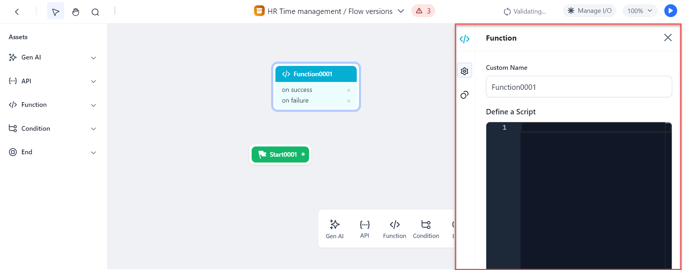
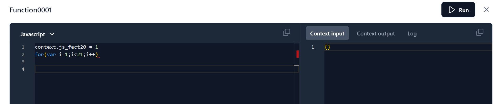
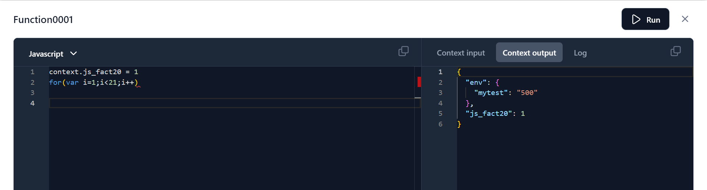
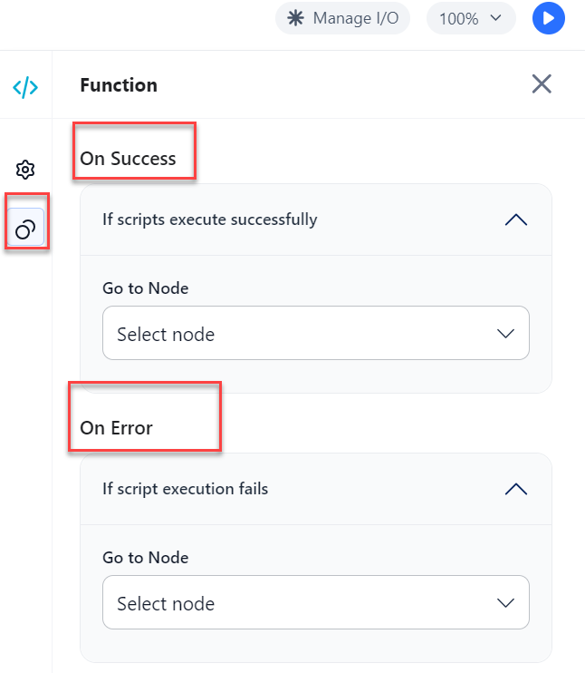

# Configure the Function Node

**To configure the Function node, follow these steps**:

1. Add a **Function** node to the canvas.
2. Click the **Function** node and the general properties dialog for the node is displayed on the right side of the page as shown in the following image.

    

1. Enter a **Custom Name** by which you will identify the node later.
2. Click the **Define a Script** box, and the **Edit script** dialog is displayed.

    

1. Select **Java** or **Python** from the drop-down list of the **Edit script** dialog.

    

1. Enter a **script** in the script box. Context variables are available for you to use while writing the script.

    

1. Click the **Copy** icon if you want to copy the code.
2. Click the **Run** button to test the script. Once the script is resolved successfully, you will be able to see the results in the **Log** section of the **Edit Script** page. You can provide the input for the script node to execute in the **Context input** section and the output of the script execution along with the variable generated is displayed in the **Context output** section. You can debug the issues based on the log report and re-run the script.

    

3. Click the **Actions** icon and select the actions that you want the node to trigger when the Functions node is successful or when it fails.

    

1. Select the **Go to Node** under the **On Success** section of the Function node configuration dialog. Based on the node you selected a respective new node is added to the canvas.
2. Select the **Go to Node** under the **On Failure** section of the Function node configuration dialog. Based on the node you selected a respective new node is added to the canvas.