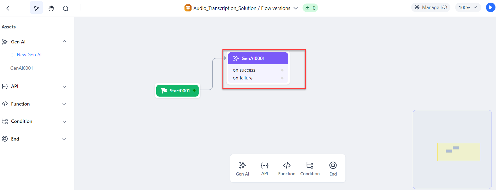
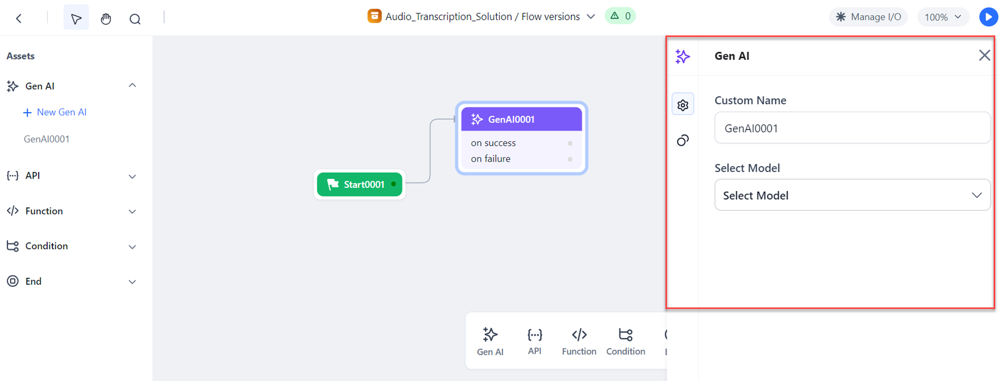
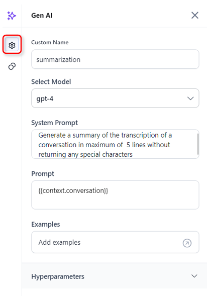
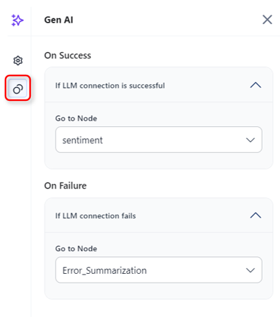

# Gen AI Node

The Gen AI node allows you to use LLM and Generative AI models to create custom prompts for your specific use case. You can choose a model, adjust its settings, and view the generated response.

## Add and Configure a Gen AI Node

Setting up a Gen AI node in an Agent Flow involves adding the node at the appropriate location in the flow and configuring various properties of the node, as explained below.

Steps to add and configure the node:

1. Open the Agent Flow to which you want to add the node: go to **Agents** > **Agent Flow** > **Go to Flow**.  

2. The Agent Flow opens in the Flow Builder. Click the “**+**” icon on the **Start** node or any existing node on the canvas and select **Gen AI** from the pop-up menu. (Alternatively, you can drag the **Gen AI** node from the Assets panel onto the canvas.)  

3. Click the added node to open its properties dialog box. The General Settings for the node are displayed.  

4. Enter or select the following **General Settings**:

    * **Custom Name**: Enter an appropriate name for the node.
    
    * **Select Model**: Select a model from the list of configured models. (For more information on models, see Model Studio.)

    * **System Prompt**: Enter the System Prompt for your use case. 
    For example, “Generate a summary of the transcription of a conversation in a maximum of 5 lines without returning any special characters.”

    * **Prompt**: It allows you to pass a variable to the System Prompt. For example, you can store the conversation transcript in a variable named “conversation” and pass it on in the Prompt.  
    Format: 
        ~~~
        {{context.variable_name}}
        ~~~
         Example:     
        ~~~
        {{context.conversation}}
        ~~~  
   
    * **Examples**: Add a few relevant examples to guide the model. Click the arrow to add examples of User input and expected AI output.  
     

    * **Hyperparameters**: Hyperparameters allow you to fine-tune the AI model's behavior to suit your needs. While the default settings work well for most cases, you can adjust them to find the right balance for your use case.

        * **Temperature**: Controls the randomness of the model's responses. Higher values lead to more random outputs, while lower values result in more focused outputs.

        * **Max Tokens**: Sets the maximum length of the model's output. Lower values generate shorter responses, while higher values produce longer responses.

        * **Frequency Penalty**: Penalizes common or frequent tokens, making the model's output less generic. Higher values produce more unique outputs, while lower values result in more common outputs.

        * **Presence Penalty**: Penalizes new or rare tokens, making the model's output more common. Higher values lead to more common outputs, while lower values result in more unique outputs.

        * **Top P**: Controls the diversity of the model's output by considering only the top tokens whose cumulative probability exceeds a threshold. Higher values produce more diverse outputs, while lower values result in more deterministic outputs.

5. Click the **Connections** icon and select the **Go to Node** for both success and failure conditions.  

    1. **On Success** > **Go to Node**: After the current node is successfully executed, go to a selected node in the flow to execute next, such as a Gen AI node, Function node, Condition node, API node, or End node.

    2. **On Failure** > **Go to Node**: If the execution of the current node fails, go to the End node to display any custom error message from the Gen AI node.

6. Finally, test the flow and fix any issues found. Click the **Run Flow** button at the top-right corner of the flow builder.

!!! failure "Standard Error"

    When the Model is not selected, the prompt details are not provided, or both, the following error message is displayed: “Proper data needs to be provided in the LLM node”.

## Access the Output of the Gen AI Node

The output of the Gen AI node is stored in a context variable and can be accessed via 
~~~
{{context.steps.GenAINodeName.output}}
~~~

!!! note 
    
    GALE can automatically recognize variables/outputs. To do this, just type "context.steps." and you will see available context variables/nodes, including the nodes' outputs.

