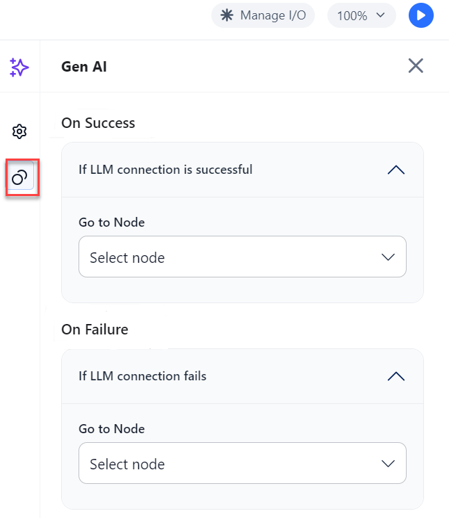

# Configure the GenAI node

You can configure a Gen AI node and connect to any model.

**To configure the AI node, follow these steps:**

1. Add a Gen AI node to the canvas as shown in the preceding procedure.
2. Click the **Gen AI node** and the general properties dialog for the node is displayed on the right side of the page as shown in the following image.

    

1. Enter a **Custom name** for the node.
2. Select a model from the list. You can see the AI models that you have already configured in the Models section of GALE. For more information about configuring a model, see Model Studio.
3. Enter a **System prompt** and the **Prompt** you want to test with your selected model.
4. Click the arrow in the **Examples** section on the **AI node settings **dialog to add a sample user input and sample AI response output.
5. Select the required **Hyperparameters**. The parameters that are displayed are based on the AI model you selected.
6. Click the **Actions** icon and select the actions that you want the node to trigger when the AI node is successful or when it fails.

    
    
1. Select the **Go to Node** under the **On Success** section of the Gen AI node configuration dialog. Based on the node you selected a respective new node is added to the canvas.
2. Select the **Go to Node** under the **On Failure** section of the Gen AI node configuration dialog. Based on the node you selected a respective new node is added.