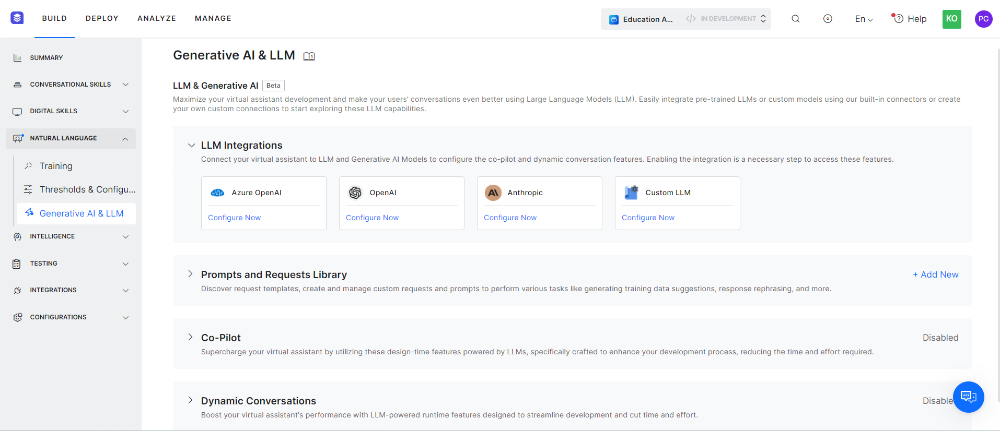

# Introduction to LLM and Generative AI

	

		

			

The Kore.ai XO Platform helps enhance your bot development process and enrich end-user conversational experiences by integrating pre-built (OpenAI, Azure OpenAI, Anthropic) or custom models in the backend.

In addition to the out-of-box integration with pre-built models, the Platform supports the bring-your-own (BYO) model framework to integrate with externally hosted models by third parties as well as models hosted by the enterprises themselves. The framework allows the creation of custom prompts that are optimized for specific purposes and models. This generic framework works seamlessly with the Auth Profiles module of the Platform, enabling enterprises to use the authentication mechanism of their choice.

By leveraging LLM and Generative AI capabilities, you can create intelligent, human-like conversational experiences for your end-users.

You can find Generative AI and LLM features by going to **Build** > **Natural Language** > **Generative AI & LLM**.

## Key Features

The Integration of Generative AI and LLM enables the following features:

* Prompts & Requests Library: Complete flexibility to create fully customized prompts optimized for particular use cases using custom models.
* Co-Pilot features:
    * **Automatic Dialog Generation**: This feature helps build production-ready dialog tasks automatically by briefly describing the task. A preview of the generated dialog is available and lets you modify the intent description and create multiple iterations of the dialog.
    * **Training Utterance Suggestions**: Generate high-quality training data quickly and easily with our platform’s suggested utterances for each intent. Review and add the suggestions as needed to create a powerful training set for your bot.
    * **Conversation Test Cases Suggestion**: The Platform suggests simulated user inputs covering various scenarios from an end-user perspective at every test step. You can use these suggestions to create test suites. 
    * **NLP Batch Test Cases Suggestion**: The Platform generates NLP test cases for every intent, including entity checks. You only need to create test suites in the Builder using the generated testing utterances.
    * **Use Case Suggestions**: Uses the Open AI LLM model to generate use cases during the VA (Bot) creation journey.
    * **Conversation Summarization**:  Implements the Conversation Summary public API to fetch the details of the entire conversation between the customer and the VA or agent. This API leverages the Flan-T5 foundational model to summarize conversations.
* Dynamic Conversations features:
    * **GenAI Node**: Collect Entities from end-users in a free-flowing conversation using LLM and Generative AI in the background. You can define entities to be collected as well as rules & scenarios.
    * **Answer from Documents**: Helps answer end-user queries from unstructured PDF documents without the need to extract individual FAQs and train them.
    * **GenAI Prompt:** Leverage this node to unlock the power of Generative AI with your prompts, enabling you to build creative and custom use cases.
    * **Rephrase Dialog Responses**: Enhance end-user experience with empathetic and contextual bot responses.
    * **Zero-shot ML Model**: Uses the Open AI LLM model for intent identification during run time based on semantic similarity.
    * **Repeat Responses**: Use LLM to reiterate the last bot responses when the Repeat Bot Response event is triggered.
    * **Few-shot ML Model**: Uses the Kore Ai’s hosted embeddings for intent identification during run time based on semantic similarity.

## Benefits

All these features benefit VA developers, NLP developers, and testers as follows:

* Being able to select between custom and pre-built LLM integrations.
* Developers can create dialog tasks on the fly through the prebuilt Dialog Tasks Flow.
* Developers can unlock the power of Generative AI with their prompts, enabling them to build creative and custom use cases.
* Mundane tasks like generating dialog tasks or training utterances are automated to help developers be more productive and focus on other important tasks like enhancing conversation design, creating complex test cases, and more.
* Testers can ensure that their intent descriptions are meaningful in the right context to generate the right content.
* The Platform provides suggestions and nudges developers in the right direction for the better design and development of Virtual Assistants. For example, it offers curated use case suggestions while[ creating the VA](https://developer.kore.ai/docs/bots/chatbot-overview/getting-started-bots/#Create_a_Standard_Virtual_Assistant), including probable user inputs (simulating end-user behavior) in[ Conversation Testing](https://developer.kore.ai/docs/bots/test-your-bot/conversation-testing-landing-page/). This way, the VA can simulate the end user’s behavior at every conversation step and respond more realistically by considering error scenarios, digressions, and contextual changes.
* Allows enterprises and advanced users to bypass the platform’s pre-built integrations. They can establish customized connections to large language models and optimize prompts and requests for their specific use cases.

## Important Considerations

Generative AI features are available for English and non-English NLU and VA languages on the Kore.ai XO Platform. However, custom LLM-specific features are currently limited to English. To learn more about managing languages for VAs, click[ here](https://developer.kore.ai/docs/bots/advanced-topics/multi-lingual/managing-languages-for-multilingual-vas/).

LLM and Generative AI also require sharing data with third parties: OpenAI (when using the OpenAI integration) or OpenAI and Microsoft (when using the Azure integration).

## Next Steps

1. [Integrate a pre-built or custom LLM](https://developer.kore.ai/docs/bots/nlp/llm-integration/). 
2. (Optional – only for custom LLM model)[ Add Prompts](https://developer.kore.ai/docs/bots/nlp/prompts-and-requests-library/).
3. Enable[ Co-Pilot](https://developer.kore.ai/docs/bots/nlp/co-pilot-features/) and[ Dynamic Conversations](https://developer.kore.ai/docs/bots/nlp/dynamic-conversations-features/) features.

		
