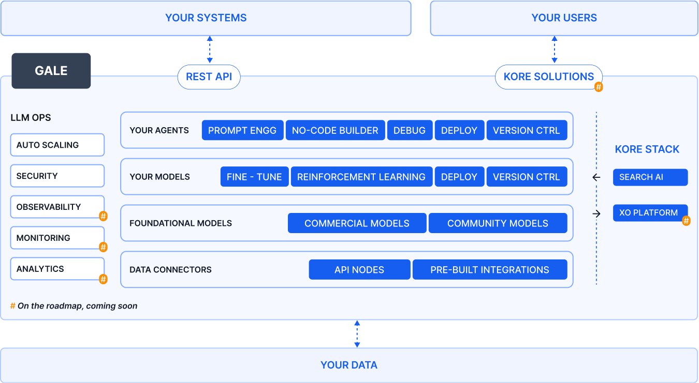

# Introducing All-new GALE Platform

GALE is a new platform for building LLM-powered AI agents. It provides tools to integrate all the pieces necessary to power Gen AI agents that can be seamlessly integrated into your existing systems and workflows, enabling you to quickly unlock the benefits of Gen AI.

With GALE's user-friendly drag-and-drop interface, you can easily prototype, customize, and deploy AI agents tailored to your specific needs. The platform offers a range of popular open-source and commercial AI models that you can fine-tune as required. You can also chain together workflows, manage inputs/outputs, and implement guardrails - all without the need for coding expertise.

Once your AI agent is ready, GALE simplifies the deployment process via API, allowing you to seamlessly integrate it into your existing systems and applications. This streamlined approach to leveraging Gen AI capabilities makes GALE the perfect solution for any business looking to accelerate their AI adoption.

<iframe src="https://player.vimeo.com/video/960261668?h=26050864c2" style="position:absolute;top:0;left:0;width:100%;height:100%;" frameborder="0" allow="autoplay; fullscreen; picture-in-picture" allowfullscreen></iframe>

## Comprehensive Suite for AI Operations

GALE provides a comprehensive platform for managing AI agents, models, and data integrations, with various tools for development, deployment, and monitoring. It also shows how GALE interfaces with external systems and users, providing a complete ecosystem for AI operations.

=== "GALE Core Offerings"

    * LLM OPS: Includes Auto Scaling, Security, Observability, Monitoring, and Analytics.

    * Your Agents: Features Prompt Engineering, No-Code Builder, Debug, Deploy, and Version Control capabilities.

    * Your Models: Offers Fine-Tuning, Reinforcement Learning, Deploy, and Version Control options.

    * Foundational Models: Includes Commercial Models and Community Models.

    * Data Connectors: Consists of API Nodes and Pre-built Integrations.

=== "Integration"

    * REST API: Connects GALE to Your Systems.

    * Kore Solutions: Interfaces with Your Users.

=== "External Components"

    * Your Systems: Interact with GALE through the REST API.

    * Your Users: Access GALE via Kore Solutions.

    * Your Data: Connect your data to GALE.

=== "Kore Stack"

    Search AI and XO Platform are part of the broader ecosystem.

## Key Components

Agents, Models, and Playground are the key components of GALE that work together to enable businesses to leverage AI capabilities effectively.

=== "Agents"

    Agents allow you to create AI-powered workflows and automation with little to no coding required. Using a visual drag-and-drop interface, you can easily configure settings and combine multiple complex workflows. Guardrails ensure the models within these workflows operate responsibly, adhering to societal norms and your business requirements. The agents can seamlessly integrate with AWS, expanding the range of use cases. This user-friendly approach empowers you to leverage AI capabilities across various applications without extensive technical expertise.
    
    [Learn more about Agents :octicons-arrow-right-24:](../agents/overview.md)

=== "Models"

    Models are the core of GALE. Based on your needs, you can choose from fine-tuned, commercial, or open-source AI models. Once you've selected the right models, you can easily integrate them into your AI agents. Guardrails ensure the models generate outputs responsibly and follow defined constraints. Additionally, you can deploy these AI agents via API endpoints and integrate them with your existing systems as required.
    
    [Learn more about Models :octicons-arrow-right-24:](../models/overview.md)

=== "Playground"

    GALE's Prompt Playground allows you to experiment and refine prompts to get the best performance from AI models. You can test different prompts across various models - external, fine-tuned, or open-source. The Playground helps you identify the ideal model and configurations for each prompt through an iterative process. This streamlined workspace enables you to optimize prompts rapidly for maximum model effectiveness.
    
    [Learn more about Playground :octicons-arrow-right-24:](../playground/overview.md)

## Deployment of AI at Scale

GALE provides enterprise-grade features to deploy AI at scale:

* **Security**: Your data and intellectual property are protected by robust security measures.

* **Scalability**: As your AI applications grow and user numbers increase, GALE automatically scales to meet demand while maintaining consistent performance.

* **Flexible Deployment**: Based on your organization's preferences, you can deploy AI models on the cloud or on-premises infrastructure.

With GALE's enterprise-ready capabilities, you can confidently scale your AI adoption while ensuring data security, reliable performance, and deployment flexibility to suit your unique business needs.
