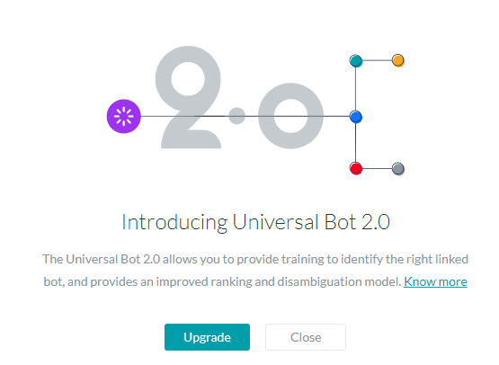
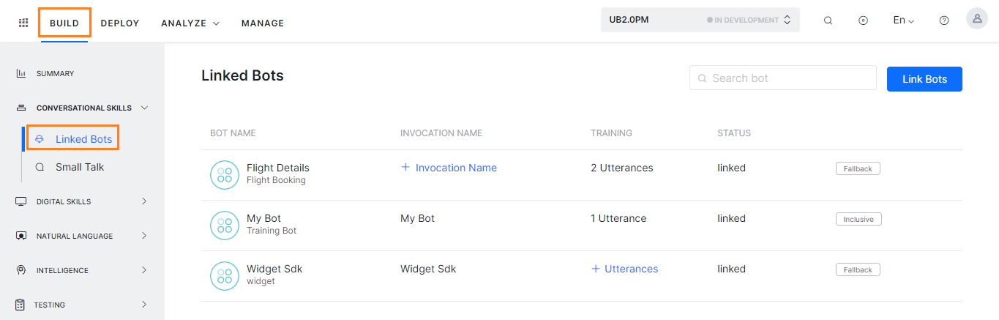
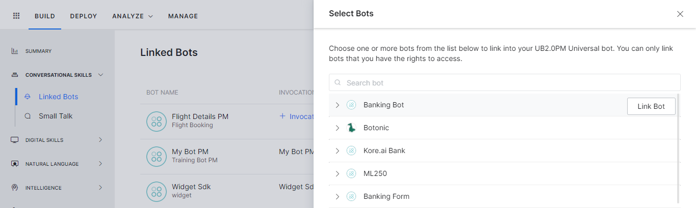
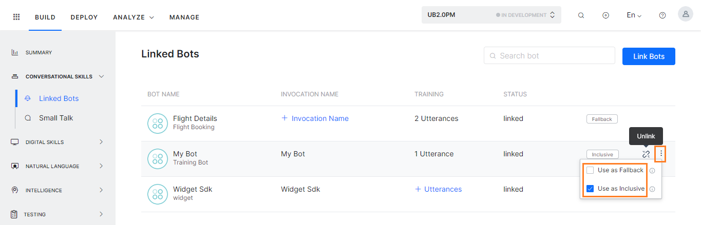
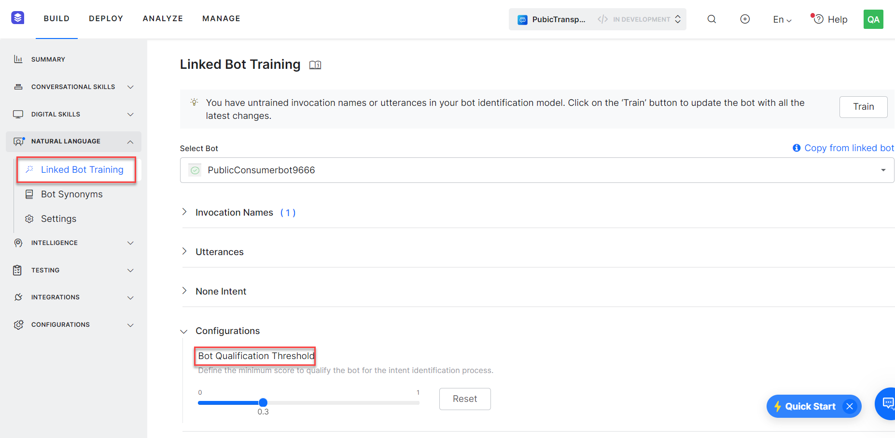
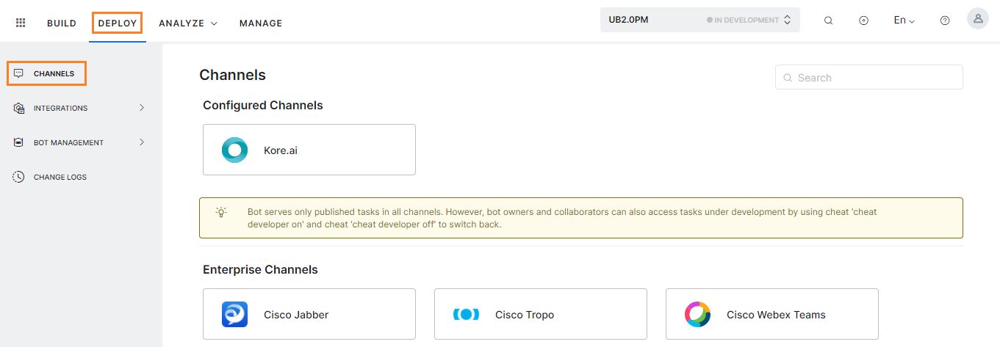
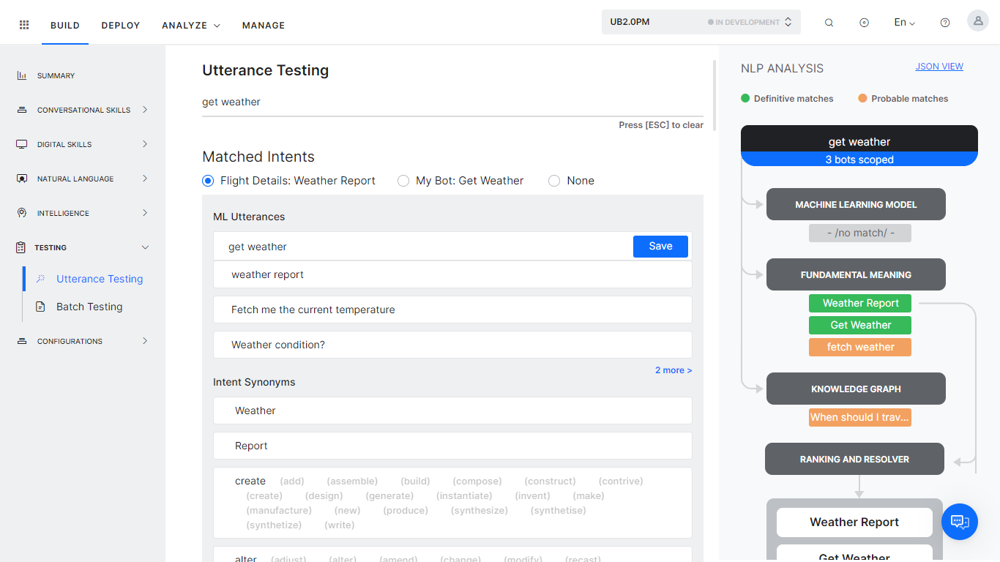

# Creating a Universal Bot

This post refers to the upgraded version of the Universal Bot offered since version 7.3 of the platform, for the older version[ click here](https://developer.kore.ai/docs/bots/advanced-topics/universal-bot/creating-a-universal-bot-older-version/).

Creating a Universal Bot involves the following major steps:

1. Create the Basic Universal Bot
2. Add Linked Bots
3. Train the Universal Bot
4. Configure the Channels
5. Test the Universal Bot
6. Publish the Universal Bot

For an overall understanding of Universal Bots[ click here](https://developer.kore.ai/docs/bots/advanced-topics/universal-bot/universal-bots/) and to understand the differences with Standard bots[ click here](https://developer.kore.ai/docs/bots/advanced-topics/universal-bot/defining-universal-bots/).

## Step 1: Creation

To create a Universal Bot, follow the steps below: 

1. On the landing page, click **New Bot**.

    

2. In the **Create New Bot** window, select **Start from Scratch**.
3. Enter a **Name**. 
4. Select an icon or click the **+** icon to upload your own. Images should be in PNG format and should not exceed 40×40 pixels. The file size is limited to 80kb. 
5. Select the **Purpose** of your VA. See[ Purposes](https://developer.kore.ai/docs/bots/chatbot-overview/getting-started-bots/#VA_Purposes) for a complete list.
6. Choose **Universal Bot** as the **Bot Type**.
7. Select the **Default Language**.
8. Click **Create** when ready. 

    

9. Wait a few moments for your VA to be configured. Once done, you can continue developing it. 

### Universal Bot Version

(post ver7.3 release of the platform)

* You will be prompted to upgrade to the Universal Bot 2.0, this version provides training capability to the universal bot.
* You can choose to **Upgrade** or continue with the older version. 

    !!! note

        The older version will be deprecated soon in the platform.
* If you want to work with the older version,[ refer here](https://developer.kore.ai/docs/bots/advanced-topics/universal-bot/creating-a-universal-bot-older-version/) for further instructions.
* This current document refers to the instructions for the upgraded version of the universal bot.

## Step 2: Add Linked Bots

After you create a universal bot, link one or more existing bots to it. Since a universal bot comprises other bots, you must have already created at least one[ standard bot](https://developer.kore.ai/docs/bots/bot-builder-tool/bot-creation/defining-a-standard-bot/).

**Important Notes**:

* Linking a standard bot does not give the owner or the developers of the universal bot access to the linked Bot’s tasks and functions.
* The universal bot does not clone the tasks in the linked bots but performs them via the linked bot. So, any changes made to the linked bot reflect the universal bot’s functionality.
* The universal bot must be published for any changes made to a linked bot.
* Adding or linking a third-party bot as a standard/child bot to a universal bot is not supported.

Follow these steps to add linked bots to the Universal Bot:

1. Open the universal bot to which you want to link other bots.
2. Select the **Build** tab from the top menu.
3. Click **Conversational Skills >** **Linked Bots** from the left menu or use the **+Link Bots** link from the Bot Summary page (landing page when you open a Bot) Linked Bot card. 

    

4. Click the **Link a Bot** link to open the Select a Bot dialog.

    !!! note
            
            On the Select a Bot dialog, you can only see the bots for which you are either the owner or a co-developer. If you cannot see a bot in this window, make sure the bot is shared with you by its owner.

        
5. Hover over the Bot to access the **Link Bot** button, and click the link. 

    

6. Once linked you will see a message stating the same.
7. You can expand the Bot name to see details like Invocation Name and Training Utterances. You can add the same here or later as explained in[ Step 3: Training Universal Bot](https://developer.kore.ai/docs/bots/advanced-topics/universal-bot/creating-a-universal-bot/#Step_3_Training). 

    

8. Select the bots that you want to link to the bot and close the dialog.
9. Once you have linked Bots to the Universal Bot, the **Linked Bots** page will list all the Linked Bots. You can use the **Link Bot** button to link another Bot.
10. You can mark some bots as fallback bots or inclusive bots:
    * Use the toggle switch to enable or disable the **Use as Fallback** option for a given bot – the bots thus marked will be used for detecting intents when no other bots are identified from other training options. Up to 15 bots can be marked as fallback bots.
    * Use the toggle switch to enable or disable the **Use as Inclusive** option for a given bot – these bots need not be trained with sample utterances to participate in the bot scoping process. These bots will always be considered for Intent Detection at the time of evaluating the user utterances, except when the user invokes a linked bot either using ‘Invocation Phrases’ or ‘Trigger Phrases’. Up to 3 linked bots can be marked as inclusive bots. 

        

### Unlink a Bot

If you want to unlink a linked bot, follow these steps:

1. On the Linked Bots page, hover over the bot you want to unlink to view the **Un-Link** icon.
2. Click **Un-Link.**

Remember to Publish the bot for the changes to be reflected in the published bot.

## Step 3: Training

Universal Bot functionality enables training of the bot. If your bot is trained in one or more languages that use NLP Version 2, you will see a banner notifying you about the upcoming[ auto-upgrade to NLP Version 3](https://developer.kore.ai/docs/bots/nlp/optimizing-bots/#NLP_Version_3). This section details the steps in training the bot, for more details on training [refer here](https://developer.kore.ai/docs/bots/advanced-topics/universal-bot/training-a-universal-bot/).

1. Open the universal bot that you want to train. This bot should have bots linked to it.
2. Select the **Build** tab from the top menu.
3. From the left menu, select **Natural Language > Linked Bot Training**.
4. Select the **Linked Bot Training** section and **Select Bot** you want to train.
5. Note that Inclusive bots do not need training, the training will not be used for bot scoping.  If you choose to train the same, this training will be used later if the linked bot is deselected as an Inclusive Bot.
6. Expand the **Invocation Names** section to add the same.  These will be treated as a special set of synonyms defined against linked bot names.[ Refer here for more](https://developer.kore.ai/docs/bots/advanced-topics/universal-bot/training-a-universal-bot/#Invocation_Names).
    * The name of the Bot is by default added as an invocation name, you can delete it if not required.
    * Enter additional **Invocation Names** as per your requirement. 

        

7. Expand the **Utterances** section to add utterances. These refer to the typical ways in which the users are expected to ask for intent from a linked bot.[ Refer here for more](https://developer.kore.ai/docs/bots/advanced-topics/universal-bot/training-a-universal-bot/#Utterances).
    * Add utterances as per your requirement. 

        

    * You can also use the **Copy from linked bot** option to add the utterances from the linked bot.
        1. Selecting this option will open a **copy from bot** page for the linked bot under training.
        2. Select the relevant task from the linked bot from the **Select Task** dropdown.
        3. All the utterances for that task will be listed and you can select from the list. Multiselection is allowed.
        4. Click **Done** to add the utterances. 

        

8. Expand the **None Intent** section to add utterances. The None Intents are used to qualify/disqualify the linked bots based on user utterances. For more information, see the[ None Intent](https://developer.kore.ai/docs/bots/nlp/advanced-nlp-configurations/#None_Intent) article.
    * Add utterances as per your requirement. 

    

    * Click **Save**.
9. Expand **Configurations** to set the **Bot Qualification Threshold** as the minimum score needed to qualify the bot for the intent identification process for each linked bot. By default, it is set to **0.3** and can be set to any value between **0** and **1**. 

    

10. **Train** the bot to activate these above changes.

## Step 4: Configure the Channels

The universal Bot requires channel configurations separate from its underlying linked Bots, so the channels must be set up or enabled again. You can set up channels for the universal Bot regardless of the linked Bot channels and the published tasks of the linked Bots will execute from the universal Bot channels.

**Before you Begin**

This article assumes that you understand the fundamentals of configuring channels in Kore.ai and therefore focuses on the configuration aspects specific to the universal bots. For fundamentals of configuring channels in the Bot Builder, refer to[ Adding Channels to your Bot](https://developer.kore.ai/docs/bots/channel-enablement/adding-channels-to-your-bot/).

**Important Notes**:

* The Universal Bot is available only on the channels enabled for it, regardless of the enabled channels for the linked Bots.
* If a channel is configured for both linked and universal Bots, the message delivered to the user follows the channel-specific messages and formatting configured at the linked Bot.
* If a channel enabled for the universal Bot is not enabled for the linked Bot, the universal Bot responds with the default messages defined for the linked Bot’s functionality.
* If you do not set up any channel-specific formatting at either the universal or the linked Bot’s settings, the default message with standard formatting gets applied.
* Alerts configured from the universal Bot will be delivered via the universal Bot.

**Steps in Configuring a Channel**

1. Open the universal bot for which you want to configure new channels.
2. Select the **Deploy** tab from the top menu.
3. Click **Channels**.
4. From the list of supported channels on the Channels page, click the channel to configure it.
5. The configuration settings for each channel vary according to the channel. When you click a channel to configure it, the configuration instructions are displayed. Follow them for channel configuration.
6. Configure and save the channel settings.

    

## Step 5: Testing

Since the universal Bot links together many standard Bots, the natural language processing settings may have to be optimized for several user utterances to accurately recognize the relevant bot and intent.

Testing the universal bot is similar to testing a standard bot where you type a user utterance and analyze the results. However, in the case of the universal bots, you see not just the shortlisted intents for the utterance but also the bots to which they belong. The name of the bot is prefixed to the intent in the following syntax: _Bot Name: Task Name._

**Before you begin**

This article assumes that you understand the fundamentals of testing bots in the Kore.ai Bots platform and therefore focuses on the testing aspects specific to the universal bots. To refer to the fundamentals of testing bots in the Bots Builder, read[ Testing your bot](https://developer.kore.ai/docs/bots/test-your-bot/testing-your-bot-with-nlp/).

**Steps in Testing a User Utterance**

Follow these steps to test user utterances for universal bots:

1. Open the universal bot for which you want to test the user utterances.
2. Select the **Build** tab from the top menu.
3. From the left menu click **Testing -> Utterance Testing**.
4. In the **Type a user utterance** field, enter the utterance that you want to test. For example _weather_.
5. The results show up below with single, multiple, or no matching intents. For example, below is a multiple-match result for the _weather_ utterance.
6. Clicking the **bots scoped** will give the details of the process involved in evaluating the linked bots.[ Refer here for more details](https://developer.kore.ai/docs/bots/advanced-topics/universal-bot/training-a-universal-bot/#Implementation). 

    

#### Understanding the Test Results

The result for test utterances falls into one of these three categories:

* **Single Matched Intent**: A task or user intent of one of the linked bots matches the input.
    * If it is a correct match, you can provide additional training for the same task in the same bot to enhance its score, or you can also train a different task from another bot to recognize the utterance.
    * If it is an incorrect match, click the **Mark as Incorrect Match** link next to the matched intent. Clicking the link allows you to select the task or intent from the same or another bot that should match.
* **Multiple Matches with Same Scores**: More than one task with the same recognition score matched the intent. These tasks can belong to one or more linked bots. Select the radio button next to the task that you want to match for the utterance.
* **Unidentified Intent**: The user input did not match any task in any of the linked bots. Train the bot as explained below to match the right bot and linked task.

#### Improving the Universal Bot Performance

You can train the universal bot for more efficient and accurate functioning. Though you train the linked bot from the universal bot windows, the training is saved directly at the linked bot.

Follow these steps to train the linked bots in a universal bot:

1. On the Utterance Testing window for the universal bot, select an intent.
2. It opens the following fields that enable you to train the task using machine-learning utterances, synonyms, and patterns. 

    

3. You can also configure the thresholds from the **Natural Language > Settings**.[ See here for more](https://developer.kore.ai/docs/bots/advanced-topics/universal-bot/training-a-universal-bot/#Configurations). 

    

## Step 6: Publishing

After you have defined, trained, and saved a new configuration for a Universal Bot, it becomes visible on the Bot Builder home page. It is not available to users other than the developers of the bot until it is published and approved by the Bots Admin.

!!! note

    If you change a linked bot, you must publish the universal bot. Otherwise, the change will not be reflected in the universal bot.

#### Universal Bot Statuses

The following are different statuses related to the universal bots, these will be displayed on the Linked Bots page against the linked Bots selected for publishing:

<table>
  <tr>
   <td><strong>Universal Bot Status</strong>
   </td>
   <td><strong>Description</strong>
   </td>
  </tr>
  <tr>
   <td><strong>Linked</strong>
   </td>
   <td>Bot configuration is complete and the standard bots are linked.
   </td>
  </tr>
  <tr>
   <td><strong>Awaiting Approval</strong>
   </td>
   <td>The Bot is published for enterprise use but has not been approved by the Bots Admin.
   </td>
  </tr>
  <tr>
   <td><strong>Published</strong>
   </td>
   <td>The Universal Bot is published for personal, enterprise, or public use.
   </td>
  </tr>
  <tr>
   <td><strong>Rejected</strong>
   </td>
   <td>The Bots Admin did not deploy the bot to the enterprise. An email is sent to the developer with comments from the Bots Admin.
   </td>
  </tr>
  <tr>
   <td><strong>Suspended</strong>
   </td>
   <td>The Bots Admin suspended the use of a deployed bot. An email is sent to the developer with comments from the Bots Admin.
   </td>
  </tr>
</table>

#### Publish the Bot

Follow these steps to publish a universal bot:

1. Open the universal bot that you want to publish.
2. Select the **Deploy** tab from the top menu.
3. From the left menu, select **Bot Management >** **Publish** option.
4. On the Publish page, select the linked bots you want to publish. This can be to:
    * Include new linked bots, or
    * Update already published linked bots, or
    * Delete any unlinked bots
    
    !!! note

            Default dialog is automatically selected and as it is mandatory to publish it you cannot de-select it. 

6. You can choose to Publish the following training components:
    * Training Utterances, Invocation Names, Synonyms, Fallback Bots, NLP Settings 
    
    !!! note

          The first time you are publishing a Universal Bot, all the NLP settings need to be selected for publishing
7. Select from the list of enabled languages to publish the bot and then click **Proceed**. 

    

8. Enter appropriate **Comments** and click **Publish**.

!!! note

       After you publish a universal bot, all the published tasks in the selected linked bots become accessible to the users and any changes made to the linked bots automatically reflect in the universal bot.

		

	

	

		

			

## Next Steps

* You can learn about training the Universal Bots from[ here](https://developer.kore.ai/docs/bots/advanced-topics/universal-bot/training-a-universal-bot/#Invocation_Names).
* You can also look into how the Universal Bot can be customized by defining the default dialog and variables[ from here](https://developer.kore.ai/docs/bots/advanced-topics/universal-bot/customizing-the-universal-bots-default-dialog-task/) and/or learning to enable additional languages[ from here](https://developer.kore.ai/docs/bots/advanced-topics/universal-bot/enabling-additional-languages-for-the-universal-bot/).

		
