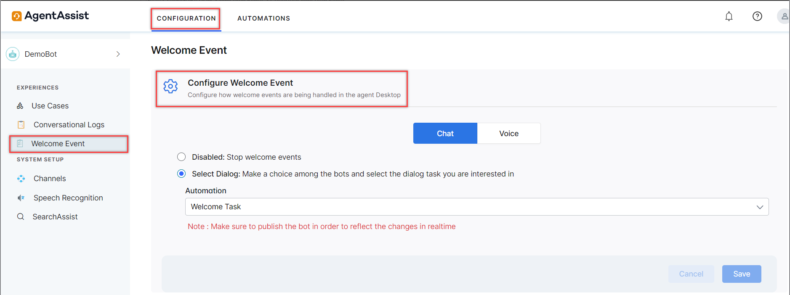
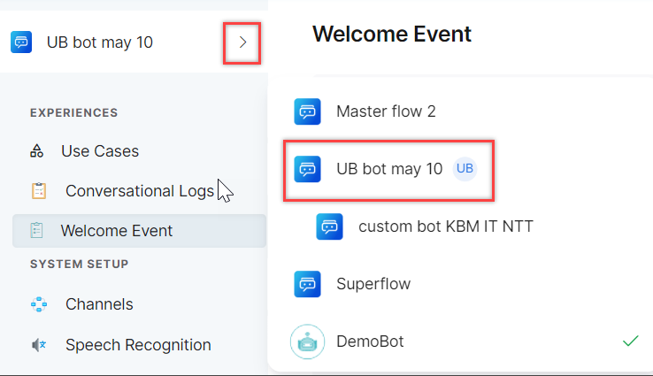
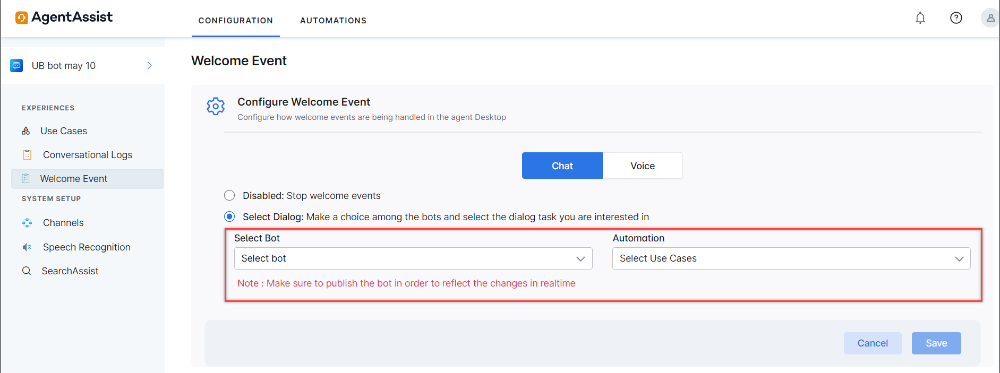

# **Welcome Events**

Welcome Events are pre-configured messages or prompts that are automatically triggered when a conversation is assigned to an agent in the AgentAssist platform. Welcome Events guide agents to handle inquiries effectively by streamlining workflows, lowering their Average Handle Times (AHT), reducing repetition, and contributing to enhanced customer satisfaction.

Managers can configure Welcome Events to provide consistent and relevant information to agents at the start of a conversation. These events can be used for both chat and voice interactions.

You can configure Welcome Events for AgentAssist using Standard/Non-Universal Bots or a Universal Bot (UB). To learn more about the types of bots, see [Universal Bots](https://developer.kore.ai/docs/bots/advanced-topics/universal-bot/universal-bots/#Highlights).

### Configure Welcome Events for a Non-Universal Bot

Steps to configure Welcome Events for Non-Universal Bots:

1. Go to **CONFIGURATION > Welcome Event > Configure Welcome Event**.\

**Note**: The bot-level settings for Welcome Event are not applicable for AgentAssist. If the same bot is used for automation (prior to agent transfer), the bot-level event settings are honored.\
2. Click **Select Dialog** and select the appropriate event from the **Automation** dropdown. \

3. Click **Save** to configure the welcome event. \

### Configure Welcome Events for a Universal Bot

If a Universal Bot is selected on the main bot selector, two dropdowns appear for Event Dialogue task selection.

Steps to configure Welcome Events for a Universal Bot:

1. Click the **Select Bot** dropdown to select the child bot (only child bots of the selected UB appear). \

2. Click the **Automation** dropdown to select dialog tasks associated with the selected bot. \

3. Click **Save** to configure the welcome event. \
