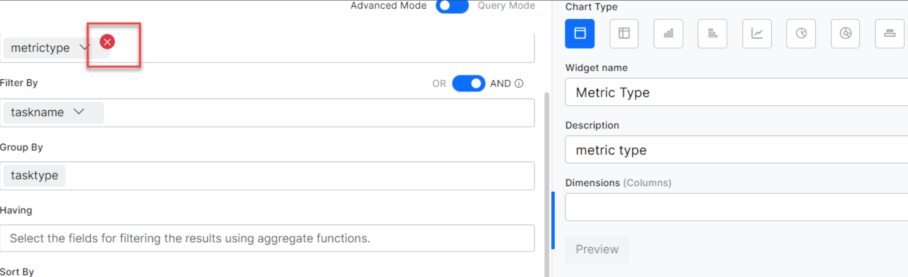
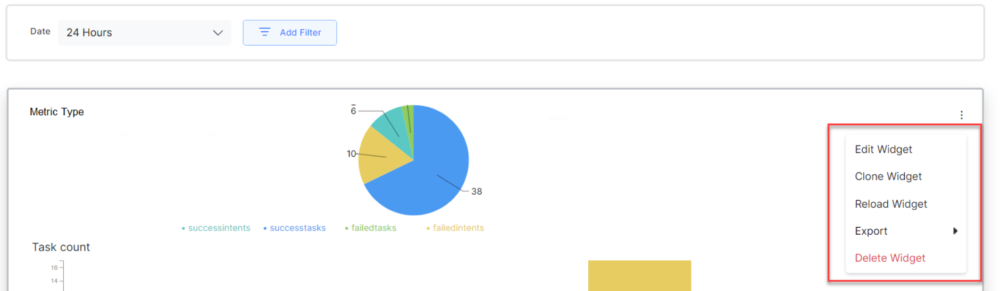

# Introduction to Custom Dashboard

Custom Dashboard allows you to design your dashboards to meet business needs using a combination of built-in metrics and custom KPIs based on the user’s demographic or context information to provide a more tailored and relevant view of the data.

Using Custom Dashboard, you can select the metrics most relevant to your needs and display them in a way that is easy to understand and use. This can be particularly useful if you have a lot of user conversations and data that you need to track and monitor, as it allows you to focus on the most important information and ignore the rest.

Custom Dashboards are available along with the other out-of-the-box dashboards in the Bot Builder. For more information on the Default Dashboard, see here.

**Follow these steps to build Custom Dashboards**:

1. Identify the data points that you need to capture for deriving the metrics, based on your business requirements and needs.
2. Define suitable Custom Meta Tags to emit these data points in the Bot definition. To know how to add custom meta tags to your Virtual Assistant (VA), see here.
3. Design widgets, preview, and update the dashboard with these widgets.

**To view the Custom Dashboard dashboard, follow the steps**: 

1. Click the three dots on the left navigation pane and then click **Analytics**. The Analytics panel is displayed with the list of reports.

2. Click the **Custom Dashboards** under the **Automation** section of the **Analytics** panel. The **Custom Dashboards dashboard** is displayed on the right side of the page.
3. Select appropriate filters on the dashboard and click **Apply**.

* Each of these dashboards can have one or more **widgets**.
* Each widget in the dashboard must be associated with a dataset.
* You need to define a query to extract the required data to be displayed in a widget.

## Add Custom Dashboards

You can add one or more Dashboards by providing basic details of the Dashboard.

* To add a new dashboard, click on the kabab icon on the top right and select the **New Dashboard** option. Enter the name of the dashboard. You can edit the name of the dashboard anytime.
* By default, each custom dashboard comes with a Date Filter, allowing you to filter the records for all the widgets in the dashboard. You can choose between 24 hours, 7 Days, and a custom date range. You can also configure and add custom filters, allowing you to filter all the widgets within the dashboard. See Create Custom Filters for Custom Dashboard to know more.
* Choose a **Color Theme** for your dashboard.
* You can **Add Widget** to a given Dashboard.
* You can reorder the widgets within a dashboard using the **move cursor**, visible on the mouse hovering over the widget, to drag and reorder the widget anywhere on the Dashboard.
* Using the Kebab menu (vertical ellipses) icon, you can do the following:
    * **New Dashboard:** Allows to create a new dashboard.
    * **Clone Dashboard:** Copies the dashboard to a new dashboard with the same configuration.
    * **Export Dashboard:** Exports the configuration of the dashboard in a JSON file.
    * **Delete Dashboard:** Allows you to Delete the custom dashboard.

## Add Widgets

You can add one or more widgets to a Dashboard using the **Add Widget** button. Widget configuration involves two steps:

* Data Definition
* Data Representation

### Data Definition

Every widget must have a query defined to retrieve and represent the required information on that Widget. The following are the configurations used to generate the query definition:

* **Dataset** defines the data source. The source can be:
    * **Analytics**: Analytics gives access to data about Success Intents, Failed Intents, Success Tasks, and Failed Tasks associated with your VA. You can view key fields like MetricType, Channel, UserId, and so on.
    * **Message**: This dataset provides VA and User messages for your VA. You can view key fields UserId, Channel, and so on.
    * **Sessions**: The dataset lists conversation sessions associated with your VA. You can choose to view key fields like UserId, Channel, and so on.

!!! note

    You can view the top 20 records for all the dataset fields.

The platform allows you to choose between Query Mode and Advanced Mode while writing a query. For more information, see Widget Configuration Modes.

* **Date Range** is set by default to the past 7 days and can be customized to a range of 90 days. This date range is only used for preview purposes.

**Select:** fields to be depicted by the Widget.

* The fields differ for each selected dataset. See the table for more details. For example to list the success & failed intents, _metricType_:
* You can apply on these fields the aggregation functions like “_min”_, “_max”_, “_sum”_, “_count”_, or “_avg”_. For example, to count the total triggered intents, _count(metricType)_, you can give a display name as an alias – _count(metricType) as total._

* **Aggregate Functions:** While defining a query, you can click the drop-down provided for each field in **Select**, to access the relevant aggregate functions. On selecting the appropriate aggregate function, you can enter the filter criteria.

!!! note

    Aggregate functions are visible only when the user chooses the Advanced mode.

The following table describes all the available aggregate functions:

<table>
  <tr>
   <td>
    <strong>Aggregate Function</strong>
   </td>
   <td>
    <strong>Description</strong>
   </td>
  </tr>
  <tr>
   <td>
    Sum
   </td>
   <td>
    The arithmetic total of all values in the column
   </td>
  </tr>
  <tr>
   <td>
    Min
   </td>
   <td>
    The smallest-value element in the column
   </td>
  </tr>
  <tr>
   <td>
    Max
   </td>
   <td>
    The largest-value element in the column
   </td>
  </tr>
  <tr>
   <td>
    Average
   </td>
   <td>
    The mean average of the elements in the column
   </td>
  </tr>
  <tr>
   <td>
    Count
   </td>
   <td>
    The total number of elements in the column
   </td>
  </tr>
  <tr>
   <td>
    None
   </td>
   <td>
    Use it to remove an aggregate function added to a query
   </td>
  </tr>
</table>

The Distinct function is used to obtain the number of distinct values across the column. It is allowed with the following aggregate functions: 

* Sum 
* Count
* Average

Apart from these if you have defined any Custom/Meta Tags for your VA, you can use them under the appropriate heading with the following notation: `userTag.tagname = value`. If you declared a Message level custom tag, select the Message Dataset and enter `messageTag.TagName`. This would result in an empty dataset, and as a result the display would be empty.

**Filter By** clause is used to extract only those records that fulfill a specified condition. You can apply the following operators on these fields: “_=”_, “_>=”_, “_&lt;=”_, “_>”_, “_&lt;“, “in”, “not in”_.
For example, to obtain the count of a specific FAQ, the following details are entered in the query setup. 

<code>taskName = 'What account privileges does an authorized user have?' <strong>and </strong>metricType = successtasks<em>.
</em></code>While conjugating multiple conditions, they would be evaluated left to right, and this ordering cannot be changed using parentheses ()

!!! note

    In the query setup, for Filter By, individual AND, OR operators, and multiple ANDs, ORs, can be applied, but a combination of AND/ORs is not supported.

**Group By** fields for applying the aggregating functions. For example, you can display the count of all messages, grouping by the userId. To understand the Group By usage, see the examples at Create Custom Dashboard.

**Having** clause is used to filter the results with aggregate functions as the ‘Where’ keyword cannot be used here. For example, _count(messageid)>10_. The clause works only with the ‘Group By’ function.
To understand how the Having clause works, see Filter the Messages using the Having Clause.

!!! note

    In the Having clause, the fields with aggregate values in the Select clause are automatically included.

**Sort By** fields (actual field names, not alias as give in the Select clause) to order the results in ascending or descending order – “_asc”_, or “_desc”_. For example to sort in the descending order of the metric type, _metricType desc_

!!! note

    In the Select clause, you can provide an alias to make column names more readable. For other fields, you cannot define aliases and must give actual column names.

**Run** the query to see the results in a tabular format.

!!! note

    A tag added for Select, Filter By, Group By, Having etc. can be deleted using a Delete icon which is displayed only upon hovering over the tag.

##### **End-user Vs. Developer Interactions**

By default, the end-user interactions are displayed for all the datasets in the Custom Dashboards. If you want to display the developer interactions, use the `isdeveloper` flag to filter the interactions as follows:

* To display only the developer interactions, use `isdeveloper = include` in the filter condition.
* To display both the developer and the end-user interactions, use one of the following in the filter condition:
    * `isdeveloper = include or isdeveloper = exclude`
    * `isdeveloper = exclude or sessionid = "any developer session Id"`

In any custom dashboard widget, for any dataset, you can assign a value to the `isdeveloper` flag in the **Filter By** clause as shown in the following screen. 

### Data Representation

The next step is to render the data in a visually appealing way. The following options are available for data representation:

* **Table** renders the data in a simple row and column format. You can specify the Columns and their order from the **Dimensions** option.
* **Pivot chart** summarizes the data. You can specify the **Dimensions** – the columns to be displayed; **Metrics** – the value against the column; and **Overlay** – the column to be considered in case a data series needs to be represented. For example, if the dimension is set to be ‘date’, metric as ‘number of chats’, and overlay to be ‘customer type’, then the number of chats per customer type, with each distinct customer type as a series, would be displayed.
* **Bar Chart** is used to depict the data across the **X-** and **Y-axis**. The results can be split into Data Series based on the **Overlay** field and get multiple lines plotted.
* **Horizontal Bar Chart** is used to depict the data across the **X-** and **Y-axis** a flipped version of Bar Chart. The results can be split into Data Series based on the **Overlay** field and get multiple lines plotted.
* **Line Chart** is used to depict the data across the **X-** and **Y-axis**. The results can be split into Data Series based on the **Overlay** field and get multiple lines plotted.
* **Pie Chart** is used for aggregation data to depict part-of-whole scenarios. Use Dimensions to set the fields to be depicted and the Metrics to set the aggregation function to be depicted.
* **Donut Chart** is similar to a Pie chart but has better visualization.
* **Label Chart** highlights value or metric in a space of its own.

Click the **Preview** button to visualize the widget. If it suits your purpose, add the widget to your Dashboard to save the changes.

!!! note

    You have to successfully run the query to be able to Preview it.

### Widget Actions

Using the **more icon** (vertical ellipses) against each Widget, you can access the following options:

* The **Edit Widget** option opens the Widget definition page where you can make changes to an already defined Widget.
* The **Clone Widget** option is used to duplicate the Widget definition and modify it.
* The **Export** option is used  to export the widget data
    * JSON format includes the final results that are displayed in the Widget UI
    * CSV format exports the results of the query that is associated with the widget (before converting the data as per the Widget UI)
* The **Delete Widget** option is used to delete the widget from the Dashboard.

!!! note

    The final Widget definitions of a custom dashboard can be exported in JSON format. The individual widget data can be exported in CSV format.

## Widget Configuration Modes

The platform allows users to select between Query Mode and Advanced Mode to extract data from a selected dataset. Widget configuration modes are introduced in the 10.0 release.

### Query Mode 

Query mode is for users and developers who can write queries to create a widget. Ideally, advanced users who know the fields in the dataset are recommended to use this feature.

### Advanced Mode

Advanced mode is a user-friendly way to create a custom dashboard without the technical know-how of writing queries or the dataset. The platform provides you with the type-ahead suggestions of the fields, aggregate function, and alias while writing a query. 

!!! note

    The configured data remains intact when you toggle between Advanced and Query modes. You can modify the configurations of any widget using either of the modes.

### Type Ahead Suggestions

In the Advanced Mode, you get type-ahead suggestions to write the criteria for **Select, Filter By, Group By, Having** and **Sort By** clauses. The platform provides suggestions of the fields present within the selected dataset or message tags, session tags, and user tags that are added to the bot. The platform also allows you to add aggregate functions, filter criteria, conditional operators, alias names, and so on to build a valid query. 

!!! note

    You can add custom meta tags to the query that are not included in the bot while configuring the widget. However, to get the right data, you need to add the custom meta tag to the bot configuration.

## Custom Dashboard Limitations

* You can define a maximum of 100 custom dashboards.
* Each dashboard can include a maximum of 100 widgets.
* A maximum of 3 metrics can be added to the chart.
* Each chart can render 1 dimension.
* The custom date range can be set up to 90 days.

## Dataset and Fields

The dataset fields and values are listed in the following table.

!!! note

    The field names are case-sensitive and should be used only as described here.

### Analytics

<table>
  <tr>
   <td><strong>Field Name</strong>
   </td>
   <td><strong>Data Type</strong>
   </td>
   <td><strong>Possible Value</strong>
   </td>
  </tr>
  <tr>
   <td>metricType
   </td>
   <td>Text
   </td>
   <td>
<ul>

<li>successtasks

<li>successintents

<li>failedtasks

<li>failedintents

<li>unhandledutterances
</li>
</ul>
   </td>
  </tr>
  <tr>
   <td>eventtype
   </td>
   <td>string
   </td>
   <td>
<ul>

<li>“analyze”, “sentiment”, “tone”,

<li>“entityretry”,

<li>“confirmationretry”,

<li>“onconnect”,

<li>“endofconversation”,

<li>“debuglog”,

<li>“welcome”,

<li>“telegramwelcomeevent”,

<li>“facebookwelcomeevent”,

<li>“telephonywelcomeeven”,

<li>“standardresponseinterruption”,

<li>“messagenodeinterruption”,

<li>“optionalentity”,

<li>“scriptfailure”,

<li>“servicefailure”,

<li>“agenttransfer”
</li>
</ul>
   </td>
  </tr>
  <tr>
   <td>nodename
   </td>
   <td>string
   </td>
   <td>Name of the node being created
   </td>
  </tr>
  <tr>
   <td>nodetype
   </td>
   <td>string
   </td>
   <td>
<ul>

<li>confirmation

<li>entity
</li>
</ul>
   </td>
  </tr>
  <tr>
   <td>linkedbotname
   </td>
   <td>string
   </td>
   <td>Name of the linked bot associated with the Universal Bot.
   </td>
  </tr>
  <tr>
   <td>botname
   </td>
   <td>string
   </td>
   <td>
<ul>

<li>bot name

<li>entity
</li>
</ul>
   </td>
  </tr>
  <tr>
   <td>taskName
   </td>
   <td>Text
   </td>
   <td>Name of the Task being executed. If the <em>taskType </em>is <em>Answer from Document</em>, then the <em>taskName </em>includes the user query.
   </td>
  </tr>
  <tr>
   <td>taskType
   </td>
   <td>Text
   </td>
   <td>
<ul>

<li>Dialog

<li>Action (includes information task also)

<li>Alert

<li>FAQ

<li>Small Talk

<li>Answer from Document
</li>
</ul>
   </td>
  </tr>
  <tr>
   <td>isDeveloper
   </td>
   <td>Text
   </td>
   <td>
<ul>

<li>exclude

<li>include
</li>
</ul>
   </td>
  </tr>
  <tr>
   <td>failurereason
   </td>
   <td>Text
   </td>
   <td>
   </td>
  </tr>
  <tr>
   <td>failurepoint
   </td>
   <td>Text
   </td>
   <td>
   </td>
  </tr>
  <tr>
   <td>language
   </td>
   <td>Text
   </td>
   <td>In the Kore.ai XO Platform over 100 languages are supported. For more information, see Supported Bot Languages.
   </td>
  </tr>
  <tr>
   <td>channel
   </td>
   <td>Text
   </td>
   <td>A total of 37 channels are supported. For more information, see Channel Enablement-Available Channels.
   </td>
  </tr>
  <tr>
   <td>sessionId (not allowed as dimension in widget representation)
   </td>
   <td>Text
   </td>
   <td>of the form:

<em>5d8361063b790ae15727d75f</em>
   </td>
  </tr>
  <tr>
   <td>trainingStatus
   </td>
   <td>Text
   </td>
   <td>
<ul>

<li>true, or

<li>false
</li>
</ul>
   </td>
  </tr>
  <tr>
   <td>pinStatus
   </td>
   <td>Text
   </td>
   <td>
<ul>

<li>true, or

<li>false
</li>
</ul>
   </td>
  </tr>
  <tr>
   <td>matchType
   </td>
   <td>Text
   </td>
   <td>
<ul>

<li>true, or

<li>false
</li>
</ul>
   </td>
  </tr>
  <tr>
   <td>userId
   </td>
   <td>Text
   </td>
   <td><em>email id</em> or <em>enterprise assigned user id</em>
   </td>
  </tr>
  <tr>
   <td>channeluserid (not allowed as dimension in widget representation)
   </td>
   <td>Text
   </td>
   <td>
   </td>
  </tr>
  <tr>
   <td>timestampvalue
   </td>
   <td>Number
   </td>
   <td>
   </td>
  </tr>
  <tr>
   <td>date
   </td>
   <td>Date
   </td>
   <td>
   </td>
  </tr>
</table>

### Messages

<table>
  <tr>
   <td><strong>Field Name</strong>
   </td>
   <td><strong>Data Type</strong>
   </td>
   <td><strong>Possible Value</strong>
   </td>
  </tr>
  <tr>
   <td>messagetype
   </td>
   <td>string
   </td>
   <td>
<ul>

<li>incoming – for user messages

<li>outgoing – for VA responses
</li>
</ul>
   </td>
  </tr>
  <tr>
   <td>isDeveloper
   </td>
   <td>number
   </td>
   <td>
<ul>

<li>exclude

<li>include
</li>
</ul>
   </td>
  </tr>
  <tr>
   <td>messageId (not allowed as a dimension in widget representation)
   </td>
   <td>string
   </td>
   <td>of the form:

<em>ms-35bb7391-edc9-5a7a-859c-5682f787a684</em>
   </td>
  </tr>
  <tr>
   <td>channel
   </td>
   <td>string
   </td>
   <td>A total of 37 channels are supported. For more information, see Channel Enablement-Available Channels
   </td>
  </tr>
  <tr>
   <td>sessionId (not allowed as a dimension in widget representation)
   </td>
   <td>string
   </td>
   <td>of the form:

<em>5daecb96e79dbaabb87fd4c4</em>
   </td>
  </tr>
  <tr>
   <td>language
   </td>
   <td>Text
   </td>
   <td>In the Kore.ai XO Platform over 100 languages are supported. For more information, see Supported Bot Languages
   </td>
  </tr>
  <tr>
   <td>userId
   </td>
   <td>Text
   </td>
   <td><em>email id</em> or <em>enterprise assigned user id</em>
   </td>
  </tr>
  <tr>
   <td>timestampvalue
   </td>
   <td>Number
   </td>
   <td>the timestamp of the message
   </td>
  </tr>
  <tr>
   <td>date
   </td>
   <td>Date
   </td>
   <td>Creation date on the message
   </td>
  </tr>
  <tr>
   <td>username
   </td>
   <td>string
   </td>
   <td>user name
   </td>
  </tr>
</table>

### Sessions

<table>
  <tr>
   <td><strong>Field Name</strong>
   </td>
   <td><strong>Data Type</strong>
   </td>
   <td><strong>Possible Value</strong>
   </td>
  </tr>
  <tr>
   <td>isdeveloper
   </td>
   <td>string
   </td>
   <td>
<ul>

<li>include

<li>exclude
</li>
</ul>
   </td>
  </tr>
  <tr>
   <td>sessionstatus
   </td>
   <td>string
   </td>
   <td>
<ul>

<li>active

<li>closed
</li>
</ul>
   </td>
  </tr>
  <tr>
   <td>streamid (not allowed as a dimension in widget representation)
   </td>
   <td>string
   </td>
   <td>Bot id
   </td>
  </tr>
  <tr>
   <td>sessionid
   </td>
   <td>string
   </td>
   <td>of the form:

<em>5daecb96e79dbaabb87fd4c4</em>
   </td>
  </tr>
  <tr>
   <td>userId
   </td>
   <td>string
   </td>
   <td>email id or enterprise assigned user id
   </td>
  </tr>
  <tr>
   <td>username
   </td>
   <td>string
   </td>
   <td>User Name
   </td>
  </tr>
  <tr>
   <td>sessiontype
   </td>
   <td>string
   </td>
   <td>Conversation session type
<ul>

<li>Interactive;

<li>Non-interactive
</li>
</ul>
   </td>
  </tr>
  <tr>
   <td>channel
   </td>
   <td>string
   </td>
   <td>A total of 37 channels are supported. For more information, see Channel Enablement-Available Channels
   </td>
  </tr>
  <tr>
   <td>language
   </td>
   <td>Text
   </td>
   <td>In the Kore.ai XO Platform over 100 languages are supported. For more information, see Supported Bot Languages
   </td>
  </tr>
  <tr>
   <td>timestampvalue
   </td>
   <td>Number
   </td>
   <td>Timestamp value
   </td>
  </tr>
  <tr>
   <td>date
   </td>
   <td>Date
   </td>
   <td><em>mm-dd-yyyy</em>
   </td>
  </tr>
  <tr>
   <td>containment_type
   </td>
   <td>string
   </td>
   <td>
<ul>

<li>dropOff

<li>selfService

<li>agent
</li>
</ul>
   </td>
  </tr>
</table>
