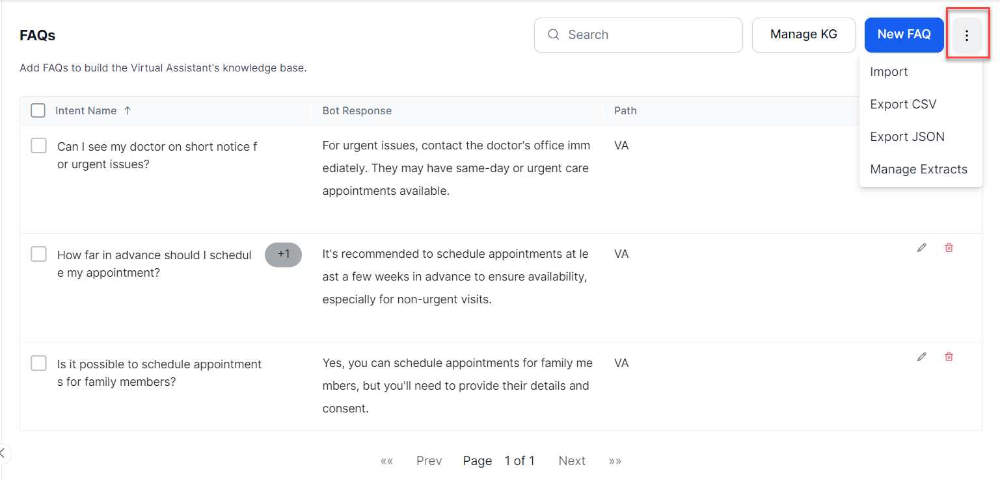
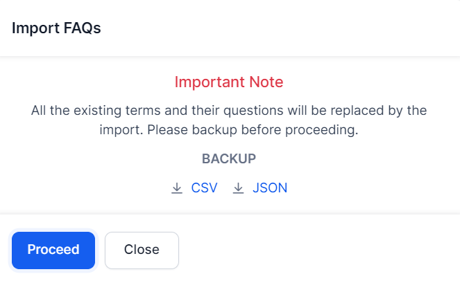

# Import and Export a Knowledge Graph

You can build a Knowledge Graph in a CSV or JSON file and upload it to a VA. Similarly, you can export the existing Knowledge Graph to CSV or JSON. Exporting a Knowledge Graph helps you edit it in a spreadsheet or import it to another VA.

The allowed limit is a maximum of 50k FAQs spread across a maximum of 20k nodes.

The XO Platform allows you to import any VA with a file size up to 50MB. If you try to import a bot with more than 50MB size, the import process fails.

## Import

Caution

Importing a Knowledge Graph replaces the existing one. Please proceed with caution and follow the steps below carefully.

To import a Knowledge Graph, follow the steps below:

1. To import the KG and go to **Virtual Assistant** > **Knowledge AI** > **FAQs**.
2. In the top right corner, click **more** icon.
3. Click **Import** option on the respective Knowledge Graph.
    

5. In the **Import FAQs** dialog, do one of the following based on the scenario:
    * For a new Knowledge Graph, click **Proceed**.
    * For an existing Knowledge Graph, take a backup CSV or JSON file, and then click **Proceed**.
     

6. Drag and drop the file to the **Import** window or click **Browse** to locate the file.
7. Click **Next** to begin the import.

After the import is complete, the success message appears in a dialog box. 
8. Click **Done**.

The hierarchy is displayed in the Knowledge Graph which you can edit and use to train your VA.

## Export

To export a Knowledge Graph, follow the below steps:

1. To export the KG and go to **Virtual Assistant** > **Knowledge AI** > **FAQs**.
2. In the top right corner, click **more** icon.
     

3. Based on the preferred format: click **Export JSON** or **Export CSV**.

    

    
Note

    
Please read the warning message shown below before clicking <b>Confirm</b>. To learn more about caching challenges and strategies, click <a href="https://aws.amazon.com/builders-library/caching-challenges-and-strategies/#:~:text=Caches%20are%20also%20susceptible%20to%20poisoning%20attacks%2C%20in%20which%20a,will%20see%20the%20malicious%20value">here</a>.

    

    

    When these steps are completed, the Knowledge Graph file is downloaded to your machine.
