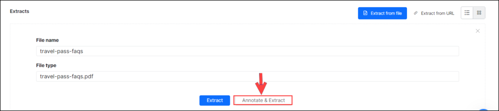

# Knowledge Graph Extraction

The **Knowledge Graph Extraction** service enables you to effortlessly move your enterprise’s Frequently Asked Questions (FAQ) content into a Knowledge Graph that trains your assistant based on these questions.

The feature supports the extraction of knowledge from unstructured content such as web pages and PDF documents, and structured content like CSV files.

After completing the extraction, you can edit the question and answers using an easy-to-use interface and organize them under the relevant Knowledge Graph nodes.

## The Extraction Process

To move data using the Knowledge Extraction service to the Knowledge Graph, follow the process below:

1. **Extracting**: Extract the existing FAQ content from structured or unstructured sources of question-answer data such as PDF, web pages, and CSV files. This extraction can be done before or after creating a Knowledge Graph for the assistant you are working with. 
    

    
Note

    
The Knowledge Extraction service supports a specific content structure for each source type. Refer to the [Supported formats](#supported-formats-and-requirements).
    

<ol start="2"><li><b>Editing</b>: Upon successful data extraction, you can edit the questions and answer text before moving it to the Knowledge Graph.</li>
<li><b>Moving</b>: You can add data to a VA before or after creating a Knowledge Graph (KG). If you try to add the extracted content to a KG before it exists, the VA automatically creates a KG with the VA’s name.</li></ol>

The Knowledge Extractor allows you to add the extracted content to the Knowledge Graph as follows:

* **Add to Knowledge Graph** moves the selected questions to the root node of the Knowledge Graph. You can use this option when the required term is not yet added to the KG or when the VA does not have a Knowledge Graph.
* **Add to Specific Term**: If the VA already consists of a Knowledge Graph, you drag-drop the selected content to the required nodes.

## Extract from a Website

1. Open the VA to which you want to extract the content.
2. Go to **Virtual Assistant** > **Knowledge AI** > **FAQs** > **more** (three dots) > **Manage Extracts**.
4. Click **Extract from URL**.
5. Enter a **Name** for the extraction.
6. Enter the **URL** of the page, and then click **Proceed**.

7. Once the extraction is completed successfully, a success status page appears.
8. **Review & Add** the relevant questions to your Knowledge Graph.

## Extract from a File

Note

The file size should not exceed 5MB.

To extract content from a file, please follow the steps below. For file format details, refer to the [Supported Formats](#supported-formats-and-requirements).

1. Open the VA to which you want to extract the content.
2. Go to **Virtual Assistant** > **Knowledge AI** > **FAQs** > **more** (three dots) > **Manage Extracts**.
4. Click **Extract from file**.
5. Click **Browse** to locate the file (PDF or CSV).

    

6. Click **Proceed**.
7. For PDF files you have an option to annotate the document before extraction.
8. After the extraction is completed successfully, a success status page is displayed.
9. **Review & Add** the relevant questions to your Knowledge Graph.

### Annotate & Extract

You might have all the FAQs related to your business in a PDF file but not in the XO Platform compatible format. Versions prior to 8.0 of the XO Platform did not allow incompatible files. The introduction of the Annotation tool helps annotate documents, identifying the key sections of the content. The Knowledge Extraction engine uses this information to extract the FAQs from the document.

Note

This is only applicable to PDF documents.

1. Select a new or previously extracted PDF file. Note that you can use a previously extracted file provided no questions from that file are added to the Knowledge Graph.
2. Click **Annotate & Extract** to make annotation on a newly uploaded file.
    

3. The PDF document is loaded into the Annotation Tool allowing you to annotate the various sections in the document.
4. To annotate, select the text and tag it as follows:
    * **Heading** tags are used to identify questions. Headings are used to train the model to identify the questions and the content between two consecutive headings is treated as the answer for the preceding heading.
    * **Header** – Text thus marked is ignored. Text marked as Headers is used to train the model to identify and ignore such text. Random marking of texts as headers must be avoided as marking texts as headers or paragraphs as the header invalidates the backend ML model, and will not produce optimal results.
    * **Footer** – Text thus marked is ignored. Text marked as Footers is used to train the model to identify and ignore such text. Same as the Header, random marking of texts as footers must be avoided as marking text such as header or paragraphs as the footer invalidates the backend ML model, and will not produce optimal results.
    * **Exclude** – This text is not used for extraction.
    * **Ignore Page** – Pages marked as ignored are not used for extraction.
    * You can use **Remove Annotation** to rectify any incorrect annotations.
5. The Knowledge Graph Engine uses the headings, headers, and footers in the extraction process. Since the model is trained by the KG Engine, annotating the entire document is not necessary. You can annotate a couple of pages with headings, headers, and footers, extract and review the questions. If satisfied, you can proceed with adding questions to the Knowledge Graph, else repeat the annotation process till you get satisfactory results.
6. Additional document information is provided:
    * **Document Info** – Name, Size, and the Number of Pages of the document.
    * **Annotation Summary** – Number of annotations marked for each category for the particular page and entire document.
7. After you annotate, you can **Extract** the document.

8. Once the content is extracted, you will see a message showing you how many questions have been found and allowing you to review and add them to the Knowledge Graph.

    

9. Choosing to **Review** the questions will take you to a screen where you can review extracted FAQs. This screen splits your FAQs into: **All Questions**, **Added** to KG and **Not Added** to the KG. 

10. The **All Questions** tab gives the questions extracted by the KG Engine as per the annotations and training. Click the name of a question or check the checkbox to select multiple ones to add to the Knowledge Graph then drag and drop them to the appropriate node..
11. If you are not satisfied with the extracted content, you can always re-annotate the document. Just click on the **Annotate** tab to return to the annotation tool.
12. The same procedure mentioned above is followed for re-annotation. The following points need to be kept in mind for re-annotation:
    * You can re-annotate the document provided no questions from this file are added to the Knowledge Graph.
    * In case questions are already added, you can choose to create a copy of the annotated document and work with it. The copy will have all the annotations intact.

### Edit the Extracted Content

1. Open the VA.
2. Got to **Virtual Assistant** > **Knowledge AI** > **FAQs** > **more** (three dots) > **Manage Extracts**.
4. The **Manage Extracts** section displays the list of all extractions.

5. Click the name of a successful extract you want to edit.

6. Hover over the question-answer pair to modify it and click the **Edit** icon.

    

7. Make the necessary changes and click **Save**.

### Add the Extracted Content to the Knowledge Graph

There are two ways to add the extracted content to the Knowledge Graph.

### From the Extracts Section

To add the content from the **Extracts** section, follow the steps below:

1. Open the VA.
2. Got to **Virtual Assistant** > **Knowledge AI** > **FAQs** > **more** (three dots) > **Manage Extracts**.
4. From the **Manage Extracts** section, select the name of a successful extract you want to add.
5. Drag and drop the required Q&A to the node/term you want to add. As you drag and drop, the child nodes will be expanded.
6. You can select multiple Q&As and perform a bulk move.

### From Knowledge Graph

To add the content from the KG, follow the steps below:

1. Open the VA.
2. Select the **Build** top menu item.
3. From the left pane, click **Conversational Skills** > **Knowledge Graph**.
4. Select the node you want to add these Question-Answers.
5. Click **Add from Extraction**. It opens the list of successful and failed extractions.
6. Click the name of a successful extract you want to move.
7. Select the checkboxes next to the question-answer pairs that you want to move and then click **Add**.

    

    

    
Note

    
Once you move a question-answer pair from the extract to the knowledge graph, you cannot move it again. The platform shows a duplicate error when you try to move a question from the extract that is already present in the collection.

    
You can make any changes to the moved content from the knowledge graph. However, if the question is modified or removed from the knowledge graph, then the developer is allowed to add it again.

    

### Supported Formats and Requirements

The Knowledge Extraction service supports extracting FAQs only from supported CSV, PDF, and URL formats.

Note that the file size must not exceed 5MB.

### CSV

* The Knowledge Extraction service interprets the text in the first column as a question and that in the second column as an answer.
* The file must not have any headers.
* The Knowledge Extraction service ignores any headers and the text present in the other columns.

### PDF

* The Knowledge Extraction service processes the content from a PDF and converts it into question-answer pairs.
* **Documents with the table of contents**: Ideally a document with a table of contents is preferred. In such cases, the Knowledge Extraction service extracts the table of contents first and then uses it to parse the document and identify headings. The information present in the table of contents is used to derive the hierarchy of headings (headings, subheadings, sub-sub headings, etc.). These levels are separated by a vertical line as a delimiter (heading | subheading | sub-sub heading) as part of the extraction process.
* **Documents with no table of contents**: In such cases, the Knowledge Extraction service uses a pre-trained machine learning model that identifies headings based on either font style or font size. In the case of using font size, the heading hierarchy can also be derived.
* The text is then formatted with a uniform header and paragraph blocks.

### Web Pages

The Knowledge Extraction service supports the following three different formats of FAQ web pages:

* Plain FAQ pages with linear question-answer pairs.
* Pages with question hyperlinks that point to answers on the same page.
* Pages with question hyperlinks that point to answers on a different page.

Extraction of certain FAQs on the webpage fails under the following conditions:

* The question text is split between multiple HTML tags on the FAQ page.
* The tag applied to the answer is neither the child nor the sibling of the extracted question as per the HTML DOM structure.
* The question does not have a hyperlink to the answer (applies to FAQs with hyperlinks).
* When the questions hyperlink to the answer, but the question statement is not repeated above the answer (applies to FAQs with hyperlinks).

The extraction of the entire FAQ page also fails if the page consists of more than one FAQ page type mentioned above.
