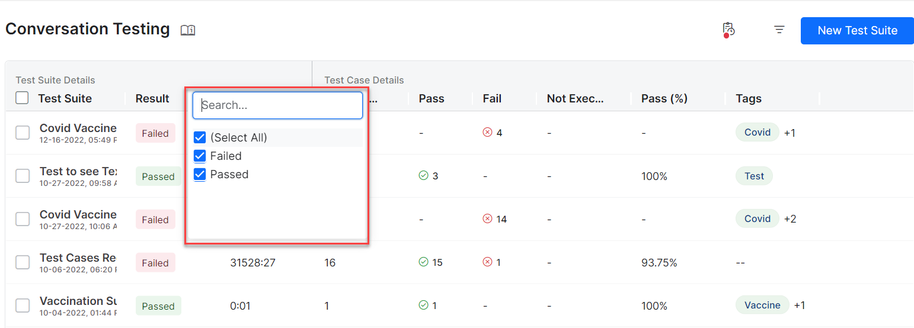

# Conversation Testing Overview

Conversation Testing enables you to simulate end-to-end conversational flows to evaluate the dialog task execution or perform regression. You can create Test Suites to capture various business scenarios and run them at a later time to validate the assistant’s performance.

The Conversation testing framework tracks the transition coverage and determines how well the Virtual Assistant (VA) understands the user queries and executes the dialogs and other intents of user conversations for a particular input(s). Like the NLP Health in the [Health and Monitoring dashboard](../../health-and-monitoring/virtual-assistants-health-and-monitoring/){:target="_blank"} a Flow health feature available in the Health and Monitoring dashboard presents a summary of the total coverage of dialog flows and analysis of conversation test results of your VA. This summary helps you understand the flow transitions and intent coverage in test suites. It enables you to add relevant test cases to cover missing transitions and intents. You can also use the test result analysis to identify and fix the issues in the dialog task definitions and improve the performance of your VA.
 

## Conversation Testing Landing Page

Go to **Automation AI > Virtual Assistant > Testing > Regression Testing** from the left navigation menu, and then the **Conversation Testing** tab. to access the Conversation Testing page. It lists all the Test Suites with details in a grid. All the Test Suite details like the Test Suite name, the execution status in the Result column, Duration of execution, Number of passed and failed test cases, Number of test cases not executed, the percentage of passed test cases, and tags added to the test suite during its creation are all displayed in the grid. Using tags, you can easily organize the test suites and filter them.

 

!!! note

    Only the results of the latest executions of test suites are displayed on the page. The details in each column can be searched and filtered as shown below.

 

You can also filter the details at the grid level by applying filters for intents covered in all the test suites.

!!! note
    Using this feature, you can identify test suites covering specific intent(s) and run them if you want to perform regression after definitions of an Intent or set of Intents are changed.

 

!!! note

    On the Conversation Testing dashboard, you can edit the test suite, clone, export, or delete it, as shown in the following screenshot. You can also rearrange the order of the columns by dragging and placing them in a different place in the grid.

 

The Conversation Testing allows you to capture the flow, track the executed nodes, covered transitions, and metadata. Following are the major options available on the Conversation Testing page:

* [Create a Test Suite](../create-a-test-suite/){:target="_blank"}
* [Test Editor](../test-editor/){:target="_blank"}
* [Test Case Assertion](../test-case-assertion/){:target="_blank"}
* [Test Case Execution Summary](../test-case-execution-summary/){:target="_blank"}

