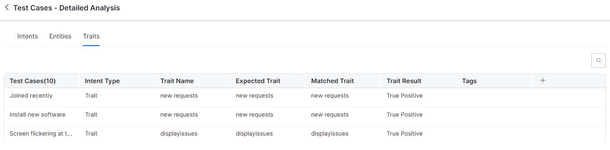

# **Health and Monitoring**

The **Health and Monitoring** dashboard offers a goal-driven approach to improving the accuracy of the virtual assistant’s Natural Language Processing (NLP) model. The training data is analyzed along with the test coverage and test results of the test suites to provide insights into the NLP Model’s performance.

This dashboard lets you achieve the following:

* Run the test suites against the in-development version of the bot to see the Virtual Assistant’s health.
* Review the test execution summary for every intent type.
* Drill down and view the coverage and key metrics of the virtual assistant determined by the Batch Test and Conversation Test executions.
* Identify incorrect intent patterns, short training utterances, incorrect entity annotations, and training recommendations and take corrective action.
* View the expected and matched results, and the detailed NLP analysis.
* Tag specific test case results that need follow-up actions and collaborate with your team to improve the performance.

!!! note

        The Health & Monitoring Dashboard is available only post 9.3 release, i.e. post-July 24, 2022.
        This feature only considers the latest In-development test executions.

## Navigating to Health and Monitoring

To navigate to the **Health and Monitoring** dashboard, follow these steps:

1. Click the **Build** tab on the top menu of the Virtual Assistant dashboard.
2. Click **Health & Monitoring** under **Testing** in the left navigation menu.

<kbd></kbd>

## Dashboard Sections and Components

The **Health and Monitoring** Dashboard is divided into two sections that include the following:

1. **NLP**: This panel extracts all test suite results from Batch Testing and presents insights into your test cases with performance analytics. The key components of this panel include the execution summary, the **key performance metrics**, and the **total test coverage** of the selected test suites for the Dialog intents, FAQs, Small Talks, and Traits. The key [recommendation scores](https://developer.kore.ai/docs/bots/analyzing-your-bot/virtual-assistants-health-and-monitoring/#Health_and_Monitoring_Metrics) presented here depict if your virtual assistant is trained sufficiently or not.
2. **Flow**: This panel summarizes the coverage of all the conversation flows by the Virtual Assistant you’ve defined including its performance, intents’ coverage and transitions. [Learn more](https://developer.kore.ai/docs/bots/analyzing-your-bot/flow-health-dashboard/). The key components of the **Flow** panel include transition coverage and intent summary panels for the test suites. [Learn more](https://developer.kore.ai/docs/bots/analyzing-your-bot/flow-health-dashboard/#Flow_Dashboard_Components).

## Health and Monitoring Metrics

### NLP Intent Coverage Metrics

The following metrics extracted from Batch Testing results are displayed in two ways:

1. As aggregate values in the **Bot Health** summary section. 

<kbd></kbd>

2. As individual scores in the **Dialog Intents**, **FAQs**, **Small Talk**, and **Traits** summary panels.

<kbd></kbd>

* **Accuracy**: Determines if the intent identified by your ML model is correct or not.
* **F1 Score**: Classifies the distribution and balances precision and recall scores. It is calculated as the weighted average of Precision and Recall.
* **Precision Score**: Defines how precise/accurate your model is and is calculated as the ratio of true positives over total predicted positives (sum of true and false positives).
* **Recall Score**: Defines the fraction of the relevant utterances that are successfully identified and is calculated as the ratio of true positives over actual positives (sum of true positives and false negatives).
* **Total Test Coverage %**: The average of the Total Test Coverage scores for **Dialog Intents**, **FAQs**, **Small Talk**, **Traits**, and **Entities**.

These metrics help gain actionable insights into your test cases to perform [ML Model Validation](https://developer.kore.ai/docs/bots/nlp/ml-model/).

### Flow Health Metrics

The Flow Health metrics display all the test suite results from the conversation testing and present insights into your test cases with performance analytics. [Learn more](https://developer.kore.ai/docs/bots/analyzing-your-bot/flow-health-dashboard/#Flow_Metrics).

## Test Cases Detailed Analysis

To get the detailed NLP data of all the test cases executed for all the test suites that are considered in the VA, click the **View Test Cases** link in the **NLP** section.

<kbd></kbd>

The **Test Cases- Detailed Analysis** window displays test results for Intents, Entities, and Traits as described below. The summary data helps identify the errors or areas of improvement for each category and fix them.

### Navigating to the Test Case Details Section

To view the **Details** section, in the **Test Cases – Detailed Analysis** window, click the **Intents**, **Entities**, or **Traits** tab. A summary table with the following details is displayed:

**Intents**

* **Test Cases**: The test case name.
* **Intent Type**: Displays if the intent is a Dialog intent, FAQ, or Small Talk.
* **Expected Intent**: Intent expected in the user utterance.
* **Matched Intent**: Intent actually matched in the utterance.
* **Result Type**: Displays if the match detected is _True Positive_, _False Positive_, or _False Negative_.
* **Tags**: The tag labeled for the conversation by the analyst.

<kbd></kbd>

**Entities**

A summary table with the following details is displayed:

* **Utterances**: The user utterance captured in the test case.
* **Entity Name**: The entity name mapped to the test case for the utterance.
* **Expected Value**: The Entity expected in the user utterance.
* **Matched Value**: The Entity actually matched in the utterance.
* **Entity Result**: Displays if an entity is matched (_True_), or not (_False_).
* **Tags**: The tag labeled for the conversation by the analyst.

<kbd></kbd>

**Traits**

A summary table with the following details is displayed:

* **Test Cases:** The test case of the trait.
* **Intent Type:** Displays Trait.
* **Trait Name:** The name of the trait analyzed in the test case.
* **Expected Trait:** The trait expected in the user utterance.
* **Matched Trait:** Displays the actual trait matched in the utterance.
* **Trait Result:** Displays if the match detected is True Positive, False Positive, or False Negative.
* **Tags:** The tag labeled for the conversation by the analyst.

<kbd></kbd>

**Tags**

After analyzing the reason for failure, you can collaborate with your team members using tags for test case executions. **Tags** are labels mapped to the test case results of intents, entities, and traits, indicating follow-up actions or suggestions.

The following tags are available for intents, entities, and traits:

* **Add Negative Pattern**: Indicates that the user has to add a negative pattern to the intent/entity/trait test execution.
* **NeedNLPHelp**: Indicates that the test execution requires explicit NLP help.
* **Needs Negative Pattern**: Indicates that the intent/entity/trait test execution needs a negative pattern to execute as expected.
* **Needs Training**: Indicates that the virtual assistant needs training for the identified intent/entity/trait after the test execution.
* **New Intent**: Indicates a new intent during test execution.

Hover over the desired entry, and click the **detailed view** icon.

<kbd></kbd>

A sliding window with the test results for the selected test case and intent type appears.

**Intent and Entity Details**

<kbd></kbd>

**Trait Details** are displayed in the test case details window if you select the **trait** intent type.

<kbd></kbd>

Click the **expansion arrow** icon under **Entity** to view the entity order expected by the ML engine and the actual entity order.

<kbd></kbd>

#### NLP Analysis

The **NLP Analysis** section displays the detailed view of the historic analysis generated at the time of the test case execution for failed and successful test cases. For the selected intent type, this section gives an overview of the intents that are qualified (the definitive and probable matches) and disqualified to serve as crucial information for users trying to decode the reason for failed test cases. The following details are displayed as a graphical representation in this section:

* [Traits](https://developer.kore.ai/docs/bots/nlp/traits/#Trait_Definition) (if applicable)
* [Machine Learning (ML) engine](https://docsinternal-kore.github.io/docs/xo/automation/testing/utterance-testing/#ml-model)
* [Fundamental Meaning (FM) engine](https://docsinternal-kore.github.io/docs/xo/automation/testing/utterance-testing/#fm-model)
* [Knowledge Graph (KG) engine](https://docsinternal-kore.github.io/docs/xo/automation/testing/utterance-testing/#knowledge-graph)
* [Trait Rule](https://developer.kore.ai/docs/bots/nlp/traits/#Trait_Association_Rules) (if applicable)
* [Ranking and Resolver](https://docsinternal-kore.github.io/docs/xo/automation/testing/utterance-testing/#ranking-and-resolver)

This is different from analyzing the test results under **Utterance Testing** where the current analysis information is displayed based on the changes to the trained data. [Learn more](https://docsinternal-kore.github.io/docs/xo/automation/testing/utterance-testing/#analyzing-the-test-results).

To view the **NLP Analysis** section, follow these steps:

1. Please follow **steps 1 to 3** mentioned in the [Navigating to the Test Case Details](https://developer.kore.ai/docs/bots/analyzing-your-bot/virtual-assistants-health-and-monitoring/#Navigating_to_the_Test_Case_Details_Section) section.
2. Click the **NLP Analysis** tab as shown below:

<kbd></kbd>

## Test Suite Summary

For **Flow Health**, clicking the **View Test Suites** link displays the following details:

* Test Suite
* Result
* Duration
* Test Cases
* Pass
* Fail
* Not Executed
* Pass percentage

Please click [here](https://developer.kore.ai/docs/bots/analyzing-your-bot/flow-health-dashboard/#Flow_Metrics) to learn more about Test Suite Performance and Test Coverage Analysis.

#### Utterance Testing

Based on the test case failures, you can retrain your virtual assistant using the **Utterance testing** option for all possible user utterances and inputs. Training is how you enhance the performance of the NLP engine to prioritize one task or user intent over another based on the user input. To learn more, please refer to this [link](https://docsinternal-kore.github.io/docs/xo/automation/testing/utterance-testing/).

To navigate to the **Utterance Testing** window, follow these steps:

* Click the **go to utterance testing** (magic wand) icon on the **Test Cases – Detailed Analysis** page.

<kbd></kbd>

In the **Utterance Testing** window shown below, you can do the following:

* Test & [Train](https://docsinternal-kore.github.io/docs/xo/automation/testing/utterance-testing/#training-the-assistant) your virtual assistant based on these [recommendations ](https://developer.kore.ai/docs/bots/nlp/user-utterances/#Recommendations)to understand different user utterances and match them with intents and entities.
* View the **NLP analysis** flow and **Fields/Entities** analysis data including the confidence score based on the NER training.
* Use the **Mark as an incorrect match** link to match the user input with the right intent when it is mapped to an incorrect task.

<kbd></kbd>

## Dialog Intent Summary

This section provides the performance metrics, test coverage and analytics for only the **Dialog Intents** test cases.

<kbd></kbd>

The sub-sections available include:

### Test Coverage

This section displays the count and percentage of the intents covered and not covered. You can find the list of intents not covered using the **View details** option and start adding test cases for them. An Intent is considered as covered when the intent has at least one test case in the selected test suite(s).

### NLP Performance Metrics

This section gives the breakdown of the test case results for the given intent type. The result type could have one of the following values:

* **True Positive (TP)**: Percentage of utterances that have correctly matched expected intent.
In the case of Small Talk, it would be when the list of expected and actual intents are the same.
In the case of Traits, this would include the traits matched over and above the expected matches.
* **False Positive (FP)**: Percentage of utterances that have matched an unexpected intent. In the case of Small Talk, it would be when the list of expected and actual intents are different.
* **False Negative (FN)**: Percentage of utterances that have not matched expected intent. In the case of Small Talk, it would be when the list of expected Small Talk intent is blank but the actual Small Talk is mapped to an intent.

**Recommendation Notification**: Shows any training recommendations available for the dialog intents.

The test execution results for the selected test suite(s) and intent type can be analyzed in the details window which provides a drill-down view of the following performance metrics for intents, entities, and traits

<table>
  <tr>
   <td><strong>METRIC NAME</strong>
   </td>
   <td><strong>DESCRIPTION</strong>
   </td>
   <td><strong>INTENT</strong>
   </td>
   <td><strong>ENTITY</strong>
   </td>
   <td><strong>TRAIT</strong>
   </td>
  </tr>
  <tr>
   <td><strong>Expected Intent/Value</strong>
   </td>
   <td>Please refer to Intents in <a href="https://developer.kore.ai/docs/bots/analyzing-your-bot/virtual-assistants-health-and-monitoring/#Navigating_to_the_Test_Case_Details_Section">this</a> section.
   </td>
   <td>Yes
   </td>
   <td>Yes
   </td>
   <td>Yes
   </td>
  </tr>
  <tr>
   <td><strong>Matched Intent/Value</strong>
   </td>
   <td>Please refer to Intents in <a href="https://developer.kore.ai/docs/bots/analyzing-your-bot/virtual-assistants-health-and-monitoring/#Navigating_to_the_Test_Case_Details_Section">this</a> section.
   </td>
   <td>Yes
   </td>
   <td>Yes
   </td>
   <td>Yes
   </td>
  </tr>
  <tr>
   <td><strong>Parent Intent</strong>
   </td>
   <td><a href="https://developer.kore.ai/docs/bots/bot-intelligence/sub-intents-and-follow-up-intents/">Learn more</a>.
   </td>
   <td>Yes
   </td>
   <td>No
   </td>
   <td>Yes
   </td>
  </tr>
  <tr>
   <td><strong>Task State</strong>
   </td>
   <td>The status of the intent or task against which the intent is identified. Possible values include <strong>Configured</strong> or <strong>Published</strong>.

.
   </td>
   <td>Yes
   </td>
   <td>No
   </td>
   <td>Yes
   </td>
  </tr>
  <tr>
   <td><strong>Result Type</strong>
   </td>
   <td>Please refer to Intents in <a href="https://developer.kore.ai/docs/bots/analyzing-your-bot/virtual-assistants-health-and-monitoring/#Navigating_to_the_Test_Case_Details_Section">this</a> section.
   </td>
   <td>Yes
   </td>
   <td>No
   </td>
   <td>Yes
   </td>
  </tr>
  <tr>
   <td><strong>Matched Intent Score and Expected Intent Score</strong>
   </td>
   <td>Displays the individual scores for the following
<ul>

<li><a href="https://docsinternal-kore.github.io/docs/xo/automation/testing/utterance-testing/#ml-model">Machine Learning (ML) score</a>

<li><a href="https://docsinternal-kore.github.io/docs/xo/automation/testing/utterance-testing/#fm-model">Fundamental Meaning (FM) score</a>

<li><a href="https://docsinternal-kore.github.io/docs/xo/automation/testing/utterance-testing/#ranking-and-resolver">Ranking and Resolver (RR) score</a>
</li>
</ul>
   </td>
   <td>Yes
   </td>
   <td>No
   </td>
   <td>Yes
   </td>
  </tr>
  <tr>
   <td><strong>Entity Name</strong>
   </td>
   <td>Please refer to Entities in <a href="https://developer.kore.ai/docs/bots/analyzing-your-bot/virtual-assistants-health-and-monitoring/#Navigating_to_the_Test_Case_Details_Section">this</a> section..
   </td>
   <td>No
   </td>
   <td>Yes
   </td>
   <td>No
   </td>
  </tr>
  <tr>
   <td><strong>Result</strong>
   </td>
   <td>Returns <strong><em>True</em></strong> if an entity is identified and <strong><em>False</em></strong> if not.
   </td>
   <td>No
   </td>
   <td>Yes
   </td>
   <td>No
   </td>
  </tr>
  <tr>
   <td><strong>Identified by</strong>
   </td>
   <td>The NLU engine that identified the entity.
   </td>
   <td>No
   </td>
   <td>Yes
   </td>
   <td>No
   </td>
  </tr>
  <tr>
   <td><strong>Identified using</strong>
   </td>
   <td>The reference entity type that was used to identify the entity during test execution.
   </td>
   <td>No
   </td>
   <td>Yes
   </td>
   <td>No
   </td>
  </tr>
  <tr>
   <td><strong>Confidence Score</strong>
   </td>
   <td>A score to determine if the test execution resulted in a favorable outcome (high score) or not (low score) when an utterance is trained for the entity.
   </td>
   <td>No
   </td>
   <td>Yes
   </td>
   <td>No
   </td>
  </tr>
</table>

## Dialog Intent Flow Health

Please refer to this [link](https://developer.kore.ai/docs/bots/analyzing-your-bot/flow-health-dashboard/#Dialog_Intent_Summary) for more information.

The following sections can be accessed from the **Dialog Intent Summary** panel:

### Conversation Test Results Analysis

Please refer to this [link](https://developer.kore.ai/docs/bots/analyzing-your-bot/flow-health-dashboard/#Conversation_Test_Results_Analysis) for more information.

### Transitions Coverage

Please refer to this [link](https://developer.kore.ai/docs/bots/analyzing-your-bot/flow-health-dashboard/#Transitions_Coverage) for more information.

### View Intents Summary

Please refer to this [link ](https://developer.kore.ai/docs/bots/analyzing-your-bot/flow-health-dashboard/#View_Intent_Summary)for more information.

View Recommendations

You can view relevant training recommendations for dialog intents, FAQs, or Small Talks when errors and warnings are triggered during the test execution. To view the recommendations summary, click **View Recommendations** on the top right of the details page.

To view the details of the utterance validations, errors, warnings, and recommendations and correct them, click the **Recommendations** column.

<kbd></kbd>

## Viewing Specific Test Results

To know how to get the drill-down view of a specific NLP test case execution, please refer to the [Test Cases – Detailed Analysis](https://developer.kore.ai/docs/bots/analyzing-your-bot/virtual-assistants-health-and-monitoring/#NLP_-_Test_Cases_Detailed_Analysis) section.

### NLP- FAQs Summary

The **FAQ Summary** section displays the [recommendation scores](https://developer.kore.ai/docs/bots/analyzing-your-bot/virtual-assistants-health-and-monitoring/#Health_and_Monitoring_Metrics) generated for FAQs from the latest batch test executions. \

<kbd></kbd>

**Viewing Additional FAQ Recommendations**: For **FAQ Details**, clicking **View Recommendations** will display the report that was already run during the previous run time. To know how to view and manage additional recommendations, please refer to this [link](https://developer.kore.ai/docs/bots/nlp/training-validations/#How_to_Use_the_NLU_Validate_Model).

<kbd></kbd>

<kbd></kbd>

**Knowledge Graph**: Clicking this button will take you to the **Knowledge Graph** section where you can perform [KG Analysis](https://developer.kore.ai/docs/bots/bot-builder-tool/knowledge-task/knowledge-ontology-analysis/). \

<kbd></kbd>

<kbd></kbd>

### Flow- FAQs Summary

Please refer to this [link](https://developer.kore.ai/docs/bots/analyzing-your-bot/flow-health-dashboard/#FAQs_Summary) for more information.

### NLP- Small Talk Summary

The **Small Talk Summary** panel displays the [recommendation scores](https://developer.kore.ai/docs/bots/analyzing-your-bot/virtual-assistants-health-and-monitoring/#Health_and_Monitoring_Metrics) generated for Small Talk interactions from the latest batch test executions. \

<kbd></kbd>

**Small Talk button**: Click this button to view the group name and the relevant user utterances, and Bot utterances.

<kbd></kbd>

### Flow- Small Talk Summary

Please refer to this [link](https://developer.kore.ai/docs/bots/analyzing-your-bot/flow-health-dashboard/#Small_Talk) for more information.

## Trait and Entity Summary Information

The **Trait Summary** and **Entity Summary** sections display the [recommendation scores](https://developer.kore.ai/docs/bots/analyzing-your-bot/virtual-assistants-health-and-monitoring/#Health_and_Monitoring_Metrics) generated for traits and entities respectively from the latest batch test executions.

**Trait Summary**

<kbd></kbd>

**Entity Summary**

<kbd></kbd>

**Test Coverage and Test Results Analysis**

Please refer to [Test Coverage](https://developer.kore.ai/docs/bots/analyzing-your-bot/virtual-assistants-health-and-monitoring/#Test_Coverage) and [Test Results Analysis](https://developer.kore.ai/docs/bots/analyzing-your-bot/virtual-assistants-health-and-monitoring/#NLP_-_Test_Results_Analysis) for information on the sub-sections of these summary panels.

## NLP Batch Test Results Summary for Universal Bots

The XO Platform now displays batch test results for Universal bots for each test run in the summary view for [FAQs](https://developer.kore.ai/docs/bots/analyzing-your-bot/virtual-assistants-health-and-monitoring/#NLP-_FAQs_Summary), [Dialog Intents](https://developer.kore.ai/docs/bots/analyzing-your-bot/virtual-assistants-health-and-monitoring/#Dialog_Intent_Summary), and [Small Talk](https://developer.kore.ai/docs/bots/analyzing-your-bot/virtual-assistants-health-and-monitoring/#NLP-_Small_Talk_Summary) during Batch Testing. The actionable insights help understand the test coverage and NLP performance for each intent type in the Universal Bot.

The only difference between Standard and Universal Bots is that the insights derived are based on the intents of all the linked bots. For instance, the intent coverage is based on the comparison of the intents covered in the test suite and the total number of intents present in all the linked bots. 

### Test Suite Summary

The **Test Suite Summary** for the Universal Bot is the same for Dialog Intents, FAQs, and Small Talk. However, for the Universal Bot, the system takes the total number of respective intents in all the linked bots as the denominator to calculate the coverage metrics.

### Intent Summary

The **NLP Intent Summary** sections are the same for Universal Bots, except the **Recommendations** information is not displayed for **Dialogs** and **FAQs**, as shown below:

<kbd></kbd>

### Dialog Intents

The **Dialog Intent Details** page for Universal Bot summarizes the following information:
* Intent Name
* Bot Name
* Training Utterance
* Test Cases
* [NLP performance metrics](https://developer.kore.ai/docs/bots/analyzing-your-bot/virtual-assistants-health-and-monitoring/#NLP_Performance_Metrics): TP, FP, FN, and F1.
* [Coverage metrics](https://developer.kore.ai/docs/bots/analyzing-your-bot/virtual-assistants-health-and-monitoring/#NLP_Intent_Coverage_Metrics): Precision, Recall, and Accuracy.
* Covered In (The Test Suites that cover the intent).

<kbd></kbd>

Please refer to [Intent Details Window](https://developer.kore.ai/docs/bots/analyzing-your-bot/virtual-assistants-health-and-monitoring/#Intent_Details_Window) for more information on the above values.

**Note**: The **Recommendations** option is not available for Universal Bot on this page.

To view the intents not covered on the **Dialog Intent Details** page, click the **Three-dotted/Ellipses** icon and select **_View Intents Not Covered_**.

<kbd></kbd>

In the **Not Covered Intent**s List, you can view the respective Bot Name, as shown below. This helps analyze which Bots don’t identify the tested intents and improve test execution accordingly.

<kbd></kbd>

The **Search** and **Filter** options help select specific intents not covered by a Bot.

### FAQ

The **FAQ Details** page for Universal Bot summarizes the following information:
* Intent Name
* Bot
* Path
* Alt Question
* Test Cases
* [NLP performance metrics](https://developer.kore.ai/docs/bots/analyzing-your-bot/virtual-assistants-health-and-monitoring/#NLP_Performance_Metrics): TP, FP, FN, and F1.
* [Coverage metrics](https://developer.kore.ai/docs/bots/analyzing-your-bot/virtual-assistants-health-and-monitoring/#NLP_Intent_Coverage_Metrics): Precision, Recall, and Accuracy.
* Covered In (The Test Suites that cover the intent).

<kbd></kbd>

Please refer to [Intent Details Window](https://developer.kore.ai/docs/bots/analyzing-your-bot/virtual-assistants-health-and-monitoring/#Intent_Details_Window) for more information on the above values.

!!! note

        The 'Knowledge Graph' and 'Recommendations' options are not available for Universal Bot on this page.

To view the intents not covered on the **FAQ Details** page, click the **Three-dotted/Ellipses** icon and select **_View Intents Not Covered_**.

<kbd></kbd>

In the **Not Covered Intents** List, you can view the respective Bot Name, as shown below.

<kbd></kbd>

### Small Talk

The **Small Talk Details** page for Universal Bot summarizes the following information:
* Intent
* Group
* Bot
* Test Cases
* [NLP performance metrics](https://developer.kore.ai/docs/bots/analyzing-your-bot/virtual-assistants-health-and-monitoring/#NLP_Performance_Metrics): TP, FP, FN, and F1.
* [Coverage metrics](https://developer.kore.ai/docs/bots/analyzing-your-bot/virtual-assistants-health-and-monitoring/#NLP_Intent_Coverage_Metrics): Precision, Recall, and Accuracy.
* Covered In (The Test Suites that cover the intent).

<kbd></kbd>

Please refer to [Intent Details Window](https://developer.kore.ai/docs/bots/analyzing-your-bot/virtual-assistants-health-and-monitoring/#Intent_Details_Window) for more information on the above values.

!!! note

        The 'Small Talk' option is not available for Universal Bot on this page.

To view the intents not covered on the **Small Talk Details** page, click the **Three-dotted/Ellipses** icon and select **_View Intents Not Covered_**.

<kbd></kbd>

In the **Small Talk-Intents Not Covered**s List, you can view the respective Bot Name, as shown below.

<kbd>

## Intent Details Window

The **View Details** link in the Dialog intent, FAQ, and Small Talk summary sections provides access to a drill-down view of the key performance metrics and recommendations of the covered intents.

The given data helps identify the intent-related issues proactively in the training phase itself to work on fixing them accordingly.

<kbd></kbd>

Here’s what you can do:

**View the Training Data Summary**

You can view the training data summary with the relevant recommendation metrics for Dialog Intents, FAQs, and Small Talks in the details panel.

<kbd></kbd>

The summary of all the metrics displayed is given below:

<table>
  <tr>
   <td><strong>RECOMMENDATION METRIC</strong>
   </td>
   <td><strong>DIALOG INTENT</strong>
   </td>
   <td><strong>FAQ</strong>
   </td>
   <td><strong>SMALL TALK</strong>
   </td>
  </tr>
  <tr>
   <td><strong>Intent</strong>
   </td>
   <td>The name of the dialog intent.
   </td>
   <td>The name of the FAQ intent.
   </td>
   <td>The name of the Small Talk intent.
   </td>
  </tr>
  <tr>
   <td><strong>Utterances</strong>
   </td>
   <td>The count of the training utterances for that intent.
   </td>
   <td>N/A
   </td>
   <td>
   </td>
  </tr>
  <tr>
   <td><strong>Test Cases</strong>
   </td>
   <td>The count of the test cases that are present in the selected test suites for that intent.
   </td>
   <td>
   </td>
   <td>
   </td>
  </tr>
  <tr>
   <td><strong>True Positive (TP)</strong>
   </td>
   <td>The count of the intent test cases that resulted in TP.
   </td>
   <td>
   </td>
   <td>
   </td>
  </tr>
  <tr>
   <td><strong>False Negative (FN)</strong>
   </td>
   <td>The count of the intent test cases that resulted in FN.
   </td>
   <td>
   </td>
   <td>
   </td>
  </tr>
  <tr>
   <td><strong>False Positive (FP)</strong>
   </td>
   <td>The count of the intent test cases that resulted in FP.
   </td>
   <td>
   </td>
   <td>
   </td>
  </tr>
  <tr>
   <td><strong>Covered In</strong>
   </td>
   <td>Name of the test suites in which the intent test cases are present.
   </td>
   <td>
   </td>
   <td>
   </td>
  </tr>
  <tr>
   <td><strong>F1, Accuracy, Precision, and Recall scores</strong>
   </td>
   <td>These <a href="https://developer.kore.ai/docs/bots/analyzing-your-bot/virtual-assistants-health-and-monitoring/#Health_and_Monitoring_Metrics">recommendation scores</a> are displayed based on the outcomes.
   </td>
   <td>
   </td>
   <td>
   </td>
  </tr>
  <tr>
   <td><strong>Recommendations</strong>
   </td>
   <td>Displays the count of training recommendations for that intent. Clicking on it will display the summary of the training recommendations and their probable corrective actions.
   </td>
   <td>N/A
   </td>
   <td>N/A
   </td>
  </tr>
  <tr>
   <td><strong>Group</strong>
   </td>
   <td>N/A
   </td>
   <td>N/A
   </td>
   <td>The group to which the Small Talk interaction is mapped.
   </td>
  </tr>
  <tr>
   <td><strong>Path</strong>
   </td>
   <td>N/A
   </td>
   <td>The node path in the Knowledge Graph.
   </td>
   <td>N/A
   </td>
  </tr>
  <tr>
   <td><strong>Alt Question</strong>
   </td>
   <td>N/A
   </td>
   <td>The number of alternative questions mapped to an FAQ.
   </td>
   <td>N/A
   </td>
  </tr>
</table>

**View Intents Not Covered**

This feature helps identify the intents not covered so as to include them in the test data for better and holistic [testing of the virtual assistant](https://developer.kore.ai/docs/bots/test-your-bot/testing-your-bot-with-nlp/#Testing_the_Bot). Click the **three-dot menu** on the right side of the panel to view the list of **intents not covered** in batch testing.

<kbd></kbd>

You can include the intents from this list to retrain your virtual assistant and improve performance.

<kbd></kbd>

