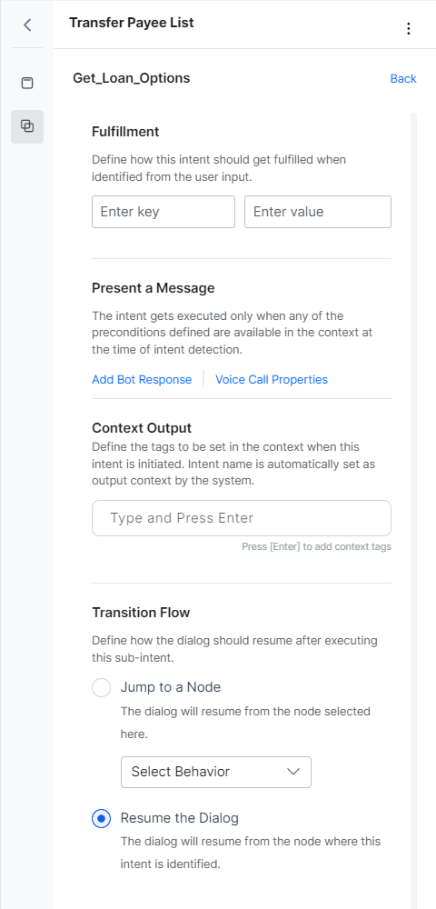

# Sub-Intent Scoping Using Node Groups

Node groups are primarily used for defining a group of nodes. Note that it is not a part of the dialog flow.

Node groups can be used to improve the user experience with follow-ups, digressions, and amending entity values. For a use case example, [refer here](../../../../../how-tos/build-a-banking-assistant/deploy-the-assistant/intent-scoping-using-group-node){:target="_blank"}.


## Add a Node Group

To add a node group to the dialog task, follow the below steps:

1. **Open the Dialog Task** where you want to add the Group node.
2. **Group the nodes**. For steps in grouping nodes, [refer here](../../using-the-dialog-builder-tool/#node-groups){:target="_blank"}.
3. You can add or remove nodes, edit and delete the group as per your need any time.


## Configure a Node Group

The Group Node functionality includes the following:

* **Scoping of Intents** – ability to define the sub-intents to be made available when the user is waiting at any of the nodes in the group;
* **Sub-intent Training** – the ability to train the sub-intent;
* **Sub-intent Properties** – ability to define the behavior of the sub-intent.


### Sub-Intent Scoping

Using Node Groups you can scope the sub-intents that are to be allowed to be identified from the user utterance and executed while the user is at one of the nodes within the group.

1. Open the dialog task. Navigate to **More Options >  Manage Groups**.

    

2. Click the Node Group you want to scope the intents for.
3. Click the **Sub Intent** icon.

    

4. Click **+ New**.

    

5. Provide a **Name** and **Description** for the Sub Intent, and click **Save**.

    


Once added, you can train, set pre-conditions, fulfillment criteria, prompts and behavioral properties for the scoped intent.


Note that you can also select an existing intent (dialog) and add it as a sub-intent.


### Sub-Intent Training

Once added, each of the sub-intent can be trained for recognition within this group. This would ensure that the sub-intent is identified in the group’s context.

1. Under **MANAGE SUB INTENT**, select the sub-intent you want to train.
2. You can train the sub-intent with the following:
        1. **Machine Learning** – Add the user utterances that should identify this sub-intent. You can also use the NER approach to annotate entities in the utterances.
        2. **Patterns** – Identify patterns in the user utterance related to this sub-intent.
        3. **Rules** – Define intent identification rules to trigger this intent.

3. You can also set the **Intent Preconditions** i.e. the sub-intent would get identified only when any of the preconditions defined is available in the context at the time of intent detection. These pre-conditions will be considered as instance levels and would take precedence over the component level pre-conditions.

    


###  Sub-Intent Properties

The **fulfillment** section can be used to define the actions when this particular sub-intent is identified from the user input. It includes the following properties:

1. **Context Variables** – Set the key-value pairs to define the session or context variables to be updated when this sub-intent is identified. If you want to reset the values, you need to use the keyword “null”, spaces would be ignored by the platform.
2. **Present a Message** – Optionally, define a message to be presented to the user when this sub-intent is identified. As with other responses, you can define the message as plain text, JavaScript format, specify, and set [Voice Call Properties](../../node-types/voice-call-properties/){:target="_blank"}, where applicable.
3. **Context Output** – Define the context tags to be set when this intent is identified. The intent name is always set as output context by the system. If you want to reset the values, you need to use the keyword “null”, spaces would be ignored by the platform.
4. **Transition Flow** – Use this option to define how the dialog should resume after executing this sub-intent. There are two behaviors you can define:
    1. **Jump To A Node** – The dialog will resume from the node selected here.
    2. **Resume The Dialog** – The dialog will resume from the node where this intent was identified.

    


## Implementation

Following are the changes in sub-intent behavior within a group:

1. For every sub-intent identified, the context object will be updated with an array of objects with the identified sub-intent details with the latest at the top. The following information is captured:
    1. Name of the sub-intent;
    2. Entities that are identified along with the sub-intent;
    3. Name of the group to which the sub-intent belongs, where applicable;
    4. Name of the node at which the sub-intent is identified.

        ```
        "identifiedSub-Intents": [
        {
        "intent": "Change Destination",
        "entities": {
        "destcity": "Delhi"
        },
        "groupName": "Entity Group",
        "identifiedAt": "to_date"
        },
        {
        "intent": "Weather Report",
        "groupName": "Entity Group",
        "identifiedAt": "destcity"
        }
        ]
        ```

    5. The intent would be executed if the sub-intent identified from the user utterance is within the group scope and all the input preconditions are satisfied and the transition flow directs to the concerned node.
    6. The execution of sub-intents would involve:
        1. Updated context variables as per the defined mapping,
        2. Setting the Output Context as per the defined mapping,
        3. Presenting the message to the user, if applicable.

    7. The current dialog execution should continue as per the transition flow defined.
        1. Jump to the specified node; or
        2. Resume from the point where the sub-intent was identified.