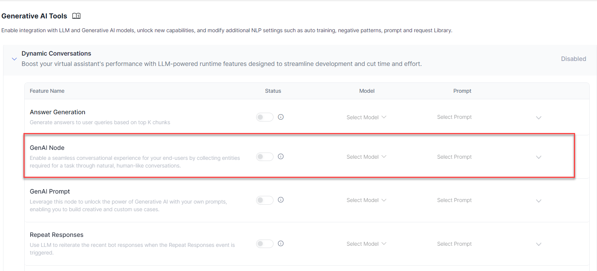
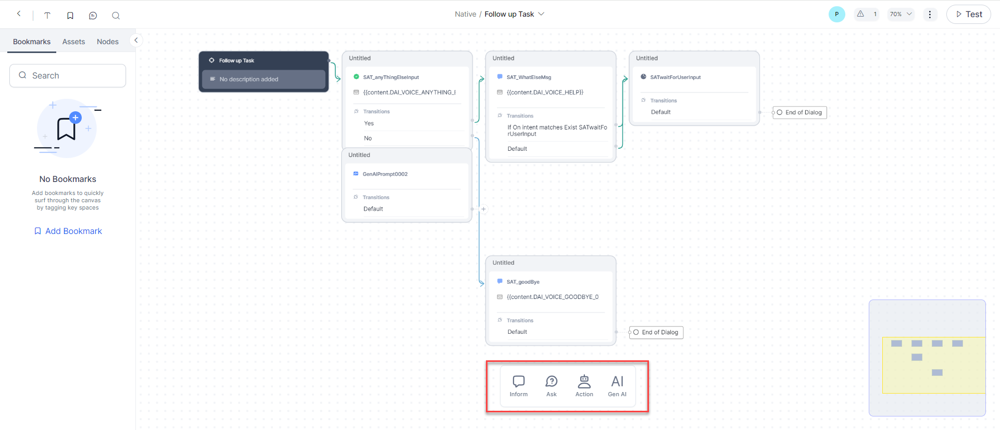

# GenAI Node (BETA)

The **GenAI Node** lets you leverage the full potential of LLMs and Generative AI models to quickly build conversations that involve complex flows and also provide human-like experiences. You can define the entities you would like to collect and also the business rules that govern the collection of these entities. The XO Platform orchestrates the conversation using contextual intelligence, ensuring that the conversation is always grounded to your enterprise business rules. You can also provide exit rules for handing off the conversation to the virtual assistant or the human agents.

**Watch a Short Video on GenAI Node (Previously AI-Assisted Dialog Node)**

<iframe title="vimeo-player" src="https://player.vimeo.com/video/818451050?h=46004417e1" width="960" height="540" frameborder="0"    allowfullscreen></iframe>


## Why a GenAI Node?

There are two key scenarios when an GenAI node might be beneficial:

1. NLP might not pick up co-referencing and entity correction during a conversation. For example, in a flight booking task, someone might ask to book two window seats, then change their mind and ask to modify one of the `seat types` from the `window` to the `middle`. In this scenario, the VA must correct the already collected entity `(seat type)` and perform entity co-referencing to modify from `window` to `middle`.
2. Complex flows like the above increase dialog task complexity, requiring multiple paths and nodes. Even then, it is humanly impossible to predict all such scenarios. Scripting all these possibilities might also result in a sub-par end-user experience.

Leveraging OpenAI’s generative AI model mitigates these scenarios by eliminating the need to predict and configure such complex possibilities while still under the constraint of defined rules and exit scenarios. This can facilitate more natural conversations and improve end-user experience.


## Node Behavior


### Runtime

You can work with this node like with any other node within Dialog Tasks and can invoke it within multiple tasks. During runtime, the node behaves as follows:

1. Entities Collection:
    1. On reaching the GenAI Node, the platform invokes the Generative AI models to understand the user input.
    2. The platform uses the entities and business rules defined as part of the node configurations to understand the user input and identify the required entity values.
    3. The responses required to prompt/inform the user are automatically generated based on the conversation context.
    4. The platform drives the conversation until all the defined entities are captured.

2. Contextual Intents:
    1. Contextual intents (Dialog or FAQs) recognized from the user input continue to be honored as per the Interruption Settings defined in the bot definition.
    2. Post completion of the contextual intents, the flows can return back to the GenAI Node.

3. Exit Conditions:
    1. The platform exits from the GenAI Node when any of the defined exit conditions are met.
    2. These conditions provide you the ability to define scenarios that need a different path in the conversation, for e.g., handing off to a human agent.

4. The platform can also exit the GenAI Node when the user exceeds the maximum number of volleys (retries to capture the required entities).
5. The platform stores the entity values in the context object, and this information can be used to define the transitions or any other part of the bot configuration.


### Output

The output generated by this node is fully usable throughout the dialog flow, even once the node is no longer in use. Output is maintained in a structured .json within the [Context Object](../../../context-object/), so you can access and use the output throughout the rest of your flow.


### Challenge Mitigation

Large Language Models come with challenges, such as potentially unwanted behavior. This is why the GenAI Node is built with the necessary infrastructure to enable you to define VA behavior. The node considers existing entities and context and allows you to configure specific rules and exit scenarios that ensure the VA acts within the boundaries of your business.


## Enable

This node is not available by default. You can enable it for all Dialog Tasks, including those created using Generative AI, as follows:

1. Configure the [LLM integration](../../../../../app-settings/generative-ai-tools/llm-integration).
2. Toggle GenAI Node feature under **App Settings** > **Generative AI Tools** > **Dynamics Conversations**. [Learn more](../../../../../app-settings/generative-ai-tools/dynamic-conversations-features/#genai-node)

    

    

If you do not integrate OpenAI and do not enable LLM or GenAI Node, then the node will not be available within the Dialog Builder.

## Add to a Task

To add the GenAI Node to a Dialog Task, follow these steps:

1. Go to **Automation** > **Dialogs** and select the task that you are working with.  


2. You can add the GenAI Node just like any other node. You can find it in the main list of nodes, as it does not depend on the Bot Action node.
    


## Configure


### Component Properties

The settings made within this section affect this node across all instances in all dialog tasks.


### General Settings

Under **General Settings**, provide a **Name** and **Display Name** for the node. The node Name cannot contain spaces.


.png "image_tooltip")


### Dialog Details

Under **Dialog Details**, configure the following:


### Pre-Processor Script

This property helps execute a script as the first step when the GenAI Node is reached. Use the script to manipulate data and incorporate it into rules or exit scenarios as required. The Pre-processor Script has the same properties as the Script Node. [Learn more](../working-with-the-script-node/#configure-the-node).

**Steps to Define and Configure Pre-processor Script**

To run a pre-processor script before reaching the GenAI Node, you must define it with the following steps:

1. Click the GenAI Node you want to configure.
2. Click the **Component Properties** icon on the left menu.
3. In the **Dialog Details** section, click **Define Script** in the **Pre-processor Script** section.
    .png "image_tooltip")

4. In the **Add Script** window, add the script you want to execute, and click **Save**.

    .png "image_tooltip")


### System Context

Include a brief description of the use case context; for example: _Act like a flight booking agent_.

.png "image_tooltip")


### Entities

Specify the entities to be collected by LLM during runtime. Click Add Entity, enter a Key for the Entity Type, then choose a Value from the drop-down list. Click the Bin icon next to an entity type to remove it.

You can add a maximum of 5 entities. Most entity types are supported. Here are the exceptions: custom, composite, list of items (enumerated and lookup), and attachment. See [Entity Types](../../entity-types) for more information.

.png "image_tooltip")


### Rules

Add the business rules that the collected entities should respect. Click Add Rule, then enter a short and to-the-point sentence, such as:

* _The airport name should include the IATA Airport Code;_
* _The passenger’s name should include the last name._

There is a 250-character limit to the Rules field, and you can add a maximum of 5 rules.

To remove a rule, click the Bin icon next to the rule.


.png "image_tooltip")


### Exit Scenarios

Specify the scenarios that should terminate entity collection and return to the dialog task. This means the node ends interaction with the generative AI model and returns to the dialog flow within the XO Platform.

Click **Add Scenario**, then enter short, clear, and to-the-point phrases that specifically tell the generative AI model when to exit and return to the dialog flow. For example, Exit when the user wants to book more than 5 tickets in a single booking and return `"max limit reached"`.

There is a 250-character limit to the Scenarios field, and you can add a maximum of 5 scenarios.

To remove a scenario, click the Bin next to the scenario.


.png "image_tooltip")


### Post-Processor Script

This property initiates the post-processor script after processing every user input as part of the GenAI Node. Use the script to manipulate the response captured in the context variables just before exiting the GenAI Node for both the success and exit scenarios. The Pre-processor Script has the same properties as the Script Node. [Learn more](../working-with-the-script-node/#configure-the-node).

**Important Considerations**

1. If the GenAI Node requires multiple user inputs, the post-processor is executed for every user input received.
2. The system evaluates the entity values collected from the user and stores the collected information in the context object for further processing.

**Steps to Define and Configure Pre-processor Script**

To define a Post-Processor script, in the **Dialog Details** section, follow the steps below:

1. Click **Define Script** in the **Pre-processor Script** section.

    .png "image_tooltip")

2. Add the script you want to execute in the **Add Script** window, and click **Save**.


### Instance Properties

Configure the instance-specific fields for this node. These apply only for this instance and will not affect this adaptive dialog node when used in other tasks. You must configure Instance Properties for each task where this node is used.


### User Input

Define how user input validation occurs for this node:

* **Mandatory**: This entity is required and must be provided before proceeding.
* **Allowed Retries**: Configure the maximum number of times a user is prompted for a valid input. You can choose between 5-25 retries in 5-retries increments. The default value is 10 retries.
* **Behavior on Exceeding Retries**: Define what happens when the user exceeds the allowed retries. You can choose to either _End the Dialog_ or _Transition to a Node_ – in which case you can select the node to transition to.


### User Input Correction

Decide whether to use autocorrect to mitigate potential user input errors:

* **Autocorrect user input**: The input will be autocorrected for spelling and other common errors.
* **Do not autocorrect user input**: The user input will be used without making any corrections.

.png "image_tooltip")


### Advanced Controls

Configure advanced controls for this node instance as follows:


### Intent Detection

This applies only to String and Description entities: Select one of these options to determine the course of action if the VA encounters an entity as a part of the user utterance:

* **Accept input as entity value and discard the detected intent**: The VA captures the user entry as a string or description and ignores the intent.
* **Prefer user input as intent and proceed with Hold & Resume settings**: The user input is considered for intent detection, and the VA proceeds according to the Hold & Resume settings.
* **Ask the user how to proceed**: Allow the user to specify if they meant intent or entity.


.png "image_tooltip")


### Interruptions Behavior

To define the interruption handling at this node. You can select from the below options:

* **Use the task level ‘Interruptions Behavior’ setting**: The VA refers to the **Interruptions Behavior** settings set at the dialog task level.
* **Customize for this node**: You can customize the **Interruptions Behavior** settings by selecting this option and configuring it. You can choose whether to allow interruptions or not, or to allow the end user to select the behavior. You can further customize Hold and Resume behavior. Read the [Interruption Handling and Context Switching](../../../../intelligence/conversation-management/manage-interruptions) article for more information.


.png "image_tooltip")


### Custom Tags

Add Custom Meta Tags to the conversation flow to profile VA-user conversations and derive business-critical insights from usage and execution metrics. You can define tags to be attached to messages, users, and sessions. See [Custom Meta Tags](../../../../../analytics/automation/custom-dashboard/custom-meta-tags){:target="_blank"} for details.


.png "image_tooltip")


### Voice Call Properties

Configure Voice Properties to streamline the user experience on voice channels. You can define prompts, grammar, and other call behavior parameters for the node. This node does not require Initial Prompts, Error Prompts, and grammar configuration.

See [Voice Call Properties](../../../../../channels/call-properties) for more information on setting up this section of the GenAI Node.


.png "image_tooltip")


### Connections

Define the transition conditions from this node. These conditions are applicable only for this instance and will not affect this node being used in any other dialog. See [Adding IF-Else Conditions to Node Connections](../../node-connections/nodes-conditions) for a detailed setup guide.


.png "image_tooltip")

All the entity values collected are stored in context variables. For example, `{{context.genai_node.collect_passengers_info.entities.DepartureAirport}}`. You can define transitions using the context variables.

This node captures entities in the following structure:

```
{
    "context":
    {
        "GenAI_Node":
        {
            "collect_passengers_info":
            {
                "entities": 
			"DepartureAirport":"Newyork"
			"ArrivalAirport":"California"
			"TravelDate":"09/03/2023"
			}
        },
        "collect_order_info":
        {
            "entities":
            {
                "pizza":"margartia"
                "size":"large"
                "crust":"thin"
                }
            }
        }
    }
}
```