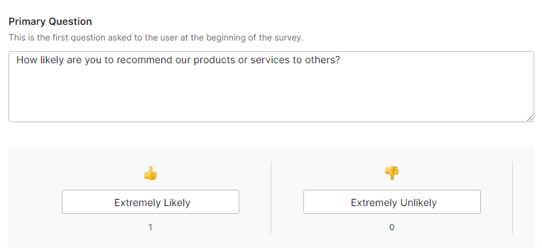
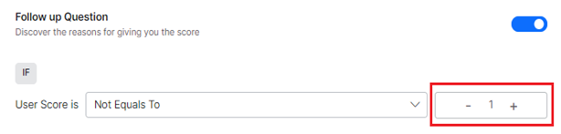

# **Feedback Surveys**

The XO Platform allows you to design and create feedback surveys for products, services, and overall experiences using out-of-the-box templates on the web and mobile channels. 

You can configure a Virtual Assistant to launch these surveys at a certain point in a conversation or at the end of a conversation (when the _end of conversation_ event is triggered). The **NPS**, **CSAT**, and **Like/Dislike** survey types are currently supported.

**Key Features**

1. The Feedback Module is use-case and channel-agnostic. But by default, it only shows text messages. You can always add additional channel-specific prompts to collect feedback from voice channels.
2. When a feedback survey is created on the platform, all messages are in text format. The text from the platform gets converted into a voice using the ASR and TTS engines.
3. You can leverage channel-specific configuration to modify the feedback prompts.
4. Feedback flows are fully customizable.
5. The Kore.ai XO Platform lets you configure feedback in two ways:
    * Using the built-in flows to collect the feedback and the new service type called **feedback service** to submit the feedback to the bots platform.
    * Collecting feedback from other sources that can be pushed to the platform as part of the conversation execution.
6. Feedback Surveys get created as dialog tasks with a series of entities, service calls, and message notes. You have complete control of modifying the out-of-the-box messages, adding additional messages to specific channels, such as voice channels, and capturing the feedback on voice.
7. You can use the automatic feedback template that the platform generates or build their flows and submit the feedback to the platform feedback service. Alternatively, it could be a hybrid approach where the feedback flow can emerge from or integrate with another flow.
8. Once a customer responds to a Feedback Survey, the event displays on the chat transcript slider of the Conversations History Dashboard. [Learn more](https://developer.kore.ai/docs/bots/analyzing-your-bot/feedback-analytics/).
9. Additionally, you can filter and analyze Conversations (with feedback survey enabled) based on the Feedback Type, Response, and Score using prebuilt and custom filters. [Learn more](https://developer.kore.ai/docs/bots/analyzing-your-bot/conversation-history-dashboard/#Prebuilt_Filters_for_Conversations_History).
10. The feedback response from a customer is captured and pushed to the platform for further analysis in three ways:
    * By creating a **Dialog** to capture feedback responses/scores and generate the required analytics to derive actionable insights on the **Feedback Analysis Dashboard**. [Learn more](https://developer.kore.ai/docs/bots/analyzing-your-bot/feedback-analytics/).
    * By pushing feedback data to the platform using the Public API. [Learn more](https://developer.kore.ai/docs/bots/api-guide/feedback-survey-api/).
    * By pushing feedback data via the Botkit. [Learn more](https://developer.kore.ai/docs/bots/sdks/using-the-botkit-sdk/#Feedback_Survey).
11. In addition to the primary survey question, you can configure a **Follow-up Question** for negative feedback to gather specific details and better understand any primary survey issues.
12. Additionally, you can set an Acknowledgement Message to customers after they complete the survey to show appreciation and let them know that it has been received.

## Navigating to Feedback Survey

To navigate to the Feedback Survey feature, follow the steps below:

1. On the Bot Builder, click the **Build** tab.
2. Navigate to **Configurations** > **Feedback Survey** on the left navigation menu.

## Feedback Template Types

The Platform provides the following in-built feedback template types, to create and define a feedback survey:

### NPS Scale Categorization

Known as **_New Promoter Score_**, this is a standard customer experience metric that measures the experience and loyalty of customers based on their feedback response. For a single-question survey, respondents give a rating between 0 (not at all likely) and 10 (extremely likely), and based on their response, they fall into one of the following NPS score categories:

<table border="1.5">
<tr bgcolor="#ECECEC">
   <td><strong>CUSTOMER CATEGORY</strong>
   </td>
   <td><strong>NPS SCORE</strong>
   </td>
   <td><strong>DESCRIPTION</strong>
   </td>
  </tr>
  <tr>
   <td><strong>Promoters</strong>
   </td>
   <td>9 & 10
   </td>
   <td>This score indicates a loyal customer who is satisfied with the conversation and is highly likely to return.
   </td>
  </tr>
  <tr>
   <td><strong>Passives</strong>
   </td>
   <td>6,7, & 8
   </td>
   <td>This score represents a satisfied customer who may or may not be willing to continue the conversation and return for a service.
   </td>
  </tr>
  <tr>
   <td><strong>Detractors</strong>
   </td>
   <td>0,1,2,3,4, & 5
   </td>
   <td>This score indicates that the customer is unsatisfied with the conversation and has given negative feedback. As a result, the customer will mostly not return to the platform and may detract other customers by sharing their experiences.
   </td>
  </tr>
</table>

### CSAT Score Categorization

**CSAT** or **Customer SATisfaction** is a customer experience metric that measures or quantifies how happy the customer is with a Virtual Assistant interaction. The customer is asked to rate on a **five-point scale**, **1** meaning very satisfied and **5** meaning very unsatisfied, for a survey question like “_How satisfied were you with the conversation?_” The response score is mapped to the relevant category as shown below:

<table border="1.5">
<tr bgcolor="#ECECEC">
   <td><strong>CATEGORY</strong>
   </td>
   <td><strong>SCORE</strong>
   </td>
  </tr>
  <tr>
   <td><strong>Very Satisfied</strong>
   </td>
   <td>1
   </td>
  </tr>
  <tr>
   <td><strong>Satisfied</strong>
   </td>
   <td>2
   </td>
  </tr>
  <tr>
   <td><strong>Neutral</strong>
   </td>
   <td>3
   </td>
  </tr>
  <tr>
   <td><strong>Unsatisfied</strong>
   </td>
   <td>4
   </td>
  </tr>
  <tr>
   <td><strong>Very Unsatisfied</strong>
   </td>
   <td>5
   </td>
  </tr>
</table>

### Like/Dislike

The customer is asked to respond to the feedback survey by clicking a **Like** or **Dislike** icon. **Like** or **Extremely Likely** denotes the customer’s positive experience and is allocated a score of 1 internally. **Dislike** or **Extremely Unlikely** indicates a negative customer experience, and is allocated a score of 0 internally.

## Feedback Survey Creation and Definition

To create a Feedback Survey on the Bot Builder, follow the steps below:

1. Navigate to **Build** > **Configurations** > **Feedback Survey**.
2. If this is your first feedback survey, click **Add Feedback** on the **Feedback Survey** screen.

 
Otherwise, click **New Survey**.

In the **Add Feedback Survey** window, define the survey details and design, and launch the survey to be visible to customers.

The Feedback Survey definition and design flow steps are given below:

### Step 1: Define the Survey Details

In this section, you can define a survey name and the type you want to use. To define the survey details, follow the steps below:

1. Enter the **Survey Name** in the relevant text area.
2. Select the **Survey Type** as either **NPS**, **CSAT**, or **Like/Dislike**. Based on your selection, the survey definition changes.
3. Click **Next** to move to the next step.

### Step 2: Define the Survey Design

You can define how to present the survey in the **Survey Design** stage which includes the following:

* Gathering the customer’s feedback using one of the out-of-the-box default templates.
* Defining the primary question that will be posed to the customer when the system triggers the feedback survey.
* Setting the follow-up questions based on the feedback conditionally.

To define the survey design, follow the steps below:

1. Select the relevant option in the **Add Feedback Survey** window based on how you want to create the survey.
2. If you want to create a new Feedback Survey along with a **Dialog Task** to collect the feedback and capture the analytics, follow the steps below:

    * Select **Create a survey with a New Dialog**.
    * Enter the **Dialog Name** in the text area.
    
    * Set the default **Primary Question** to be posed to the customer for the selected survey type when it’s triggered.
    
    * Alternatively, modify/change the **Primary Question** in the text area.

The **Primary Question** response options the customer will see are displayed below based on the selected survey type:

**NPS**

**CSAT**
> **
NOTE
** The default response names provided for **CSAT** and the **Like/Dislike** types are editable; however, the scores set in the system cannot be changed for any survey type.

**Like/Dislike**

**Create the Survey Flow**

To create your flow, follow the steps below:

1. Select **Create survey without Dialog** and click **Next**.

2. **(Optional Step)**: To capture additional details from the customer for a negative feedback, configure the **follow-up question** with the steps below:
* Enable the **Follow-up Question** option (default setting).

* Define when to post the follow-up question by configuring the **IF condition**, where you must select the conditional option from the list for **User Score**.

* Next, increment or decrement the **feedback score counter** for the selected condition to set the validation criterion.

* Either edit the default follow-up question in the text area provided for the **THEN** clause or keep it unchanged.

3. Modify the **Acknowledgement Message** in the text area or retain the default message to acknowledge the customer’s effort in taking the survey.

4. Click **Next** to move to survey launch configuration.

### Step 3: Define Launch Configuration

After defining the survey, you can choose how and when to launch the survey in one of the following ways with the **Launch Configuration**:

* Associate the survey with the end-of-task (conversation) event.
* Add the survey task as a sub-dialog to other primary tasks.

To configure the feedback survey launch, follow the steps below:

1. Select one of the following options:
    * **Launch after End of Task**: The dialog task is considered as the ‘_End of Task_‘ event, and the survey is triggered at the end of every conversation. When selected, **_End of Task_** (**End of Conversation** Event) under **Intelligence** > **Events** > **End Of Task** will be overridden and the feedback survey is launched. Through the survey dialog you’ve created in the previous step.
    * **I will decide how to launch the Survey**: You can manually initiate the feedback survey at any time by using the associated dialog task in the Kore.ai XO platform. A dialog task will be made available under Build → Conversational Skills. This allows you to control when the survey is launched and gather feedback at your own convenience.
    

2. Click **Create** to launch the feedback survey.

A success confirmation message, as shown below, is displayed with your survey details.

## Feedback Survey Dialog Flow

After you’ve created the survey, you can view the built-in survey flow as a dialog task under **Build** > **Conversational Skills** > **Dialog Tasks** on the left menu.

The **Task Flow** will include a combination of **Entity**, **Message**, and **Service** nodes to represent the survey flow.

You can customize the dialog flow as per your need by changing the dialog flow definition fields.

<b>DEFINING CUSTOM FLOWS</b>

* **Feedback Service** is introduced as the new **Service Type** option under **General Settings** for the **Service Node**. You can use this service to submit feedback on the surveys you may have captured using your custom flows.

* You can invoke feedback as a sub-dialog from any other point in the conversation where you would like to capture the feedback.

