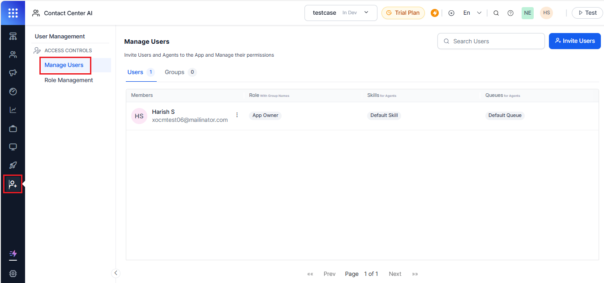
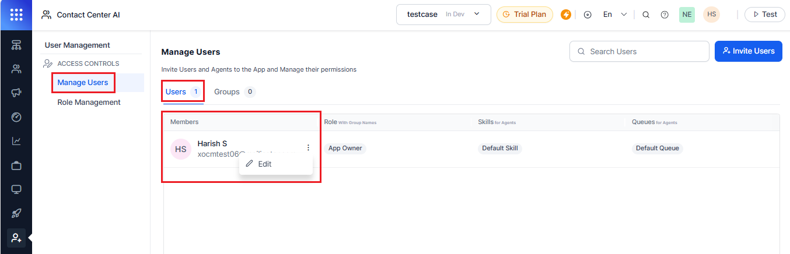
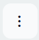
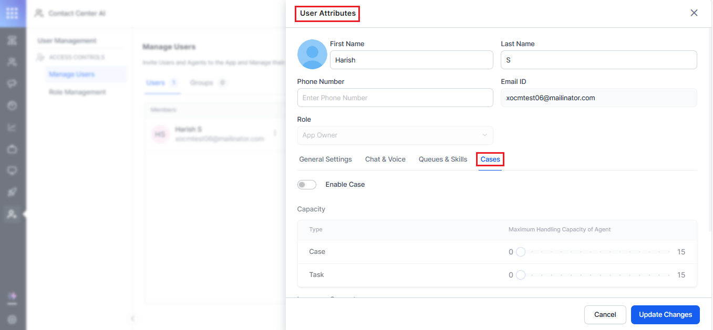

# Setup Process

The following sections provide the setup process of the case management, enable features, customize system registration, and configuration validation. 

1. **Sign Up for the XO11 Platform**

    * **Sign Up**: Access the XO11 Platform registration page and fill out the sign-up form with your email address.

    * **Workspace Creation**: After you complete registration, the XO11 Platform automatically creates your workspace with default configurations. [Learn more](https://docsinternal-kore.github.io/docs/xo/getting-started/navigating-the-platform/?h=navigat){:target="_blank"}.

2. **Enable Case Management**

    * **Provide Account ID**: Capture your unique Account ID to activate Case Management.

    * **Admin Access**: Once enabled, you get the admin rights for Case Management. 

    * **Contact Support**: Reach out to the Kore Product team for assistance. [Learn more](https://docsinternal-kore.github.io/docs/xo/app-settings/app-profile/?h=app+profile#general-app-settings){:target="_blank"}.

3. **Configure Queues and Skills**

    * **Queue Setup**: Create and customize queues as needed (contact center agents and back-office) for different teams. [Learn more](https://docs.kore.ai/xo/contactcenter/routing/queues/queue-management/?h=queues){:target="_blank"}.

    * **Default or Custom**: Use default queues or customize your setup according to your needs. 

    * **Configure**: Set up agent skills for proper case routing (optional). [Learn more](https://docs.kore.ai/xo/user-management/manage-users/?h=skills#skills){:target="_blank"}. 

    * **Customize**: Adjust hours of operation to match your business schedule (for example, weekday hours or 24/7 hours of operation). [Learn more](https://docs.kore.ai/xo/contactcenter/configurations/hours-of-operation/manage-hours-of-operation/?h=hours+of+operation){:target="_blank"}.

4. **Add Channels**

    Configure your communication channels setup (Email, Chat, Voice) according to the documentation. [Learn more](https://docsinternal-kore.github.io/docs/xo/channels/adding-channels-to-your-bot/){:target="_blank"}.

5. **Invite Team Members**

    * **Send Invitations**: Email invitations to agents and supervisors.

    * **Assign Roles**: Assign appropriate roles ([Learn more](https://docs.kore.ai/xo/user-management/role-management/)){:target="_blank"}, queues, and skills. [Learn more](https://docs.kore.ai/xo/user-management/manage-users/#queues-skills){:target="_blank"}.

    * **Case Capacity Limits**: Enable capacity limits for each agent as needed. [Learn more](https://docs.kore.ai/xo/user-management/manage-users/#chat-voice){:target="_blank"}.

6. **Set Up Case Management Components**

    * **Fields**: Create custom fields with different field formats as needed for your business (drop-downs, multi-selects, checkboxes, phone number, email, and URL). [Learn more. ](#fields-configuration-12)

    * **Statuses**: Create custom statuses under the status type based on business requirements. Add to the five default statuses as needed. [Learn more](#status-configuration-33). 

    * **Priorities**: Create custom priorities with values to automatically sort case severity to supplement the four default priorities. [Learn more](#priority-configuration-38). 

    * **Task Templates**: Create task templates to manage and automate tasks to support customers, including assignment options (unassigned, queue, individual agent, task creator). [Learn more](#task-templates-configuration-18).

    * **Additional Fields**: Add custom fields as needed from the custom fields that are necessary for a task. [Learn more](#fields-configuration-12). 

    * **Case Templates**: Design case templates to help agents gather and reference information for various types of customer issues, including custom fields (name, description, and default assignment) and predefined tasks if required (unassigned, queue, individual agent, and case creator). [Learn more](#case-templates-configuration-25).

7. **Set up Case Layout**

    Design an efficient layout for cases within the agent console. [Learn more](https://docs.kore.ai/xo/console/manage-layout/?h=layout#adding-new-layout){:target="_blank"}. 

8. **Test Your Setup**

    Validate your configuration process using the following test scenarios.

* **Email Channel**: 

    * Ensure that all components of the Case Management system, from case creation to resolution, function correctly in the email channel.

    * Ensure the Case Management system is properly integrated with the email system.

    * Set up an email account to receive and send test cases.

    * Prepare templates for case creation and communication.  

* **Automation Process**:

    * Admin creates a flow with a call to automation.

    * If automation fails, transfer the conversation to an agent in the default queue (Agents 1 and 2).

    * Create a new queue named **Case Queue** and add Agents 3 and 4.

    * Create a new case template with **Case Queue** as the default assignee. [Learn more.](#case-templates-configuration-25) 

* **Conversation Process**:

    * **Send Email**: Process the conversation through the flow under the “default queue”.

    * **Automation Failure**: If automation fails, the conversation goes to Agent 1 or Agent 2.

        * **Case Creation**: If Agent 1 creates a case, it is assigned to Agent 3 or Agent 4. [Learn more](#case-creation-process-67).

        * **Case Handling**: Agent 1 can close the conversation, but the case remains open for further action by the assigned agent.

9. **Set up User Permissions**

    Configure the following access controls (user management and role settings):

    * **Manage Users:** See [Manage Users](https://docs.kore.ai/xo/user-management/manage-users/?h=manage+users){:target="_blank"}. 

    * **User Attributes:** See [User Attributes](https://docs.kore.ai/xo/user-management/manage-users/#attributes){:target="_blank"}. 

10. **Set Case Handling Capacity and Languages**

    Steps for configuring case handling capacity and language settings:

    1. Navigate to the **User Management**> **Manage Users**.

        

    2. Under the **Manage Users**, right-click to edit any of the existing users.

        

    3. Click on the three vertical ellipsis (</img>) button, and click **Edit.**

    4. In the **User Attributes** page, select **Cases**.

       

5. Turn on the **Enable Case** toggle button to configure the **Maximum Case Handling Capacity** of the agent.

    !!! Note

        Ensure that the maximum capacity for both **Case **and **Task **is limited to 15 each.

6. In the **Language Support**, select your desired language.

7. Select the **Proficiency Level** against the supported language selected. [Learn more](https://docs.kore.ai/xo/app-settings/language-management/managing-languages-for-multilingual-vas/){:target="_blank"}.
8. Click **Update Changes** to save your settings.