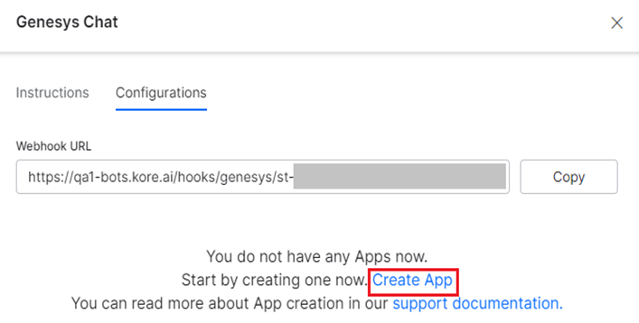
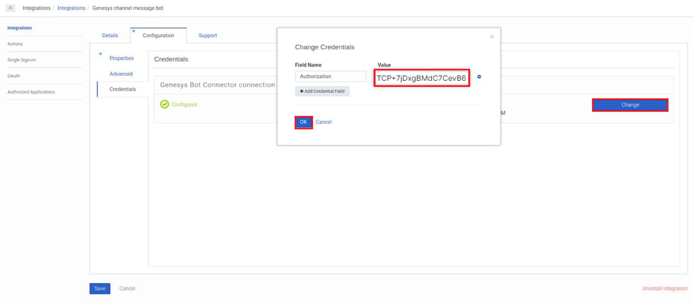
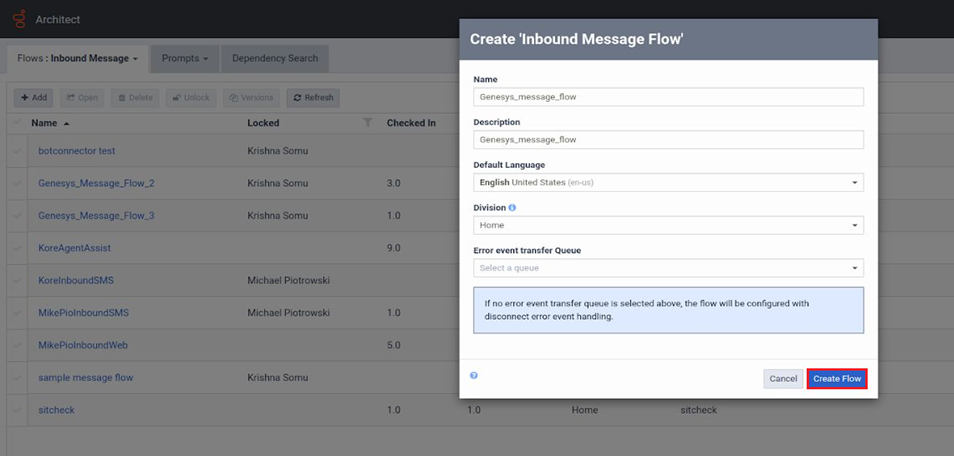
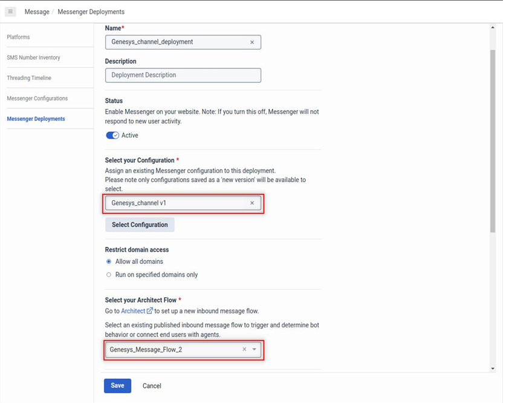

# **Adding Genesys Chat as a Channel**

The Kore.ai XO Platform now allows you to add **Genesys Chat** as a messaging channel for your Virtual Assistants (VAs). Genesys Chat helps instantly share your ideas with people inside your organization with the persistent chat history feature to start a conversation with your colleagues and continue it anywhere any time.

With the **Genesys Chat** integration on the Kore.ai XO Platform, you can achieve the following:

* Set up the _REST API_ and authorization flow for events and conversations.
* Link the app to the Kore.ai XO Platform using the app’s credentials.
* Deploy the VAs and transfer conversations to the **Genesys Agent System**.
* Leverage various templates like _Button_, _Quick Replies_, and _Bullets List_ provided by Genesys for message formatting.
* Accept any attachments in the chat messages that Genesys supports.

After the integration, you can do the following:

* Track Virtual Assistant conversations.
* Listen to new messages from Genesys Chat.
* Have VAs post and respond to messages in Genesys Chat conversations.
* Have VAs handle incoming notifications from your apps into Genesys Chat.

To set up **Genesys Chat** as a channel, you should create an account on the [Genesys Cloud](https://genesyspartner.force.com/customercare/RequestAccount) Platform and enable a _webhook_ for the platform to receive messages.

The steps to add the channel are summarized below:

1. [Create a Bot Connector](https://developer.kore.ai/docs/bots/channel-enablement/adding-genesys-chat-as-a-channel/#Step_1_Create_a_Bot_Connector).
2. [Link the Virtual Assistant to the Bot Connector](https://developer.kore.ai/docs/bots/channel-enablement/adding-genesys-chat-as-a-channel/#Step_2_Link_the_Virtual_Assistant_to_the_Bot_Connector).
3. [Create an inbound message flow](https://developer.kore.ai/docs/bots/channel-enablement/adding-genesys-chat-as-a-channel/#Step_3_Create_an_Inbound_Message_Flow).
4. [Configure the Messenger SDK](https://developer.kore.ai/docs/bots/channel-enablement/adding-genesys-chat-as-a-channel/#Step_4_Configure_the_Messenger_SDK).
5. [Enable the Channel](https://developer.kore.ai/docs/bots/channel-enablement/adding-genesys-chat-as-a-channel/#Step_5_Enable_the_Channel).
6. [Publish the Bot](https://developer.kore.ai/docs/bots/channel-enablement/adding-genesys-chat-as-a-channel/#Step_6_Publish_the_Bot).

## Step 1: Create a Bot Connector

A **Bot Connector service** enables your bot to exchange messages with the _Genesys Agent System_ configured on the Kore.ai XO Platform by using industry-standard _REST_ and _JSON_ over HTTPS.

1. Log in to the **[Genesys Developer Portal](https://login.mypurecloud.com/#/authenticate)**.
2. Create a Bot Connector with the steps below:
    * Navigate to **Admin** > **Integrations** on the left menu.
    * Click the **Configuration** tab.
    * On the Kore.ai XO Platform, navigate to **Deploy** > **Channels** > **Genesys Chat**.
    
    * Copy the **Webhook URL** from the **Configurations** section.
    * Paste it in the **Value** field of the **Properties** section under **Configuration** on the **Genesys Chat** Portal.
    
    * In the **Genesys Cloud login URL** field under **Configuration**, provide the URL of your Genesys AWS Region which will allow the platform to correctly route the conversation requests. This is a **mandatory field.** You can find the URL of your region through the link provided with the field.
    
3. Create an app on the Kore.ai XO platform. A JWT Token is created with the _clientId_ and _clientSecret_ credentials. To create an app, follow the steps below:
    * Click the **Create App** link under the **Configurations** section of the **Genesys Chat** Channel.
    
    * Follow the steps mentioned [here](https://developer.kore.ai/docs/bots/channel-enablement/adding-the-webmobile-client-channel/).
    **Note**: Select _HS256_ for **JWT Signing Algorithms Used For Client App Authentication**.
    * Copy the **_Client Secret_** value of the app you’ve created.
    *  Navigate to the **Configuration** > **Credentials** page, and click **Change**.
    
    * Paste the copied **_Client Secret_** in the **Value** field when the **Change Credentials** window appears.
    * Click **OK**.
    
    * Once you paste all the required credentials, click **Authorize** to validate the authorization.
    

    Your Bot Connector is created successfully!

## Step 2: Create an Inbound Message Flow

To create an inbound message flow after connecting your VA to the Bot Connector, follow the steps below:

1. Navigate to **Admin** > **Architect** on the **Genesys Bot Connector** page.
2. Click the **Flows: Inbound Message** tab.
3. Click the Add button.
4. In the **Create ‘Inbound Message Flow’** window, enter the values for the required fields.
5. Click **Create Flow**.

6. After creating the Inbound Message Flow, follow the steps below:
    * Click the flow you’ve created in the list.
    * Click the **Initial State** icon on the top menu.
    * Select the **Call Bot Connector** option by navigating to **Start** > **Toolbox** > **Bot**.
    
    * Select the bot connector and the relevant Bot from the list.
    * Enter values for the given fields.
    

7. Click **Publish** on the top panel.

## Step 3: Configure the Messenger SDK

After creating the inbound messaging flow, you should configure and deploy the messenger with the steps below:

  1. Navigate to **Admin** > **Message** > **Messenger Deployments**.
  2. Enter the values for **Name** and **Description**.
  3. Set **Status** to _Active_.
  4. For **Select your Configuration**, select the _Messenger Configuration_ to assign it to the deployment.
  5. For **Restrict Domain Access**, select _Allow all domains_.
  6. For **Select your Architect Flow**, select your Message Flow created in the previous step.
  7. Click **Save**. 
  The system routes the message sent by the user via the **Genesys Messenger** to the message flow.
  

  8. Paste the script generated in the messenger deployment on the HTML page where you want to add the **Genesys Messenger**.
  

## Step 4: Enable the Channel

After you’ve configured the Genesys Messenger and deployed it for your Virtual Assistant, you must enable the **Genesys Chat** Channel by following the steps below:

1. Navigate to **Deploy** > **Channels** > **Genesys Chat** on the Kore.ai XO Platform.
2. Click the **Configurations** tab.
3. Select _YES_ for **Enable Channel**.
4. Click **Save**.

## Step 5: Publish the Bot

After enabling the channel and verifying all the configurations, you can test the new channel integration by publishing your virtual assistant. [Learn more](https://developer.kore.ai/docs/bots/publish/publishing-bot/).

To learn more about working with messaging channels within the Kore.ai XO Platform, please see [Channel Enablement](https://developer.kore.ai/docs/bots/channel-enablement/adding-channels-to-your-bot/).
