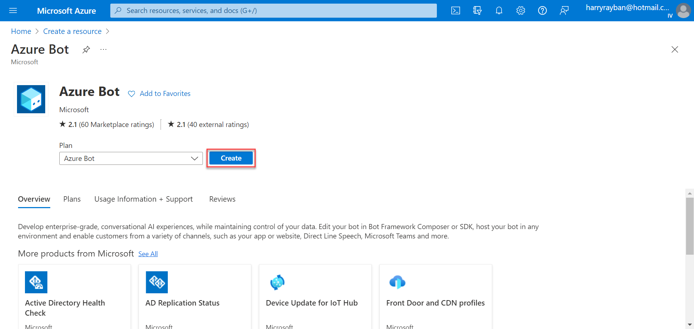
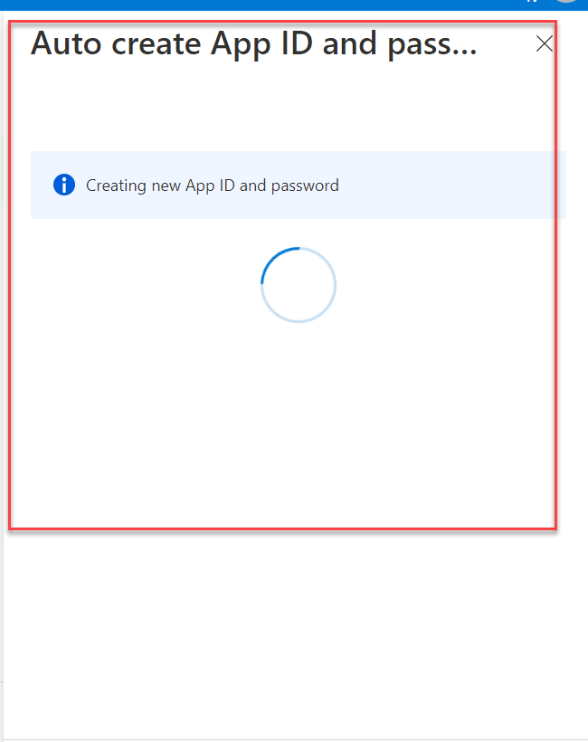
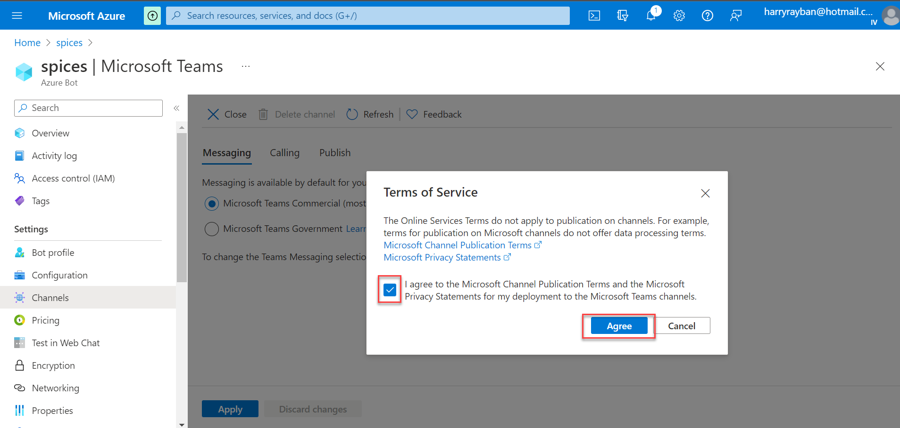
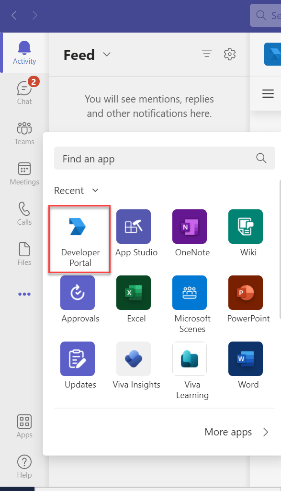
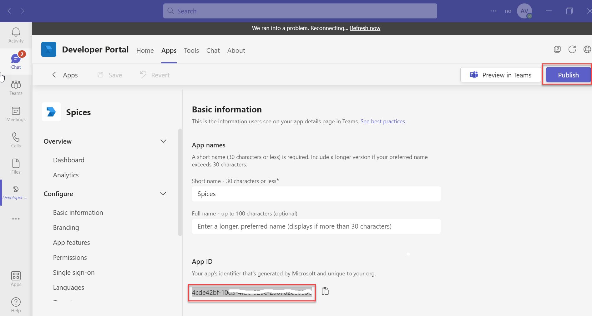
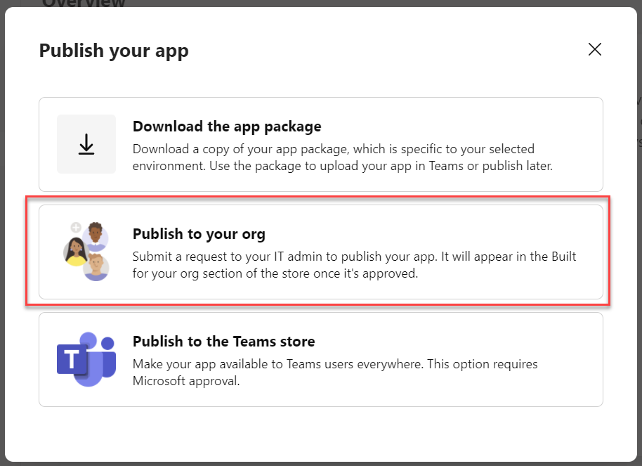
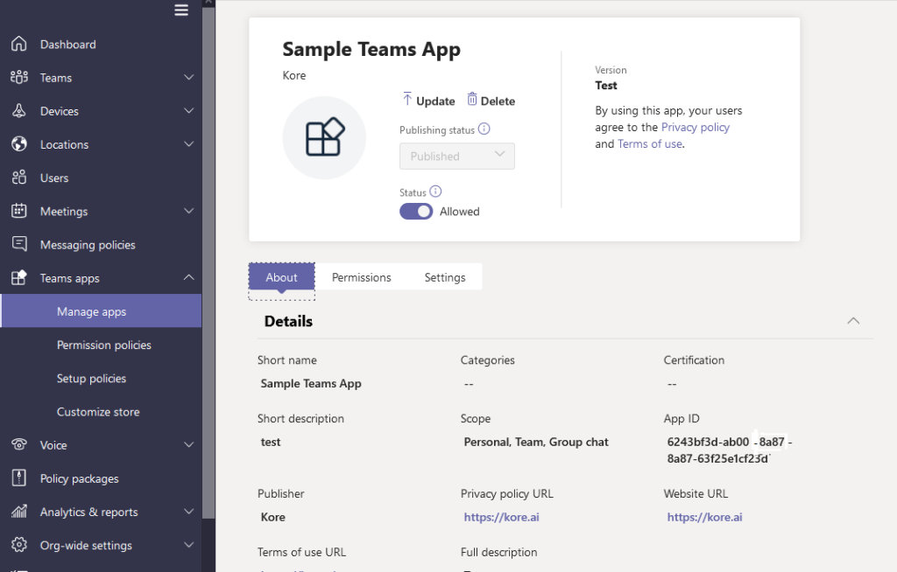
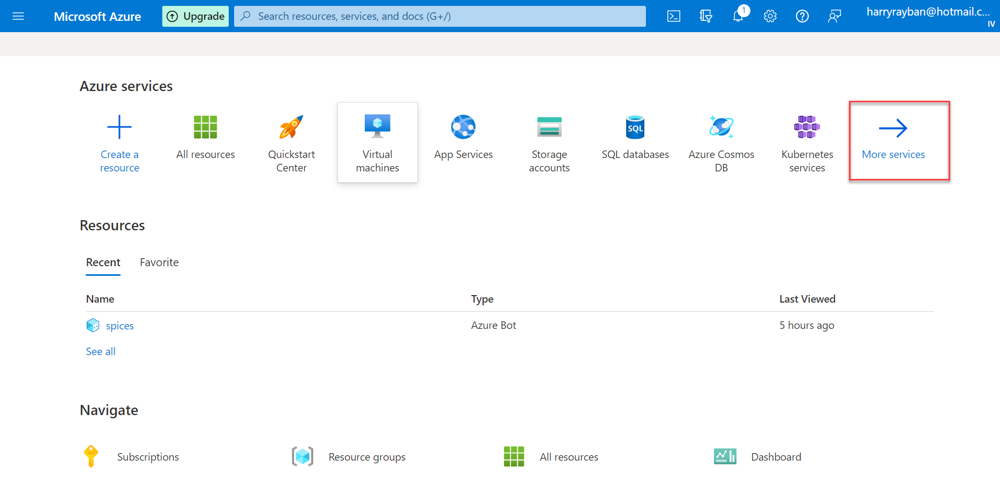
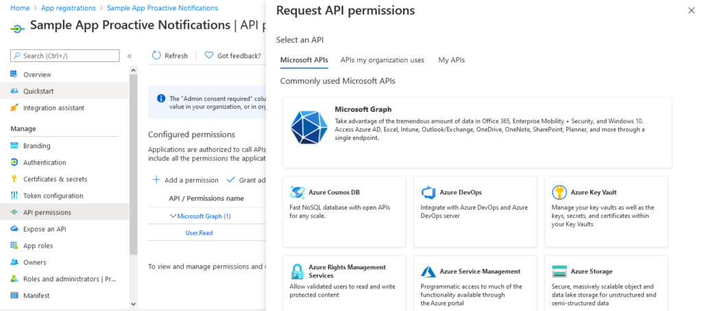
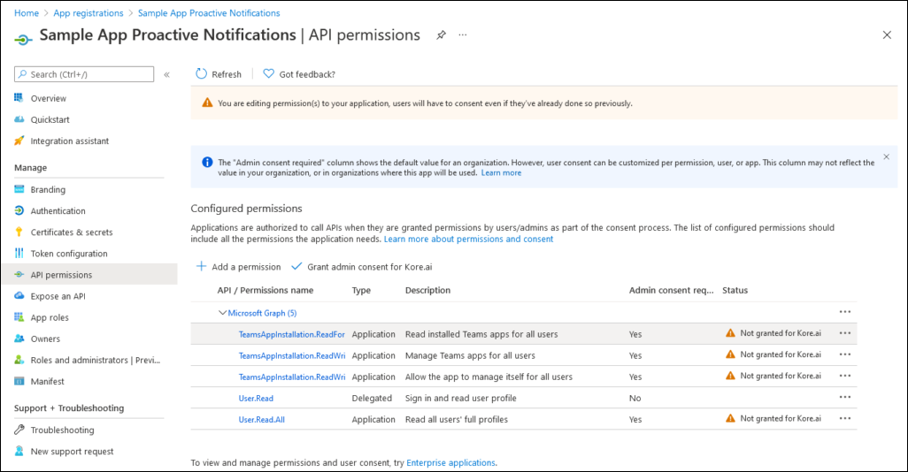

# **Adding the Microsoft Teams Channel**

You can add Microsoft Teams as a delivery channel to your Kore.ai Virtual Assistant to allow it to interact with end-users using Microsoft Teams.

## Prerequisites

* Ensure you have an account with the [Microsoft Bot Framework](https://dev.botframework.com/).
* Create a Bot Channel Service and register it in Azure.
* Enable a webhook for the platform to receive messages.
* Purchase an active subscription to Azure services with Admin access; required to subscribe to a new Azure service.

## Step 1: Create an Azure Bot

Create an Azure Bot and configure it on the Kore.ai XO Platform to establish a communication channel between Microsoft Teams and the platform.

1. Log in to the [Azure portal](https://portal.azure.com/), and click **+ Create a resource** from the portal menu.
2. Search and select **Azure Bot** on the page, and click **Create**. \

3. Fill in the required details, select the **Multi Tenant **option in the **Type of App field** then click **Review + Create**. \

!!! note

         The platform supports both Single-Tenant and Multi-Tenant apps.

4. On the next page, review the details and check for the **Validation** status. Click **Create **to proceed.

5. Associate the Azure Bot with a **Microsoft App ID** and **Password**. You can choose the default option: **Auto create App Id and password**. You can also choose to** Create a new Microsoft App ID** or **Use existing app registration**. For more information, see [Microsoft Bot Framework documentation](https://docs.microsoft.com/en-gb/azure/bot-service/bot-service-resources-bot-framework-faq?view=azure-bot-service-4.0#app-registration). \

6. Once the deployment is completed, click **Go to resource** to view details of your resource.

## Step 2: Configure the Resource App Id and Password

Generate a new App Password and Client Secret to configure the Azure Bot on the Kore.ai XO Platform.

1. On the **Configurations **tab, click the **Manage **option next to the **Microsoft App ID** field. \

2. Choose **Certificates & secrets** in the left navigation bar, and create a new client secret on the page:
    * Click the **+ New client secret** option.
    * Provide the necessary details, and then click the **Add **option.
3. Copy the **Value **of the new client secret and provide it in the **App Password** field present on the **Configurations **tab of the Kore.ai XO Platform. Refer Step 3: Enable Microsoft Teams Channel. \

4. Close the** Certificates and secrets** section to return the **Configuration **section of the resource using the breadcrumbs.

!!! note

         Make a note of the Microsoft App Id in the Azure Bot configurations page and provide it in the Configuration tab of this window.

## Step 3: Enable Microsoft Teams Channel

Configure the MS Teams credentials on the Kore.ai XO Platform to establish communication between both.

1. On the platform, select the assistant, and then go to the **Deploy **menu.
2. Select the **Microsoft Teams** channel, click the **Configuration **tab, and then enter the following details:**Multi-Tenant Apps Configuration**
    * **Microsoft App ID** – The app ID of your Azure Bot resource.
    * **App Password** – The App password value that you find in the Certificates & Secrets page of the Azure bot.
    * **Enable Proactive Notifications (optional)** – Drag the slider to enable proactive notifications.
    * **Application (Client) ID** – The app ID of your Azure Bot resource.
    * **Client Secret** – The client secret value that you find on the Certificates & Secrets page of the Azure bot.
    * **Delivery (tenant) ID **– The subscription ID that you can find on the Overview page of the Azure bot.
    

**Single-Tenant App Configuration**

1. Select the **Single-Tenant** option and enter the **App Tenant ID** value.

2. Click **Save**.
3. Copy the **Webhook URL** from the tab and paste it in the **Messaging endpoint** field on the **Configurations **module in Azure bot.
4. Click **Apply** to save the entered value.
5. Once the **Configuration** is completed, select the **Channels** option from the left menu and then select the **Microsoft Teams** channel.

6. Select the **I Agree** checkbox on the **Terms of Service** dialog and then click **Agree**.

7. Select the **Microsoft Teams Commercial (most common)** option to enable the Teams as per your commercial business requirements. If you want to enable the Azure bot for Government Community Cloud (GCC) organizations, select the **Microsoft Teams Government** option. Click the [Learn more ](https://learn.microsoft.com/en-us/microsoftteams/platform/concepts/deploy-and-publish/apps-publish-overview)link next to the option on the screen for more information.

8. Click **Apply** to complete the channel setup.

!!! note

         The Web Chat option of Bot Framework is not supported.

## Step 4: Publish Your Bot in Teams

You can now publish the Azure bot on your MS Teams account so that your users can discover and converse with the bot.

To do so, create an MS Teams app, associate the bot with it, and then publish the app.

1. [Log in](https://teams.microsoft.com/) to the MS Teams account with admin credentials.
2. Click **Ellipsis […]** in the left navigation bar and then select the **Developer Portal** icon to launch the Apps builder.

!!! note

          The Developer Portal view is only available on the **Microsoft Teams Desktop** client.

3. On the **Developer Portal** page, select the **Apps** tab and then click the **New App** button.

4. On the **New App** dialog, enter a name for the app, copy and paste the App ID of your Azure Bot in the **App ID** field, and then click **Publish**.

5. On the **Publish** dialog, select the **Publish to your org** option.

6. Grant the desired permissions to your MS Teams app.

7. Click **Publish your App** and complete the publishing process.

## Step 5: Approve the MS Teams App Publish Request

The request to publish the MS Teams App must be approved by an MS Teams Admin. Log in to the [MS Teams Admin Portal](https://admin.teams.microsoft.com/) and proceed to **Teams apps > Manage apps**. Search for the app that you published in the earlier step. Select the app and change the Publishing status to **Published**. This completes the process for publishing your bot for your Teams users.

## Step 6: Configure Proactive Notifications [Optional]

If you want to send Proactive Notifications to your users, you need to perform a few more actions.

!!! note

          You can skip the following sections and proceed to the Configurations tab if you do not intend to send Proactive Notifications.

To enable Proactive Notifications, follow these steps:

1. Capture the **App ID** associated with the MS Teams App that is approved in Step 3. You can find this information on the details page of the app.
2. Provide this **App Id** in the channel **Configurations** tab.

3. The bot requires additional app credentials for sending the Proactive Notifications. Go to the [Azure](https://portal.azure.com/) portal, and click the **More Services** link.

4. On the More Services page, search and select the **App registrations**.

5. On the App registrations page, click **New registration**.

6. Provide the required information and click **Register**.

7. You are redirected to the details page of the newly registered app.
8. From the Manage menu, select the **API permissions** section and then click the **Add a permission** option. From the **Request API permissions**, select **Microsoft Graph** and choose **Application Permissions**.

9. From the permissions list, select the following permissions and click **Add permissions**.
    * TeamsAppInstallation.ReadForUser.All
    * TeamsAppInstallation.ReadWriteSelfForUser.All
    * TeamsAppInstallation.ReadWriteForUser.All
    * User.Read.All

    

10. Click on the **Grant admin consent** for > domain name> option to complete the granting of the permissions.
11. Proceed to the **Certificates & secrets** section and select the **New client secret** option.
12. Copy the **Value** of the newly created certificate and provide it on the **Configurations** tab of MS Teams Channel on the Kore.ai XO Platform.
13. Overview section of the app and capture **Application (client) ID**, **Directory (tenant) Id** and provide them on the **Configurations** tab of this page.
14. Navigate to the **Configurations** tab to review and enable the Microsoft Teams channel for your bot.

### Related Links

* Once the channel is enabled and all configurations are verified, you can optionally publish the assistant to make it available to end-users. Learn more about [Publishing your Virtual Assistant](https://developer.kore.ai/docs/bots/publish/publishing-bot/).
* To learn more about working with Channels within the Kore.ai XO Platform, see[ Channel Enablement.](https://developer.kore.ai/docs/bots/channel-enablement/adding-channels-to-your-bot/)
