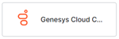

# Copy of Channels - Digital - DO NOT PUBLISH

### Enterpriase Channels

| [Cisco Jabber](./add-cisco-jabber-channel.md)    | [Cisco Webex Teams (formerly  Cisco Spark)](./add-cisco-channel.md)    | [Google Assistant](./add-google-assistant-channel.md)   | [Genesys Cloud   CX Messaging](./add-genesys-chat-channel.md)     |
|:---:|:---:|:---:|:---:|
[**Google Business Messaging**](./add-google-business-messaging-channel.md)    | [**Google Chat**](./add-google-chat.md)     | [**Kore.ai**](./add-kore-channel.md)       | [**Live Person**](./add-live-person-channel.md)     

|[Mattermost](./add-mattermost-channel.md)        | [Microsoft Teams](./add-microsoft-teams-channel.md)       | [Naver Works](./add-naver-works-channel.md)      | [Nice inContact](./add-nice-incontact-channel.md)        |
|:---:|:---:|:---:|:---:|
|[**RCS Business Messaging**](./add-google-rcs-channel.md)    | [**Glip by RingCentral**](./add-ringcentral-glip-channel.md)    | [**RingCentral  Engage**](./add-ringcentral-engage-channel.md)     | [**Skype for Business**](./add-skype-business-channel.md)      |

| [Slack](./add-slack-channel.md)      | [Sunshine Conversations](./add-sunshine-conversations-channel.md)     | [Syniverse](./add-syniverse-channel.md)       | [Unblu](./add-unblu-channel.md)       |
|:---:|:---:|:---:|:---:|
| [**WhatsApp Business Messaging**](./add-whatsapp-business-channel.md)    | [**Workplace By Facebook**](./add-workplace-by-facebook-channel.md)     | [**Yammer**](./add-microsoft-yammer-channel.md)      | [**Zoom Contact Center**](./add-zoom-contact-center-channel)     | 

### Social Channels

|[Facebook Messenger](./add-facebook-messenger-channel.md)       |[Line](./add-line-messenger-channel.md)        |[Skype](./add-skype-channel.md)        |[**Twitter**](./add-twitter-channel.md) |[**WeChat**](./add-wechat-channel.md)        |
|:--------:|:----:|:----:|:----:|:----:|
[**Telegram**](./add-telegram-channel.md)         |

### Other Channels

#### without heading 

|[Email](./add-email-channel.md) |[Twilio SMS](./add-twilio-sms-channel.md)  |[Web/MobileClient](./add-web-mobile-client.md)  |[Webhook](./add-webhook-channel.md)  |[Widget SDK](./add-widget-sdk-channel.md)  |
|:---:|:---:|:---:|:---:|:---:|

Table 2 

|[Email](./add-email-channel.md) |[Twilio SMS](./add-twilio-sms-channel.md)  |[Web/MobileClient](./add-web-mobile-client.md)  |[Webhook](./add-webhook-channel.md)  |
|:---:|:---:|:---:|:---:|
|[**Widget SDK**](./add-widget-sdk-channel.md)  |

### with heading

|heading 1|2|3|4|5|
|:---:|:---:|:---:|:---:|:---:|
|[Email](./add-email-channel.md)|[Twilio SMS](./add-twilio-sms-channel.md) |[Web/MobileClient](./add-web-mobile-client.md) |[Webhook](./add-webhook-channel.md) |[Widget SDK](./add-widget-sdk-channel.md) |

### no table borders

|[Email](./add-email-channel.md)|[Twilio SMS](./add-twilio-sms-channel.md) |[Web/MobileClient](./add-web-mobile-client.md) |[Webhook](./add-webhook-channel.md) |[Widget SDK](./add-widget-sdk-channel.md) |

### with br tag

|Heading1|no heading||||
|---|---|---|---|---|
|[Email](./add-email-channel.md) |[Twilio SMS](./add-twilio-sms-channel.md) |[Web/MobileClient](./add-web-mobile-client.md) |[Webhook](./add-webhook-channel.md) |[Widget SDK](./add-widget-sdk-channel.md) |

|

<table>
  <tr>
   <td><strong>Field</strong>
   </td>
   <td><strong>Description</strong>
   </td>
   <td><strong>Applicable</strong>

<strong>to</strong>

<strong>Nodes</strong>
   </td>
   <td><strong>Applicable</strong>

<strong>to</strong>

<strong>Channel</strong>
   </td>
  </tr>
  <tr>
   <td>Initial Prompts
   </td>
   <td>Prompts that are played when the IVR first executes the node. If you do not enter a prompt for a node, the default user prompt for the node plays by default. If you do not enter a prompt for Standard Responses and Welcome Message, the default Standard Response and Welcome Message are played by default.
   </td>
   <td>Entity,

Confirmation,

Message nodes;

Standard Responses and

Welcome Message
   </td>
   <td>IVR,

Twilio,

AudioCodes,

Kore.ai Voice Gateway
   </td>
  </tr>
  <tr>
   <td>Timeout Prompts
   </td>
   <td>Prompts that are played on the IVR channel when the user has not given any input within the specified time. If you do not enter a prompt for a node, the default Error Prompt of the node is played. Standard Responses and Welcomes have a default Timeout Prompt that plays if you don’t define No Match Prompts.

You can <strong>Customize Retries Behavior</strong> for the Timeout Prompts and define the number of retries to configure the number of times the user would be prompted for this entity value by setting the number of <strong>Allowed Retries </strong>to any value between 1 and 10. The default is 3.

Further, you can define the VA’s <strong>Behavior on Exceeding Retries</strong>; this can be set to trigger <em>Invoke Call Termination Handler, Initiate Dialog Task,</em> or <em>Jump to specific node in current task</em>. When you select <em>Initiate Dialog </em>or <em>Jump to a specific node in the current task </em>option, you are prompted to select the dialog task or task within the node.

<strong>Note</strong>: The <strong>Customize Retries Behavior </strong>function is supported only for the <strong>IVR </strong>channel at the Entity, Confirmation, and Message nodes.
   </td>
   <td>Entity,

Confirmation;

Standard Responses

and Welcome Message
   </td>
   <td>IVR,

Twilio,

AudioCodes,

Kore.ai Voice Gateway
   </td>
  </tr>
  <tr>
   <td>No Match Prompts
   </td>
   <td>Prompts that are played on the IVR channel when the user’s input has not matched any value in the defined grammar. If you do not enter a prompt here or select <strong>No Grammar</strong> option for an Entity or Confirmation node, the default Error Prompt of the node is played. Standard Responses and Welcomes have a default No Match Prompt that plays if you do not enter it.

You can <strong>Customize Retries Behavior</strong> for the No Match Prompts and define the number of retries to configure the number of times the user would be prompted for this entity value by setting the number of <strong>Allowed Retries </strong>to any value between 1 and 10. The default is 3.

Further, you can define the VA’s <strong>Behavior on Exceeding Retries</strong>; this can be set to trigger <em>Invoke Call Termination Handler, Initiate Dialog Task,</em> or <em>Jump to specific node in current task</em>. When you select <em>Initiate Dialog </em>or <em>Jump to a specific node in the current task </em>option, you are prompted to select the dialog task or task within the node.

<strong>Note</strong>: The <strong>Customize Retries Behavior </strong>function is supported only for the <strong>IVR </strong>channel at the Entity, Confirmation, and Message nodes.
   </td>
   <td>Entity,

Confirmation;

Standard Responses and

Welcome Message
   </td>
   <td>IVR
   </td>
  </tr>
  <tr>
   <td>Error Prompts
   </td>
   <td>Prompts that are played on the IVR channel when user input is an invalid Entity type. If you do not enter a prompt here, the default Error Prompt of the node is played.

You can <strong>Customize Retries Behavior</strong> for the Error Prompts and define the number of retries to configure the number of times the user would be prompted for this entity value by setting the number of <strong>Allowed Retries </strong>to any value between 1 and 10. The default is 3.

Further, you can define the VA’s <strong>Behavior on Exceeding Retries</strong>, this can be set to trigger <em>Invoke Call Termination Handler, Initiate Dialog Task,</em> or <em>Jump to specific node in current task</em>. When you select <em>Initiate Dialog </em>or <em>Jump to a specific node in the current task </em>option, you are prompted to select the dialog task or task within the node.

<strong>Note</strong>: The <strong>Customize Retries Behavior </strong>function is supported only for the <strong>IVR </strong>channel at the Entity, Confirmation, and Message nodes..
   </td>
   <td>Entity,

Confirmation;
   </td>
   <td>IVR,

Twilio,

AudioCodes,

Kore.ai Voice Gateway
   </td>
  </tr>
  <tr>
   <td>Grammar
   </td>
   <td>Define the grammar that should be used to detect a user’s utterance
<ul>

<li>The input type can be Speech or DTMF

<li>Source of grammar can be Custom or Link 
<ul>
 
<li>For Custom, write VXML grammar in the textbox.
 
<li>For Link, enter the URL of the grammar. Ideally, the URL should be accessible to the IVR system so that the resource can be accessed while executing the calls at runtime

<a href="https://developer.kore.ai/docs/bots/bot-builder-tool/dialog-task/voice-call-properties/#Configuring_Grammar">See below for a detailed configuration for Grammar syntax</a>. \
 <strong>Note</strong>: If the <strong>Enable Transcription </strong>option is enabled for the VA along with specifying the source of the transcription engine, defining grammar isn’t mandatory.
</li> 
</ul>
</li> 
</ul>
   </td>
   <td>Confirmation;

Standard Responses and

Welcome Message
   </td>
   <td>IVR,

Twilio
   </td>
  </tr>
  <tr>
   <td colspan="4" ><strong>Advanced Controls</strong>
   </td>
  </tr>
  <tr>
   <td colspan="4" >These properties override the properties set in the VA IVR Settings page and apply to the Dialog Task that you are currently working with.
   </td>
  </tr>
  <tr>
   <td>Timeout
   </td>
   <td>Select the maximum wait time to receive user input from the drop-down list, from 1 second up to 60 seconds. The default value is the same as defined in the VA IVR Settings page.
   </td>
   <td>N/A
   </td>
   <td>IVR,

Twilio,

AudioCodes,

Kore.ai Voice Gateway
   </td>
  </tr>
  <tr>
   <td>No. of Retries
   </td>
   <td>Select the maximum number of retries to allow. You can select from just 1 retry up to 10 retries.

The default value is the same as defined in the VA IVR Settings page.
   </td>
   <td>N/A
   </td>
   <td>IVR,

Twilio,

AudioCodes,

Kore.ai Voice Gateway
   </td>
  </tr>
  <tr>
   <td>Behavior on Exceeding Retries
   </td>
   <td>Define behavior when either the timeout or number of retry attempts exceed the specified limit.

You can <strong>Customize Retries Behavior</strong> for the standard number of retries to configure the number of times the user would be prompted for this entity value by setting the number of <strong>Allowed Retries </strong>to any value between 1 and 10. The default is 3.

Further, you can define the VA’s <strong>Behavior on Exceeding Retries</strong>, this can be set to trigger <em>Invoke Call Termination Handler, Initiate Dialog Task,</em> or <em>Jump to specific node in current task</em>. When you select <em>Initiate Dialog </em>or <em>Jump to a specific node in the current task </em>option, you are prompted to select the dialog task or task within the node.

<strong>Note</strong>: The <strong>Customize Retries Behavior </strong>function is supported only for the <strong>IVR </strong>channel at the Entity, Confirmation, and Message nodes.
   </td>
   <td>N/A
   </td>
   <td>IVR,

Twilio,

AudioCodes,

Kore.ai Voice Gateway
   </td>
  </tr>
  <tr>
   <td>Barge-In
   </td>
   <td>Select whether you want to allow a user input while a prompt is in progress. If you select no, the user input is not considered until the prompt is completed. The default value is <strong>No</strong>.
   </td>
   <td>N/A
   </td>
   <td>IVR,

Twilio,

AudioCodes,

Kore.ai Voice Gateway
   </td>
  </tr>
  <tr>
   <td>Call Control Parameters
   </td>
   <td>Click <strong>Add Property. </strong>Enter property names and values to use in defining the VXML definition in the IVR system and Session Parameters in AudioCodes channel. These values defined for a node or a standard response override the global Call Control Parameters defined in the VA IVR /AudioCodes settings page.
   </td>
   <td>N/A
   </td>
   <td>IVR,

AudioCodes,

Kore.ai Voice Gateway
   </td>
  </tr>
  <tr>
   <td>Log
   </td>
   <td>Select <strong>Yes </strong>if you want to send the chat log to the IVR system. The default value is <strong>No</strong>.
   </td>
   <td>N/A
   </td>
   <td>IVR
   </td>
  </tr>
  <tr>
   <td>Locale Definition
   </td>
   <td>Enable the<strong> Locale Definition </strong>property to define the <strong><em>(xml:lang = “&lt;value>”) </em></strong>attribute in the VXML file by enabling the <strong>Locale Definition</strong> property. Automatic Speech Recognition engines use the language attribute to enhance speech recognition.

Once the property is enabled, you can see one or more language codes corresponding to the bot languages.  Enter the locale code for a specific bot language in the <strong>Locale Value</strong> field. For example, enter ‘<strong>US</strong>‘ or ‘<strong>UK</strong>‘ as the Locale Value for the English (EN) bot language.

>>>>>  gd2md-html alert: inline image link here (to images/image1.png). Store image on your image server and adjust path/filename/extension if necessary.  (<a href="#">Back to top</a>)(<a href="#gdcalert2">Next alert</a>) >>>>> 

<strong>Note</strong>: By default, the <strong>Locale Definition</strong> property is disabled for all virtual assistants.
   </td>
   <td>N/A
   </td>
   <td>IVR
   </td>
  </tr>
  <tr>
   <td>Document Type Definitions
   </td>
   <td>The Document Type Definition (DTD) typically refers to a specific syntax used to define the structure and constraints of a Voice Extensible Markup Language (VXML) document. The DTD settings help the VXML to understand the response.

You can use the <strong>Default </strong>DTD settings defined in the Status, Public ID, and System ID fields for the VXML. If you want to modify settings, click <strong>Customize </strong>to change the values.

<strong>Note</strong>: If the <strong>Status </strong>field is set to <em>Include</em>, you can enter the Public and System ID. If it is set to <em>Exclude</em>, you cannot view those fields.
   </td>
   <td>N/A
   </td>
   <td>IVR
   </td>
  </tr>
  <tr>
   <td>Fallback Redirection
   </td>
   <td>A Fallback Redirection is an alternative path that the IVR system uses to handoff the conversation whenever the call hangs up

You can add an URL to redirect the conversation whenever the call hangs up.

By default, the <strong>Fallback Redirection</strong> is disabled. If you want to enable the Fallback Redirection, click <strong>Customize</strong>.

<strong>Note</strong>: The Fallback Redirection is supported by both standard and universal bots.
   </td>
   <td>N/A
   </td>
   <td>IVR
   </td>
  </tr>
  <tr>
   <td>Propagate Values to Link Bots
   </td>
   <td>Enable this option to propagate the Voice Call Properties from the Universal Bot to all its linked bots. It helps you to leverage the UB properties when a linked bot’s execution is in progress. The Voice Call Properties of the linked bot are used when the conversation is happening directly with the bot as a Standard bot.

By default this option is disabled.
   </td>
   <td>N/A
   </td>
   <td>IVR
   </td>
  </tr>
  <tr>
   <td>Recording
   </td>
   <td>Define the state of recording to be initiated. The default value is <strong>Stop</strong>.
   </td>
   <td>N/A
   </td>
   <td>IVR
   </td>
  </tr>
</table>

B

<!-----

Conversion time: 0.875 seconds.

Using this Markdown file:

1. Paste this output into your source file.
2. See the notes and action items below regarding this conversion run.
3. Check the rendered output (headings, lists, code blocks, tables) for proper
   formatting and use a linkchecker before you publish this page.

Conversion notes:

* Docs to Markdown version 1.0β35
* Thu Apr 18 2024 04:32:28 GMT-0700 (PDT)
* Source doc: Test Migration
* Tables are currently converted to HTML tables.
----->

<table>
  <tr>
   <td><strong>Field</strong>
   </td>
   <td><strong>Description</strong>
   </td>
   <td><strong>Applicable</strong>

<strong>to</strong>

<strong>Channel</strong>
   </td>
  </tr>
  <tr>
   <td>IVR Data Extraction Key
   </td>
   <td>Specify the syntax to extract the filled data

For Entity and Confirmation nodes, you can define the extraction rule overriding the channel level setting. This is particularly helpful with ASR engines that provide transcription results in a different format based on the input type. For example, VXML can contain the word format of the credit card in one key and the number format in another key
   </td>
   <td>IVR
   </td>
  </tr>
  <tr>
   <td>End of Conversation Behavior
   </td>
   <td>This property can be used to define the VA behavior at the end of the conversation. The options are:
<ul>

<li>Trigger End of Conversation Behavior and configure the Task, Script or Message to be initiated.<a href="https://developer.kore.ai/docs/bots/bot-intelligence/event-based-bot-actions/#End_of_Conversation"> See here for details</a>.

<li>Terminate the call.

<strong>Note</strong>: Selecting the <strong>Terminate call</strong> option under <strong>IVR Channel – Voice Call Properties – End of Task Behavior</strong> no longer turns off the End of Task event at the bot level.
</li>
</ul>
   </td>
   <td>IVR,

Twilio,

IVR-AudioCodes,

Kore.ai Voice Gateway
   </td>
  </tr>
  <tr>
   <td>Call Termination Handler
   </td>
   <td>Select the name of the Dialog task that you want to use as the call termination handler when the call ends in error.
   </td>
   <td>IVR,

Twilio,

IVR-AudioCodes,

Kore.ai Voice Gateway
   </td>
  </tr>
  <tr>
   <td>Call Control Parameters
   </td>
   <td>Click <strong>Add Parameter</strong>. Enter property names and values to use in defining the call behavior.

<strong>Note</strong>: You should use these properties and values in the VXML files for all call flows in the IVR system and Session Parameters in AudioCodes channel.
   </td>
   <td>IVR,

IVR-AudioCodes
   </td>
  </tr>
  <tr>
   <td colspan="3" >ASR Confidence Threshold
   </td>
  </tr>
  <tr>
   <td>Threshold Key
   </td>
   <td>This is the variable where the ASR confidence levels are stored. This field is pre-populated, do not change it unless you are aware of the internal working of VXML.
   </td>
   <td>IVR
   </td>
  </tr>
  <tr>
   <td>Define ASR threshold confidence
   </td>
   <td>In the range between 0 to 1.0 which defines when the IVR system hands over the control to the VA.
   </td>
   <td>IVR
   </td>
  </tr>
  <tr>
   <td>Timeout Prompt
   </td>
   <td>Enter the default prompt text to play when the user doesn’t provide the input within the timeout period. If you do not specify a Timeout Prompt for any node, this prompt takes its place.
   </td>
   <td>IVR,

Twilio,

IVR-AudioCodes,

Kore.ai Voice Gateway
   </td>
  </tr>
  <tr>
   <td>Grammar
   </td>
   <td>Define the grammar that should be used to detect user’s utterance
<ul>

<li>The input type can be Speech or DTMF

<li>Source of grammar can be Custom or Link 
<ul>
 
<li>For Custom, write VXML grammar in the textbox.
 
<li>For Link, enter the URL of the grammar. Ideally, the URL should be accessible to the IVR system so that the resource can be accessed while executing the calls at runtime

<a href="https://developer.kore.ai/docs/bots/bot-builder-tool/dialog-task/voice-call-properties/#Configuring_Grammar">See below for a detailed configuration for Grammar syntax</a>. \
 <strong>Note</strong>: If the <strong>Enable Transcription </strong>option is enabled for the VA along with specifying the source of the transcription engine, defining grammar isn’t mandatory.
</li> 
</ul>
</li> 
</ul>
   </td>
   <td>IVR
   </td>
  </tr>
  <tr>
   <td>No Match Prompt
   </td>
   <td>Enter the default prompt text to play when user input is not present in the defined grammar. If you do not specify a <em>No Match Prompt</em> for any node, this prompt takes its place.
   </td>
   <td>IVR
   </td>
  </tr>
  <tr>
   <td>Barge-In
   </td>
   <td>Select whether you want to allow a user input while a prompt is in progress. If you select no, the user cannot provide input until IVR completes the prompt.
   </td>
   <td>IVR,

Twilio,

IVR-AudioCodes,

Kore.ai Voice Gateway
   </td>
  </tr>
  <tr>
   <td>Timeout
   </td>
   <td>Select the maximum wait time to receive user input from the drop-down list, from 1 second up to 60 seconds.
   </td>
   <td>IVR,

Twilio,

IVR-AudioCodes,

Kore.ai Voice Gateway
   </td>
  </tr>
  <tr>
   <td>No. of Retries
   </td>
   <td>Select the maximum number of retries to allow. You can select from just 1 retry up to 10 retries.
   </td>
   <td>IVR,

Twilio,

IVR-AudioCodes
   </td>
  </tr>
  <tr>
   <td>Log
   </td>
   <td>Select <strong>Yes </strong>if you want to send the chat log to the IVR system.
   </td>
   <td>IVR
   </td>
  </tr>
</table>

| **Field** | **Description** | **Applicable** **to** **Channel** |
| --- | --- | --- |
| IVR Data Extraction Key | Specify the syntax to extract the filled data  For Entity and Confirmation nodes, you can define the extraction rule overriding the channel level setting. This is particularly helpful with ASR engines that provide transcription results in a different format based on the input type. For example, VXML can contain the word format of the credit card in one key and the number format in another key | IVR |
| End of Conversation Behavior | This property can be used to define the VA behavior at the end of the conversation. The options are:  * Trigger End of Conversation Behavior and configure the Task, Script or Message to be initiated. [See here for details](https://developer.kore.ai/docs/bots/bot-intelligence/event-based-bot-actions/#End_of_Conversation). * Terminate the call.          **Note**: Selecting the **Terminate call** option under **IVR Channel – Voice Call Properties – End of Task Behavior** no longer turns off the End of Task event at the bot level. | IVR,  Twilio,  IVR-AudioCodes,  Kore.ai Voice Gateway |
| Call Termination Handler | Select the name of the Dialog task that you want to use as the call termination handler when the call ends in error. | IVR,  Twilio,  IVR-AudioCodes,  Kore.ai Voice Gateway |
| Call Control Parameters | Click **Add Parameter**. Enter property names and values to use in defining the call behavior.  **Note**: You should use these properties and values in the VXML files for all call flows in the IVR system and Session Parameters in AudioCodes channel. | IVR,  IVR-AudioCodes |
| ASR Confidence Threshold |     |     |
| Threshold Key | This is the variable where the ASR confidence levels are stored. This field is pre-populated, do not change it unless you are aware of the internal working of VXML. | IVR |
| Define ASR threshold confidence | In the range between 0 to 1.0 which defines when the IVR system hands over the control to the VA. | IVR |
| Timeout Prompt | Enter the default prompt text to play when the user doesn’t provide the input within the timeout period. If you do not specify a Timeout Prompt for any node, this prompt takes its place. | IVR,  Twilio,  IVR-AudioCodes,  Kore.ai Voice Gateway |
| Grammar | Define the grammar that should be used to detect user’s utterance  * The input type can be Speech or DTMF * Source of grammar can be Custom or Link     * For Custom, write VXML grammar in the textbox.     * For Link, enter the URL of the grammar. Ideally, the URL should be accessible to the IVR system so that the resource can be accessed while executing the calls at runtime                  [See below for a detailed configuration for Grammar syntax](https://developer.kore.ai/docs/bots/bot-builder-tool/dialog-task/voice-call-properties/#Configuring_Grammar). \ **Note**: If the **Enable Transcription** option is enabled for the VA along with specifying the source of the transcription engine, defining grammar isn’t mandatory. | IVR |
| No Match Prompt | Enter the default prompt text to play when user input is not present in the defined grammar. If you do not specify a _No Match Prompt_ for any node, this prompt takes its place. | IVR |
| Barge-In | Select whether you want to allow a user input while a prompt is in progress. If you select no, the user cannot provide input until IVR completes the prompt. | IVR,  Twilio,  IVR-AudioCodes,  Kore.ai Voice Gateway |
| Timeout | Select the maximum wait time to receive user input from the drop-down list, from 1 second up to 60 seconds. | IVR,  Twilio,  IVR-AudioCodes,  Kore.ai Voice Gateway |
| No. of Retries | Select the maximum number of retries to allow. You can select from just 1 retry up to 10 retries. | IVR,  Twilio,  IVR-AudioCodes |
| Log | Select **Yes** if you want to send the chat log to the IVR system. | IVR |

## Table 1

<table>
  <tr>
   <td><strong>FIELD</strong>
   </td>
   <td><strong>DESCRIPTION</strong>
   </td>
   <td><strong>APPLICABLE</strong>

<strong>TO</strong>

<strong>CHANNEL</strong>
   </td>
  </tr>
  <tr>
   <td>IVR Data Extraction Key
   </td>
   <td>Specify the syntax to extract the filled data

For Entity and Confirmation nodes, you can define the extraction rule overriding the channel level setting. This is particularly helpful with ASR engines that provide transcription results in a different format based on the input type. For example, VXML can contain the word format of the credit card in one key and the number format in another key
   </td>
   <td>IVR
   </td>
  </tr>
  <tr>
   <td>End of Conversation Behavior
   </td>
   <td>This property can be used to define the VA behavior at the end of the conversation. The options are:
<ul>

<li>Trigger End of Conversation Behavior and configure the Task, Script or Message to be initiated. <a href="https://developer.kore.ai/docs/bots/bot-intelligence/event-based-bot-actions/#End_of_Conversation">See here for details</a>.

<li>Terminate the call.

   !!! note

       Selecting the <strong>Terminate call</strong> option under <strong>IVR Channel – Voice Call Properties – End of Task Behavior</strong> no longer turns off the End of Task event at the bot level.

</li>
</ul>
   </td>
   <td>IVR,

Twilio,

IVR-AudioCodes,

SmartAssist Gateway
   </td>
  </tr>
  <tr>
   <td>Call Termination Handler
   </td>
   <td>Select the name of the Dialog task that you want to use as the call termination handler when the call ends in error.
   </td>
   <td>IVR,

Twilio,

IVR-AudioCodes,

SmartAssist Gateway
   </td>
  </tr>
  <tr>
   <td>Call Control Parameters
   </td>
   <td>Click <strong>Add Parameter</strong>. Enter property names and values to use in defining the call behavior.

   !!! note

       You should use these properties and values in the VXML files for all call flows in the IVR system and Session Parameters in AudioCodes channel.

   </td>
   <td>IVR,

IVR-AudioCodes
   </td>
  </tr>
  <tr>
   <td colspan="3" >ASR Confidence Threshold
   </td>
  </tr>
  <tr>
   <td>Threshold Key
   </td>
   <td>This is the variable where the ASR confidence levels are stored. This field is pre-populated, do not change it unless you are aware of the internal working of VXML.
   </td>
   <td>IVR
   </td>
  </tr>
  <tr>
   <td>Define ASR threshold confidence
   </td>
   <td>In the range between 0 to 1.0 which defines when the IVR system hands over the control to the VA.
   </td>
   <td>IVR
   </td>
  </tr>
  <tr>
   <td>Timeout Prompt
   </td>
   <td>Enter the default prompt text to play when the user doesn’t provide the input within the timeout period. If you do not specify a Timeout Prompt for any node, this prompt takes its place.
   </td>
   <td>IVR,

Twilio,

IVR-AudioCodes,

SmartAssist Gateway
   </td>
  </tr>
  <tr>
   <td>Grammar
   </td>
   <td>Define the grammar that should be used to detect user’s utterance
<ul>

<li>The input type can be Speech or DTMF

<li>Source of grammar can be Custom or Link
<ul>

<li>For Custom, write VXML grammar in the textbox.

<li>For Link, enter the URL of the grammar. Ideally, the URL should be accessible to the IVR system so that the resource can be accessed while executing the calls at runtime

<a> To learn more about Grammar syntax, see Configuring Grammar. </a>.
<a>

   !!! note

       If the <strong>Enable Transcription </strong>option is enabled for the VA along with specifying the source of the transcription engine, defining grammar isn’t mandatory.</a>
</li>
</ul>
</li>
</ul>
   </td>
   <td>IVR
   </td>
  </tr>
  <tr>
   <td>No Match Prompt
   </td>
   <td>Enter the default prompt text to play when user input is not present in the defined grammar. If you do not specify a <em>No Match Prompt</em> for any node, this prompt takes its place.
   </td>
   <td>IVR
   </td>
  </tr>
  <tr>
   <td>Barge-In
   </td>
   <td>Select whether you want to allow a user input while a prompt is in progress. If you select no, the user cannot provide input until IVR completes the prompt.
   </td>
   <td>IVR,

Twilio,

IVR-AudioCodes,

SmartAssist Gateway
   </td>
  </tr>
  <tr>
   <td>Timeout
   </td>
   <td>Select the maximum wait time to receive user input from the drop-down list, from 1 second up to 60 seconds.
   </td>
   <td>IVR,

Twilio,

IVR-AudioCodes,

SmartAssist Gateway
   </td>
  </tr>
  <tr>
   <td>No. of Retries
   </td>
   <td>Select the maximum number of retries to allow. You can select from just 1 retry up to 10 retries.
   </td>
   <td>IVR,

Twilio,

IVR-AudioCodes
   </td>
  </tr>
  <tr>
   <td>Log
   </td>
   <td>Select <strong>Yes </strong>if you want to send the chat log to the IVR system.
   </td>
   <td>IVR
   </td>
  </tr>
</table>

## table 2

<table>
  <tr>
   <td>
<strong>FIELD</strong>
   </td>
   <td><strong>DESCRIPTION</strong>
   </td>
   <td><strong>APPLICABLE</strong>

<strong>TO</strong>

<strong>NODES</strong>
   </td>
   <td><strong>APPLICABLE</strong>

<strong>TO</strong>

<strong>CHANNEL</strong>
   </td>
  </tr>
  <tr>
   <td>Initial Prompts
   </td>
   <td>Prompts that are played when the IVR first executes the node. If you do not enter a prompt for a node, the default user prompt for the node plays by default. If you do not enter a prompt for Standard Responses and Welcome Message, the default Standard Response and Welcome Message are played by default.
   </td>
   <td>Entity,

Confirmation,

Message nodes;

Standard Responses and

Welcome Message
   </td>
   <td>IVR,

Twilio,

AudioCodes,

SmartAssist Gateway
   </td>
  </tr>
  <tr>
   <td>Timeout Prompts
   </td>
   <td>Prompts that are played on the IVR channel when the user has not given any input within the specified time. If you do not enter a prompt for a node, the default Error Prompt of the node is played. Standard Responses and Welcomes have a default Timeout Prompt that plays if you don’t define No Match Prompts.

You can <strong>Customize Retries Behavior</strong> for the Timeout Prompts and define the number of retries to configure the number of times the user would be prompted for this entity value by setting the number of <strong>Allowed Retries</strong> to any value between 1 and 10. The default is 3.

Further, you can define the VA’s <strong>Behavior on Exceeding Retries</strong>; this can be set to trigger <em>Invoke Call Termination Handler</em>, <em>Initiate Dialog Task</em>, or <em>Jump to specific node in current task</em>. When you select <em>Initiate Dialog</em> or <em>Jump to specific node in the current task</em> option, you are prompted to select the dialog task or task within the node.
   </td>
   <td>Entity,

Confirmation;

Standard Responses

and Welcome Message
   </td>
   <td>IVR,

Twilio,

AudioCodes,

SmartAssist Gateway
   </td>
  </tr>
  <tr>
   <td>No Match Prompts
   </td>
   <td>Prompts that are played on the IVR channel when the user’s input has not matched any value in the defined grammar. If you do not enter a prompt here or select <strong>No Grammar</strong> option for an Entity or Confirmation node, the default Error Prompt of the node is played. Standard Responses and Welcomes have a default No Match Prompt that plays if you do not enter it.

You can <strong>Customize Retries Behavior</strong> for the No Match Prompts and define the number of retries to configure the number of times the user would be prompted for this entity value by setting the number of <strong>Allowed Retries</strong> to any value between 1 and 10. The default is 3.

Further, you can define the VA’s <strong>Behavior on Exceeding Retries</strong>; this can be set to trigger <em>Invoke Call Termination Handler</em>, <em>Initiate Dialog Task</em>, or <em>Jump to specific node in current task</em>. When you select <em>Initiate Dialog</em> or <em>Jump to specific node in the current task</em> option, you are prompted to select the dialog task or task within the node.
   </td>
   <td>Entity,

Confirmation;

Standard Responses and

Welcome Message
   </td>
   <td>IVR
   </td>
  </tr>
  <tr>
   <td>Error Prompts
   </td>
   <td>Prompts that are played on the IVR channel when user input is an invalid Entity type. If you do not enter a prompt here, the default Error Prompt of the node is played.

You can <strong>Customize Retries Behavior</strong> for the Error Prompts and define the number of retries to configure the number of times the user would be prompted for this entity value by setting the number of <strong>Allowed Retries</strong> to any value between 1 and 10. The default is 3.

Further, you can define the VA’s Behavior on Exceeding Retries, this can be set to trigger <em>Invoke Call Termination Handler</em>, <em>Initiate Dialog Task</em>, or <em>Jump to specific node in current task</em>. When you select <em>Initiate Dialog</em> or <em>Jump to specific node in the current task</em> option, you are prompted to select the dialog task or task within the node.
   </td>
   <td>Entity,

Confirmation;
   </td>
   <td>IVR,

Twilio,

AudioCodes,

SmartAssist Gateway
   </td>
  </tr>
  <tr>
   <td>Grammar
   </td>
   <td>Define the grammar that should be used to detect a user’s utterance
<ul>

<li>The input type can be Speech or DTMF

<li>Source of grammar can be Custom or Link
<ul>

<li>For Custom, write VXML grammar in the textbox.

<li>For Link, enter the URL of the grammar. Ideally, the URL should be accessible to the IVR system so that the resource can be accessed while executing the calls at runtime

<a>See below for a detailed configuration for [Grammar syntax](#configuring-grammar)</a>.

!!! note

    If the <strong>Enable Transcription </strong>option is enabled for the VA along with specifying the source of the transcription engine, defining grammar isn’t mandatory.

</li>
</ul>
</li>
</ul>
   </td>
   <td>Confirmation;

Standard Responses and

Welcome Message
   </td>
   <td>IVR,

Twilio
   </td>
  </tr>
  <tr>
   <td colspan="4" ><strong>Advanced Controls</strong>
   </td>
  </tr>
  <tr>
   <td colspan="4" >These properties override the properties set in the VA IVR Settings page and apply to the Dialog Task that you are currently working with.
   </td>
  </tr>
  <tr>
   <td>Timeout
   </td>
   <td>Select the maximum wait time to receive user input from the drop-down list, from 1 second up to 60 seconds. The default value is the same as defined in the VA IVR Settings page.
   </td>
   <td>N/A
   </td>
   <td>IVR,

Twilio,

AudioCodes,

SmartAssist Gateway
   </td>
  </tr>
  <tr>
   <td>No. of Retries
   </td>
   <td>Select the maximum number of retries to allow. You can select from just 1 retry up to 10 retries.

The default value is the same as defined in the VA IVR Settings page.
   </td>
   <td>N/A
   </td>
   <td>IVR,

Twilio,

AudioCodes,

SmartAssist Gateway
   </td>
  </tr>
  <tr>
   <td>Behavior on Exceeding Retries

(applies only to entity node)
   </td>
   <td>Define behavior when either the timeout or number of retry attempts exceed the specified limit. Options include:
<ul>

<li>Invoke Call Termination Handler

<li>Initiate Dialog: Select a Dialog task from the list of VA tasks.

<li>Jump to a specific node in the current task: Select a node from the list of nodes in the current Dialog task.

Post v7.3, this feature has been enhanced so that on exceeding entity error count, the platform will trigger the Behavior on Exceeding Retries behavior, when the transcription is enabled.
</li>
</ul>
   </td>
   <td>N/A
   </td>
   <td>IVR,

Twilio,

AudioCodes,

SmartAssist Gateway
   </td>
  </tr>
  <tr>
   <td>Barge-In
   </td>
   <td>Select whether you want to allow a user input while a prompt is in progress. If you select no, the user input is not considered until the prompt is completed. The default value is <strong>No</strong>.
   </td>
   <td>N/A
   </td>
   <td>IVR,

Twilio,

AudioCodes,

SmartAssist Gateway
   </td>
  </tr>
  <tr>
   <td>Call Control Parameters
   </td>
   <td>Click <strong>Add Property. </strong>Enter property names and values to use in defining the VXML definition in the IVR system and Session Parameters in AudioCodes channel. These values defined for a node or a standard response override the global Call Control Parameters defined in the VA IVR /AudioCodes settings page.
   </td>
   <td>N/A
   </td>
   <td>IVR,

AudioCodes,

SmartAssist Gateway
   </td>
  </tr>
  <tr>
   <td>Log
   </td>
   <td>Select <strong>Yes </strong>if you want to send the chat log to the IVR system. The default value is <strong>No</strong>.
   </td>
   <td>N/A
   </td>
   <td>IVR
   </td>
  </tr>
  <tr>
   <td>Locale Definition
   </td>
   <td>Enable the<strong> Locale Definition </strong>property to define the <strong><em>(xml:lang = “&lt;value>”) </em></strong>attribute in the VXML file by enabling the <strong>Locale Definition</strong> property. Automatic Speech Recognition engines use the language attribute to enhance speech recognition.

Once the property is enabled, you can see one or more language codes corresponding to the bot languages.  Enter the locale code for a specific bot language in the <strong>Locale Value</strong> field. For example, enter ‘<strong>US</strong>‘ or ‘<strong>UK</strong>‘ as the Locale Value for the English (EN) bot language.

!!! note

    By default, the <strong>Locale Definition</strong> property is disabled for all virtual assistants.

   </td>
   <td>N/A
   </td>
   <td>IVR
   </td>
  </tr>
  <tr>
   <td>Document Type Definitions
   </td>
   <td>The Document Type Definition (DTD) typically refers to a specific syntax used to define the structure and constraints of a Voice Extensible Markup Language (VXML) document. The DTD settings help the VXML to understand the response.

You can use the <strong>Default </strong>DTD settings defined in the Status, Public ID, and System ID fields for the VXML. If you want to modify settings, click <strong>Customize </strong>to change the values.

!!! note

    If the <strong>Status </strong>field is set to <em>Include</em>, you can enter the Public and System ID. If it is set to <em>Exclude</em>, you cannot view those fields.

   </td>
   <td>N/A
   </td>
   <td>IVR
   </td>
  </tr>
  <tr>
   <td>Fallback Redirection
   </td>
   <td>A Fallback Redirection is an alternative path that the IVR system uses to handoff the conversation whenever the call hangs up

You can add an URL to redirect the conversation whenever the call hangs up.

By default, the <strong>Fallback Redirection</strong> is disabled. If you want to enable the Fallback Redirection, click <strong>Customize</strong>.

!!! note

    The Fallback Redirection is supported by both standard and universal bots.

   </td>
   <td>N/A
   </td>
   <td>IVR
   </td>
  </tr>
  <tr>
   <td>Propagate Values to Link Bots
   </td>
   <td>Enable this option to propagate the Voice Call Properties from the Universal Bot to all its linked bots. It helps you to leverage the UB properties when a linked bot’s execution is in progress. The Voice Call Properties of the linked bot are used when the conversation is happening directly with the bot as a Standard bot.

By default this option is disabled.
   </td>
   <td>N/A
   </td>
   <td>IVR
   </td>
  </tr>
  <tr>
   <td>Recording
   </td>
   <td>Define the state of recording to be initiated. The default value is <strong>Stop</strong>.
   </td>
   <td>N/A
   </td>
   <td>IVR
   </td>
  </tr>
</table>